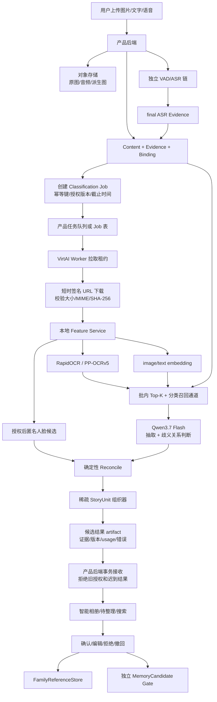

# SGX 自动分类与归纳：算法设计、架构和功能说明 v1

> 交付状态：`internal_release_candidate`
> 文档版本：`1.1.0`
> 日期：2026-10-03
> 当前语义模型：`qwen3.7-flash-2026-07-15`
> Prompt：`sgx-five-facets.13`
> 语义校验：`stage-a-validation.2`
> 混合契约：`classification-hybrid.2`
> 组织器：`content-organization.3`

本文面向产品负责人、算法工程师和全栈工程师，说明当前版本究竟接收什么、如何处理、输出什么、哪些结果能自动使用、哪些结果必须确认，以及产品如何调用云端算法服务。

## 1. 算法目标

算法把照片、用户文字和 final ASR 转写整理为可用于智能相册的内容单元：

- 为单张内容抽取人物候选、时间、地点、事件和场景；
- 在多张内容之间找到少量值得比较的候选，不做全图库两两 VLM 比较；
- 判断候选是否可能属于同一事件或同一匿名人物组；
- 生成事件/故事组、AI 标题、简短摘要、时间线和筛选标签；
- 保留用户原文、证据来源、冲突、未知和拒判；
- 让低风险整理结果进入相册，让高影响身份、关系和人生事实进入独立确认链；
- 为搜索、后续访谈问题和 MemoryCandidate 提供带状态的候选数据。

算法不负责证明照片内容在现实世界中绝对真实，也不把 AI 候选直接写成长期 Memory。长期 Memory 仍需独立权限、确认和写入策略。

## 2. 端到端处理流程



真实用户只访问产品前端和后端。浏览器不直接连接 SSH、VirtAI、Feature Service、OCR、embedding 或模型供应商。

## 3. 输入模型

### 3.1 Content、Evidence 和 Binding

一项用户内容用三个概念表达：

|概念|作用|例子|
|---|---|---|
|`Content`|产品中的逻辑内容单元|一张照片、一段文字、一段 final ASR|
|`Evidence`|可追溯且带版本的来源|图片 SHA-256、用户原文、ASR 文本|
|`Binding`|说明文字与哪些内容相关|“这段说明属于第 1、3 张照片”或“批次级说明”|

用户明确指定的单图或多图 Binding 是高优先级证据。用户没有指定图片时，说明先保存为批次级证据；算法可以提出关联候选，但不能擅自把它改成某张照片的确定事实。

### 3.2 当前分类任务接受的模态

|模态|进入分类链的形式|处理方式|
|---|---|---|
|图片|JPEG/PNG/WebP 派生图和来源哈希|OCR、image embedding、VLM 视觉抽取|
|用户文字|`user_text` 原文|优先语义证据、text embedding、VLM 输入|
|语音|原音频先走独立 ASR，分类链接收 `final_asr`|作为独立 Evidence，不能覆盖用户原文|

当前 Worker 控制面不把原始音频塞进 classification lease。这样能分别定位 ASR 错误和分类错误，也便于产品复用已有音频存储与 ASR 服务。

### 3.3 Scope 和身份字段

- `householdId + subjectId` 是隔离边界；跨家庭或跨主体数据不能互相召回。
- `actorId` 是当前操作人。
- `subjectId` 是内容主要描述的人。
- `ownerId` 是素材权利主体。
- `contributorId` 是上传或补充内容的人。

上传者不是照片中人物身份的证据。

## 4. 各阶段如何工作

### 4.1 接收、校验和异步建 Job

产品后端先保存素材并计算来源哈希，再创建带以下冻结信息的 Job：

- scope、purpose、授权版本；
- Evidence 版本、生命周期和来源哈希；
- Prompt、模型、规则、taxonomy 和执行配置 digest；
- `deadlineAt`、幂等键和最大费用/调用预算。

创建接口应快速返回 `202 + jobId`。OCR、embedding 和 VLM 在后台执行，避免上传页面等待数十秒。

### 4.2 Worker 下载和防篡改

Worker 通过短租约取得工作，只下载本 Job 的短时签名 URL。每个文件都校验：

- URL 未过期；
- 文件大小不超限；
- MIME 与可解码格式一致；
- 实际 SHA-256 与 Evidence/租约一致；
- 当前授权、Job revision、attempt revision 和执行配置未变化。

授权撤回、Evidence 失效、deadline 到期或租约变化时立即停止。产品后端在 complete 时再次做 CAS 校验，所以旧 Worker 的迟到结果不能覆盖新状态。

这里的 Evidence 下载是单任务临时副本，完成后从 `/tmp` 清理。模型、依赖、wheel、源码包、许可证和工具下载属于部署制品，必须写到 `/gemini/code/sgx-classification` 持久盘；`/quota` 只放可由这些持久制品离线重建的 venv 和生成缓存，不能承载下载内容的唯一副本。

### 4.3 OCR

OCR 用于读取老照片背面日期、横幅、票据或照片内文字。当前已验证的工程基线是 RapidOCR 3.9.2 + PP-OCRv5 mobile ONNX。OCR 结果必须绑定原图哈希和模型版本。

OCR 文字是非可信数据：照片里的“忽略规则”等指令不会被当作系统指令；只有能在 OCR 派生文本中逐字找到的 quote 才能作为 `ocr` support。

### 4.4 image/text embedding

embedding 把图片和已绑定文字映射为向量，用于从当前授权范围内找 Top-K 候选。其作用是减少比较数量，不是直接证明“同一个事件”或“同一个人”。

当前策略：

1. 用户文字或 final ASR 明确绑定到图片时，优先使用这些文本向量表达图片语义；
2. 没有绑定文字时使用图片向量；
3. 对每项内容仅保留 `maxCandidatesPerContent` 个候选；
4. 相似度只负责排序，不转成概率，也不设置硬阈值自动确认；
5. embedding 失败时禁用历史自动关联，当前批次仍可依靠文字、OCR 和 VLM 整理，并标记 partial/review。

当前内部候选已固定为
`damo/multi-modal_clip-vit-base-patch16_zh` revision
`e6d9ca1cf467fb979d8511ed8349d29bdfd8ea1b`，GPU FP16、batch=1，输出
512 维归一化向量。该模型已通过单组件和同进程 HTTP 执行冒烟，但尚未通过
固定图库的 Top-K 召回质量 Gate，因此只能做有界候选排序，不能把向量相似度
当作同一事件或人物结论。

### 4.5 Stage A VLM 抽取

`sgx-five-facets.13` 让 Qwen3.7 Flash 分别输出：

- `people`：匿名脸或有明确文字支持的人物提及；
- `times`：事件、拍摄、扫描或上传时间，并保留精度；
- `places`：具名地点或通用场景地点；
- `events`：受控事件类型；
- `scenes`：受控场景标签；
- `unknownFacets`：无足够证据的维度；
- `conflicts`：来源互相冲突的维度。

每条候选都要引用 `visual/caption/exif/ocr/user_text/final_asr` 中的来源。用户文字和 final ASR 的 quote 必须逐字存在；OCR quote 必须存在于哈希绑定的 OCR 派生文本。模型不能发明姓名、亲属关系、时间或地点精度。

### 4.6 稀疏关系判断

系统不会把新照片与图库中所有照片两两送给 VLM。候选顺序由两部分组成：

1. embedding Top-K；
2. 无 embedding 或补充召回时，使用“已有 reference、事件/时间/地点是否一致”的分类通道排序，并保留一个发现性 fallback。

模型只对这批有界候选输出：

```text
kind: person | event
decision: same | different | unknown
```

这里的 `same event` 必须表示同一次真实事件；相同的“生日”“旅行”类别不能自动合并。

### 4.7 确定性 reconcile 和人物候选

模型关系进入组织器前仍要经过否决规则：

- 用户明确的 `same/different` 永远覆盖 AI；
- 用户拒绝持续生效，直到可信 correction 被撤回；
- 冲突的时间窗口、事件或地点阻止事件自动合并；
- 两个不同的已确认人物 reference 不可合并；
- 同一照片中的两张不同脸不能合并为同一人物；
- 旧照片版本上的 reference/correction 失效并进入复核；
- 人物匹配必须有逐图生物特征授权。

人脸模型只输出匿名候选和 `same/different/unknown`。首次确认建立临时 reference；积累 2–3 张不同年代、角度或质量的已确认照片后，可成为稳定 reference。姓名和亲属关系只能来自用户确认。

当前内部候选已冻结 OpenCV Zoo commit
`47534e27c9851bb1128ccc0102f1145e27f23f98` 下的 YuNet 和 SFace artifact，
并通过多人合成图的检测/向量 HTTP 冒烟。真实跨年龄匹配和 SFace 预训练权重
的商业/训练数据来源审查仍未完成，因此只开放匿名候选能力，不声明真实人物
身份匹配已上线。

### 4.8 StoryUnit 组织

当前 active policy 是 `evidence_rules`，不使用 `0.80/0.55` 或其他硬分数决定是否合并：

|输入证据|当前动作|
|---|---|
|用户明确 same/rejected|按用户权威约束执行|
|Stage A 明确 `same_event`，无冲突，且不会桥接两个已确认组|生成 `auto_link_candidate`|
|Stage A 明确 `different`|`auto_separate`|
|`same` 但有冲突或会桥接稳定组|进入 review|
|只有 retrieval/embedding 相近|保持分开，不自动合并|
|`unknown`|保持分开|

自动结果仍是 `ai_candidate/ai_organized`，产品显示“AI 整理”。低风险整理可以直接出现在相册；身份、关系、敏感事实和长期 Memory 走独立确认。

标题和摘要由 StoryUnit 成员的事件、地点、时间、主题和有文字支持的人物生成，并保存 `titleSupports/summarySupports`。详情页始终保留用户原文。

## 5. 模型与规则分工

|能力|当前组件|是否消耗 VLM Token|当前交付状态|
|---|---|---:|---|
|文件哈希、生命周期、授权、CAS|本地确定性代码|否|可交付|
|OCR|RapidOCR + PP-OCRv5 mobile|否|远端工程基线已验证；真实手机分布待验证|
|图片/文字召回|ModelScope Chinese-CLIP revision `e6d9ca1...`|否|artifact/运行依赖/HTTP 已冻结；固定图库召回质量 Gate 待跑|
|视觉语义、冲突、关系|Qwen3.7 Flash|是|真实 API 路径和小规模探针已有，正式固定分母待补|
|故事标题和摘要|当前规则组织器；困难组可调用 Flash|视路径而定|规则路径可交付|
|匿名人物候选|YuNet + SFace at OpenCV Zoo `47534e27...`|否|内部匿名候选可运行；真实跨年龄与商业来源审查 gated|
|ASR|SenseVoiceSmall `7bf45240...` + FunASR 1.4.16|否|真实 runtime/HTTP 已运行；真实老人语音质量 Gate 待跑|

这种混合结构让便宜、稳定、可缓存的任务在本地完成，只把困难语义送给 VLM。随着 FamilyReferenceStore 和已确认历史增加，候选召回更准确，需要 VLM 和人工确认的比例可以逐步下降。

## 6. Prompt、规则和评分器的边界

- Prompt 负责约束模型输出结构和证据来源，不负责最终授权。
- embedding 分数只做 Top-K 排序，不是“同一事件概率”。
- 旧 `+8/+3/+2/+1` 与 `0.80/0.55` 仅保留历史回放兼容，不是 active 产品策略。
- 当前 active decision 使用明确证据状态：`supported/conflicted/insufficient` 和 `same/different/unknown`。
- 正式准确率、召回率、误合并率和延迟 Gate 必须在冻结数据集和真实产品链上测量，不能由规则常数替代。

完整 System Prompt 和字段规则见 [完整算法指南](CLASSIFICATION_ALGORITHM_COMPLETE_GUIDE.md)。

## 7. 输出和产品展示

算法结果包含：

- 每个 Content 的五维 Observation 和来源；
- event/person relation candidate；
- StoryUnit 成员、标题、摘要和筛选 facets；
- `partial`、`needs_review`、abstain 和 component errors；
- 模型、Prompt、规则、taxonomy、输入哈希、授权和运行版本；
- provider latency、token、费用和调用次数；
- AI 候选状态及后续用户操作记录。

建议产品展示：

- 列表页：AI 标题、简短摘要、“AI 整理”标记；
- 详情页：原图、用户原文、final ASR、来源和可编辑标签；
- 待整理：高风险冲突、身份/关系和无法自动决定的事项；
- 搜索与筛选：人物组、时间、地点、事件、场景，未来可扩展主题和内容类型；
- 双端互传内容：先进入待整理，低风险结果自动进入相册；第 3 天轻提醒，第 7 天从首页待办收起，高风险项继续留在未确认列表。

## 8. 失败恢复和鲁棒性

|失败点|系统行为|
|---|---|
|文件损坏、哈希不符、跨 scope|fail closed，不进入模型|
|OCR 失败|保留图片/文字/VLM 路径，结果 `partial`|
|embedding 失败|关闭历史自动关联，仍整理当前批次|
|VLM 超时/限流/非法输出|0 自动重试；记录稳定错误码，可由新 attempt 再执行|
|授权撤回、Evidence 删除|中止当前 Worker；后端拒收迟到结果|
|Worker 重启|租约过期后由新 Worker 重新领取，不覆盖已接受结果|
|人物授权缺失|跳过人脸向量与人物自动匹配|
|冲突或未知|保留候选和来源，不强行补全|

组件失败不会自动放宽授权或把低证据结果升级为事实。

## 9. 性能与成本设计

- 产品上传接口异步返回，不等待模型。
- OCR 与 YuNet/SFace 运行在 CPU；embedding 和 SenseVoice 运行在单张 vGPU，默认并发 1。
- 批内向量召回替代全量两两 VLM；每项内容只比较 Top-K。
- 相同来源哈希、模型版本和 Prompt 的派生特征可以安全缓存；版本变化自动失效。
- 只在抽取、歧义关系和困难摘要时调用 Flash。
- 每次调用记录 token、费用、延迟和停止原因；不做隐式自动重试。
- 首批最多 10 名内部用户可采用后台短轮询；规模增长后可替换为正式队列和事件推送，不改变算法契约。

目标机全能力 loopback HTTP 冒烟的总冷路径约 112 秒，主要来自 embedding 与
ASR 权重首次加载；加载后单次 embedding/ASR 推理明显更短。产品后端必须采用
异步 Job，服务启动后应预热并保持进程常驻，不能把 112 秒冷启动放进用户上传
请求。该单次数据不是 p95 或 SLA，正式并发、显存和长时稳定性仍需 T1 压测。

## 10. 全栈接入边界

产品后端负责：用户鉴权、数据库、对象存储、签名 URL、Job/outbox/lease、授权 revision、结果 CAS、产品状态和审计。

算法包负责：契约校验、Worker、Feature Service、Stage A、稀疏组织、错误码、版本和参考测试。

全栈工程师不需要把 OCR 或 embedding 嵌入浏览器，也不需要让用户连接 VirtAI。具体 7 个产品 API、Worker 内部 endpoint 和请求样例见 [全栈接入手册 v2](CLASSIFICATION_FULLSTACK_INTEGRATION_GUIDE_V2.md)。

## 11. 当前完成边界

本交付候选已经具备：

- 输入、Binding、授权、Job、Worker 和 execution-context 契约；
- OCR/embedding 派生特征进入 Stage A 的接线；
- 有界候选召回、VLM 抽取/关系、确定性冲突否决和稀疏 StoryUnit；
- 人物授权门禁与匿名候选边界；
- 取消、撤权、超时、迟到结果、幂等和双家庭/多主体隔离测试；
- 参考 Worker、Feature Service、部署/回滚脚本和统一交付检查。

仍需在正式产品链完成：

- 产品后端 OpenAPI、数据库事务、对象存储签名 URL 和 lease/outbox；
- embedding、YuNet/SFace、ASR 的最终 artifact/license/hash/runtime 冻结；
- 固定分母真实模型功能矩阵、故障恢复和延迟/成本 Gate；
- 智能相册 UI 的真实上传、查看、纠错和撤回；
- 长期 Memory 的独立写入适配器。

因此，本包可以交给全栈工程师并行接入，但状态是 `integration_candidate`，不是生产发布包，也不能把本地绿测解释为真实用户准确率。

## 12. 代码导航

|职责|入口|
|---|---|
|输入与 Binding|`contracts/classification-ingestion-v2.schema.json`|
|Worker 控制面|`contracts/classification-worker-control-plane.schema.json`|
|混合特征与策略|`contracts/classification-hybrid.schema.json`|
|Stage A Schema/校验|`src/lib/algorithms/classification/stage-a-contract.ts`|
|当前 Prompt/Provider|`src/lib/algorithms/classification/stage-a-provider.ts`|
|有界召回与 reconcile|`src/lib/algorithms/classification/stage-a-association.ts`|
|主动证据规则|`src/lib/algorithms/classification/evidence-rule-policy.ts`|
|StoryUnit 组织|`src/lib/algorithms/classification/content-organization.ts`|
|云端流水线处理器|`deploy/classification-worker/runtime/pipeline-processor.mjs`|
|Worker 生命周期|`deploy/classification-worker/runtime/worker-runtime.mjs`|
|OCR/embedding/face/ASR 服务|`services/classification-feature-service/`|
|统一交付检查|`scripts/classification-delivery-check.mjs`|
