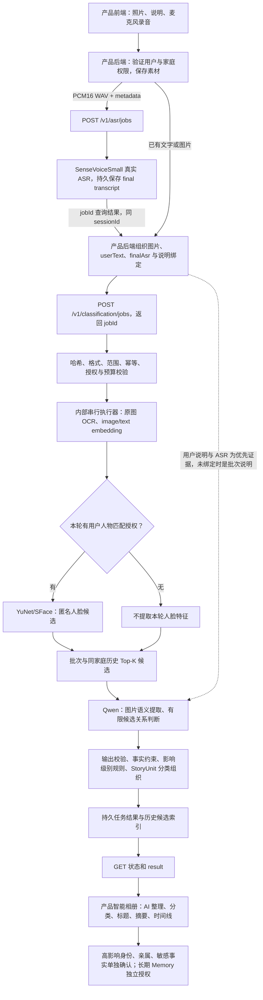

# 全栈直接调用算法 API：接入说明

## 本轮交付与双方分工

2026-10-09 用户已确认改为**产品后端直接调用独立算法 HTTP API**。
云端 `127.0.0.1:8765` 是完整分类/ASR 入口，`127.0.0.1:8766` 是内部模型组件。
公网 HTTPS 域名和映射由全栈完成；SSH `30022` 是维护通道。
本说明取代旧文档中的“全栈需实现 Worker lease/heartbeat/complete”要求。
内部复用现有执行器，但控制面在 API 进程内运行，不依赖开发机或反向 SSH 隧道。

全栈只需要：产品登录与家庭权限校验、文件存储、HTTP 提交与轮询、结果入产品库、
智能相册展示、确认/纠错界面。算法侧负责模型、Prompt、候选召回、语义判断、
故事组织、任务状态及算法运行记录。算法使用持久文件存储，不要求全栈连接算法目录
或共用数据库；产品原始素材与正式业务数据仍由产品存储管理。

当前真实模型配置沿用 [运行配置](CLASSIFICATION_RUNTIME_CONFIGURATION.md)：
RapidOCR/PP-OCRv5 mobile、Chinese-CLIP 512 维、OpenCV YuNet/SFace 128 维、
SenseVoiceSmall/FunASR、Qwen `qwen3.7-flash-2026-07-15`，Prompt `.16`、validation `.4`。
本轮改变接入方式，未重选模型。开源来源与许可证在模型配置索引中。

## 处理流程



embedding 相似度用于召回排序，不是概率、不直接决定合并；不对图库所有照片逐一发
Qwen。本轮候选上限每内容 1 个，单轮 Qwen 预留为图片数加有限候选关系数，6 张图
最多预留 12 次，实际按 usage 结算。跨轮仅返回关联候选，不自动确认同一事件或合并故事。

## 请求鉴权

除 `GET /healthz` 外均需服务端 Bearer Token。业务路由还需以下头，由**产品后端**
从已验证登录态生成；不要直接相信浏览器上送的 householdId/actorId。

```text
Authorization: Bearer <通过私密渠道获得的算法服务 Token>
X-SGX-Household-ID: 产品家庭 ID
X-SGX-Subject-ID: 产品主体/老人 ID
X-SGX-Actor-ID: 当前操作人 ID
Idempotency-Key: 本次上传固定且唯一的产品请求 ID（仅提交路由）
```

ID 限 ASCII 字母、数字、点、下划线、冒号、连字符，1–128 字符，首字符字母/数字。
metadata 的 scope/actor 必须与请求头一致；查询必须传正确 sessionId，并再次校验调用人。
一个服务 Token 对应受信产品后端，不作为多租户浏览器 API Key。浏览器无 CORS 直连入口。

## 路由和顺序

|方法与路由|输入|输出与用途|
|---|---|---|
|`GET /healthz`|无鉴权|进程存活；不代表模型已加载|
|`GET /readyz`|Bearer|模型 ready、ASR ready、分类 ready 与预算；分类不可执行时 503|
|`GET /version`|Bearer|API/源码/模型/Prompt/容量/授权策略|
|`POST /v1/asr/jobs`|multipart：metadata JSON、单个 audio|202：sessionId、jobId、status|
|`GET /v1/asr/jobs/{jobId}?sessionId=...`|调用人头|ASR 状态；原始音频不在响应中|
|`GET /v1/asr/jobs/{jobId}/result?sessionId=...`|调用人头|ASR text、segments、模型来源；未完成返回 409|
|`POST /v1/classification/jobs`|multipart：metadata JSON、重复 images|202：sessionId、jobId、round、status|
|`GET /v1/classification/jobs/{jobId}?sessionId=...`|调用人头|pending/processing/succeeded/needs_review/failed/cancelled|
|`GET /v1/classification/jobs/{jobId}/result?sessionId=...`|调用人头|完整核心 result、metrics 或错误；未完成返回 409|
|`GET /v1/classification/jobs?sessionId=...`|调用人头|当前会话最近任务记录|
|`POST /v1/classification/jobs/{jobId}/cancel?sessionId=...`|调用人头|终止任务；已发模型请求仍计费|

详见 [OpenAPI](../../deploy/classification-api/openapi.yaml) 和
[算法 result 契约](../../src/lib/algorithms/classification/lab-execution-contract.ts)。
完成结果保留 `result.output.organization`、`observations`、`batchBindings`、
`highImpactClaims`、`crossRoundAssociations`；前端应根据结构展示，不能将返回对象直接
作为所有高影响事实的最终确认。`needs_review` 是需查看问题的结果，通常仍包含可用整理。

第一轮不传 sessionId，保存响应中的 sessionId。之后每轮带同一 sessionId，以及同一
scope/actor，保留连续性与历史候选。不要每轮随机创建新家庭/主体 ID。
每 2–5 秒轮询状态即可；提交不等推理完成，反向代理无需保持 20 分钟长请求。

### 分类 metadata

```json
{
  "scope": {"householdId": "house-demo", "subjectId": "elder-demo"},
  "actorId": "child-demo",
  "contextKind": "album_upload",
  "userText": "这是我们在杭州拍的照片。",
  "userTextTargetIndexes": null,
  "finalAsr": "这张照片是去年的春节拍的。",
  "finalAsrTargetIndexes": [0],
  "submittedAt": "2026-10-09T12:00:00+08:00",
  "personMatchingAuthorized": true
}
```

`sessionId` 可选。`userText/finalAsr` 可选，但图片/文字/final ASR 至少有一项。
TargetIndexes 是本次 images 顺序的从 0 开始下标；null 表示用户未指明，保持批次级
证据，不能静默扩写到每张图。`personMatchingAuthorized` 默认 false，产品应在本轮真实
授权后传 true。`contextKind=family_transfer` 时还需 senderId 与非空 recipientIds。
不能混入产品其他任意字段；原始数据、确认过的身份事实分别走各自权限机制。

### 麦克风 ASR

metadata 只含 scope、actorId 和可选 sessionId。`audio` 来自用户实际麦克风采集的
PCM16 WAV；默认推荐 16kHz/单声道。WebM/Opus、MP3 不能冒充 WAV，产品采集端或
后端需先解码转为 WAV。拿到 `result.text` 后放入分类请求的 finalAsr；audio 原文、
来源哈希与转写结果在算法侧保存，产品也应保留 source asset ID，方便用户修正。

## 示例

部署后全栈设置 `SGX_API_BASE` 为正式 staging HTTPS，Token 放产品后端 secret storage。
在同机联调可用 `http://127.0.0.1:8765`。示例不包含真实凭据。

```bash
curl "$SGX_API_BASE/version" -H "Authorization: Bearer $SGX_API_TOKEN"

curl "$SGX_API_BASE/v1/classification/jobs" \
  -H "Authorization: Bearer $SGX_API_TOKEN" \
  -H 'X-SGX-Household-ID: house-demo' \
  -H 'X-SGX-Subject-ID: elder-demo' \
  -H 'X-SGX-Actor-ID: child-demo' \
  -H 'Idempotency-Key: product-upload-001' \
  -F 'metadata=<metadata.json;type=application/json' \
  -F 'images=@photo.jpg;type=image/jpeg'

curl "$SGX_API_BASE/v1/classification/jobs/$JOB_ID/result?sessionId=$SESSION_ID" \
  -H "Authorization: Bearer $SGX_API_TOKEN" \
  -H 'X-SGX-Household-ID: house-demo' \
  -H 'X-SGX-Subject-ID: elder-demo' \
  -H 'X-SGX-Actor-ID: child-demo'
```

## 容量、失败与恢复

当前 8 图/轮、10MiB/图、80MiB 总输入、40MP 原图，文字和 final ASR 各 64KiB。
multipart 总请求上限 81MiB。ASR 音频 50MiB/10 分钟，请求上限 51MiB。
同时接受最多 2 个上传，内部推理串行；服务设计目标为最多 10 名内部用户的有界排队，
本轮未证明 10 人同时大批上传的性能。没有自动付费重试。

提交必须使用固定 Idempotency-Key：同内容重发返回原 jobId；同 Key 换内容 409。
若提交中进程退出导致 receipt 未完成，返回 `SUBMISSION_OUTCOME_UNKNOWN`，需要查任务
列表/日志确认，不自动另建付费请求。失败再次测试用新 Key，不覆盖原失败。
重启后 processing 任务标记中断，不自动重做；pending 保留到截止或继续处理。
状态查询是最新事实，幂等重发响应的 status 是初次 receipt 状态。

统一错误：`{"ok":false,"error":{"code":"..."}}`。
401 缺 Token；403 scope/actor 不匹配；413 容量超限；415 格式不支持；429 上传忙；
503 组件未 ready、凭据/授权未配置或授权失效；409 结果未 ready/幂等冲突/额度不足。
客户端可以重试**同一提交 Key**和状态查询；不能自动重建失败任务去绕过预算。

当前累计授权 200 次/¥50、0 自动重试；**7 次历史剩余额度不能视为开放给 10 人长期使用的
模型预算**。截止时间沿用 2026-10-10 00:00 +08:00，到期或耗尽后分类停止，ASR 可独立使用。
每次实测前以 `/readyz.realCallBudget` 为准。增加实际内部测试额度由 Owner 决策。

## 启动、公网与验收

云端：`current/classification-api/bin/start.sh <current 的完整 Git SHA>`。
管理程序独立运行两个服务，退出后恢复；模型冷启动后使用现有冻结媒体预热。
PID 位于 `/quota/sgx-classification/runs/direct-*.pid`，日志在持久 `shared/logs`。
配置、secret 路径和回滚见 [部署说明](../../deploy/classification-api/README.md)。

全栈将云端同机 HTTPS 反向代理转发到 `127.0.0.1:8765`，保持路径、Bearer 和调用人头。
代理总 body 上限至少 81MiB（建议 82MiB），上传超时建议 120 秒；组件 8766 不开放。
如果公网网关在另一主机，需要部署网络/私网通道，不能把另一主机的 localhost 当算法地址。
公网地址未落实前仅能同机调用，不能把 SSH 端口或开发 quick tunnel 当稳定 HTTPS 服务。

第一条产品验收：麦克风录音转写 → 图文提交 → 查询结果 → 产品入库与“AI 整理”展示 →
同 session 再上传 → 看到历史候选 → 刷新后两轮结果仍在。随后测试一次家庭越权拒绝、
一次错误恢复和一次人物授权/高影响确认。旧 T0/T1 模型证据继续有效，产品 T2 不能由
算法自测替代。平台整体实例回收仍需平台常驻部署，进程管理不能保证实例永久在线。
