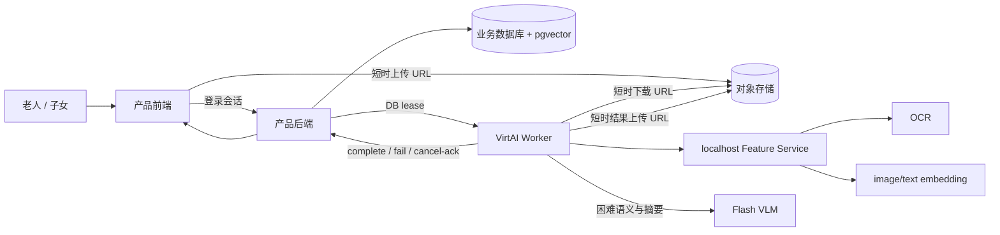

# SGX 自动分类与归纳：全栈接入手册 v2

> 日期：2026-10-02
> 面向：产品前端、业务后端、对象存储、数据库与云端 Worker 集成工程师
> 适用：T0/T1 内部测试到 T2 产品接入
> 当前源码语义基线：`qwen3.7-flash-2026-07-15`、Prompt `sgx-five-facets.16`、`stage-a-validation.4`；远端激活与真实运行状态见当日执行记录
> 控制面协议：`classification-worker-control-plane.v1`
> 输入契约：`classification-ingestion.2` / `specVersion=2.0.0`

本文不依赖某个前端仓库、ORM、云厂商或对象存储产品。工程师可以把接口映射到已有后端，但必须保留本文定义的权限、版本、幂等、撤回和证据语义。

本文同时区分三种状态：

- **已经冻结的契约**：仓库存在 JSON Schema 和回归测试；
- **已经存在的算法实现**：可以由 Worker 调用，但仍需冻结模型制品和远端验收；
- **全栈需要实现的产品能力**：业务 API、数据库事务、对象存储、租约队列和正式鉴权。

不能因为某个 Schema、Fake 服务或实验页面可运行，就宣称生产链路已经完成。

## 1. 全栈最终接入什么

真实用户只接触产品前端和产品后端，不接触 VirtAI、SSH、OCR 或 embedding 服务。



首版采用 **worker-pull**：VirtAI Worker 主动向业务后端领取任务。后端不需要连接 Notebook 入站端口，真实用户也不需要 SSH。

### 1.1 外网开放什么接口

全栈工程师应把本手册第 4 节的**产品 API**部署在现有产品后端，通过正式 HTTPS 域名供前端访问。浏览器上传原图、文字或音频后，只查询产品 Job 和智能相册结果。VirtAI Worker 使用独立的服务凭据，主动通过出站 HTTPS 调用第 5 节的 Worker 控制面。

```text
浏览器 --HTTPS/登录态--> 产品后端 --对象引用/事务--> DB 与对象存储
                              ^
                              |
                  出站 HTTPS lease/heartbeat/result
                              |
                        VirtAI Worker
                              |
                      localhost:8765
                    OCR/Embedding/Face/ASR
```

需要公网可达的是产品后端域名。`8765` Feature Service、GPU、模型目录和向量不开放公网；全栈工程师也不需要持有服务器 SSH 才能在产品中调用算法。产品后端可以部署在现有云环境，VirtAI 只要能够主动访问它即可。

#### T1 临时外网联调入口

在正式产品后端完成前，本仓提供一个**仅供全栈后端调用**的窄网关。它不是最终产品 API，也不能把 Bearer Token 放入浏览器代码。

```bash
# 仅首次：在本机 Keychain 生成独立测试 Token，不打印明文
scripts/classification-keychain.zsh external-setup

# 启动真实 T1 控制面和窄网关
scripts/classification-keychain.zsh lab-real -p 3137
scripts/classification-keychain.zsh external-gateway
```

窄网关只监听 `127.0.0.1:3140`，再由经过批准的 HTTPS tunnel 暂时转发。它只允许：

- `GET/POST /api/classification-lab/t1`；
- `GET/POST /api/classification-lab/t1/asr`；
- `POST /api/classification-lab/t1/retry`。

它拒绝浏览器 `Origin`、未授权请求、并发超过 4 的请求和大于 96MiB 的请求体；不开放页面、原始资产下载、Worker 控制面、Feature Service、GPU、SSH、模型目录或内部日志。每张图片的产品上限是 10MiB，每轮最多 8 张、总输入上限 80MiB。OCR、Embedding 和授权后人物特征读取经哈希验证的原图；VLM 使用最长边 1600px、目标不超过 900KiB 的去元数据 JPEG 派生副本。原图仍是唯一 Evidence，派生副本必须记录原图哈希、派生哈希和转换版本。

全栈后端用以下方式调用，Token 通过独立安全渠道分发：

```http
Authorization: Bearer <T1_STAGING_TOKEN>
Content-Type: multipart/form-data
```

正式接入完成后撤销该 Token 并关闭 tunnel；产品浏览器改为调用全栈工程师实现的业务 API，VirtAI Worker 继续使用第 5 节控制面主动拉取任务。

### 1.2 当前 SSH 隧道为什么不稳定

当前 T1 页面暂时使用反向 SSH，把 VirtAI 的本机端口连接到开发机控制面。它同时依赖开发机、网络、SSH 会话、Next 开发服务和 VirtAI Notebook 进程。电脑休眠、网络切换、Codex 终端结束或远端代理回收连接都会中断；异常断开还可能留下占用端口的旧 `sshd`。2026-10-05 又确认 Feature Service 会受 `ORION_TASK_IDLE_TIME=3600` 影响退出，因此 PID 存在也不能证明服务可用。

|用途|方案|结论|
|---|---|---|
|当前 T1 临时测试|SSH keepalive + 明确的旧监听清理 + `/readyz` 恢复脚本|可以继续实验，不能交给真实用户|
|临时共享演示|Cloudflare Tunnel、Tailscale 或受控 FRP，并在前面增加 HTTPS 鉴权|可作 staging 备选，仍需健康检查和访问控制|
|最多 10 名内部用户|公网 HTTPS 产品后端 + VirtAI Worker 主动出站拉取|本项目首选；不依赖 GPU 入站端口|
|后续稳定服务|把同一冻结 release 部署到有进程监督、固定生命周期的推理实例|消除 Notebook 一小时空闲回收问题|

`autossh`、`launchd` 或 `systemd` 可以自动重连 SSH，但只能缓解测试桥接；它们不能代替产品鉴权、对象存储、任务事务、撤权和结果 fencing。

### 1.3 什么是联调，双方怎样配合

联调是把真实前端、产品后端、对象存储、数据库、VirtAI Worker、Feature Service 和真实 VLM 接成一条可观察链路，用同一组固定案例验证输入、状态、结果和失败恢复。它不是把 SSH 账号交给全栈工程师，也不只是双方各自跑单元测试。

算法侧交付 Schema、Worker、Feature Service、版本配置、错误码、示例请求/结果和验收清单。全栈工程师实现产品 API、数据库事务、对象存储签名 URL、Worker 服务鉴权、智能相册投影和页面状态。Owner 提供经授权的测试素材并裁决产品结果是否可用。

第一轮联合验收固定执行：上传 1 张图和文字、上传 3–6 张图、浏览器录音转 final ASR、第二轮新增内容检索历史、取消任务、撤回 Evidence、制造一次服务中断后恢复。每例都要核对页面状态、Job/Attempt、模型 usage、相册结果和临时文件清理。全部通过后，全栈工程师无需 SSH 即可让内部用户从产品页面使用算法。

## 2. 责任边界

### 2.1 算法包负责

- Ingestion、Evidence、Worker 控制面和算法结果 Schema；
- Prompt、Guard、taxonomy、adapter 和组织规则的版本；
- RapidOCR、image/text embedding、VLM 与故事组织实现；
- 本地 Feature Service；
- 稳定错误码、模型与资源基准、冻结测试报告。

### 2.2 全栈工程师负责

- 登录会话、`actorId`、`subjectId`、`householdId` 和代理权限校验；
- 原图、原音频和派生文件的对象存储；
- Evidence、Binding、Job、Attempt、Action、StoryUnit 和向量的权威数据库；
- 上传签名 URL、Worker 下载签名 URL和结果上传签名 URL；
- DB-backed lease、heartbeat、CAS、取消、撤权和 late-result 拒收；
- 产品状态查询、通知、待整理列表和人工复核页面；
- 对象物理删除、派生索引清理和审计保留策略；
- 监控、告警、限流、备份和正式部署。

### 2.3 浏览器不得负责

- 生成授权快照或自证 `actorId` 权限；
- 持有 VLM、对象存储主密钥或 Worker 凭据；
- 直接调用 OCR、embedding 或 VirtAI Feature Service；
- 把 AI 候选直接写成已确认事实或长期 Memory。

## 3. 数据权威边界

|数据|唯一权威位置|VirtAI 允许保存什么|
|---|---|---|
|原图、原音频、派生媒体|产品对象存储|短时任务副本|
|Evidence、Binding、授权、Job、用户动作|产品数据库|只读租约快照|
|StoryUnit 和当前产品视图|产品数据库|候选结果 artifact|
|向量、特征版本|产品数据库 + pgvector|短时计算结果|
|模型权重|冻结的只读模型目录|长期只读制品|
|任务临时文件|无产品权威性|任务结束、取消或超时后删除|
|密钥|Secret store / 进程环境|只在进程中使用|

Worker 重启、迁移或整个 VirtAI 环境丢失，都不能导致产品权威状态丢失。

建议的最小数据库语义如下，表名可以适配现有 ORM：

- `evidence`：来源、owner、contributor、scope、revision、hash、lifecycle、consent；
- `evidence_object`：对象键、MIME、字节数、校验状态、删除状态；
- `content_item`：图片、用户原文、final ASR 等产品内容；
- `evidence_binding`：说明绑定到单图、指定多图或整个批次；
- `classification_job`：状态、输入 hash、授权 revision、当前 run；
- `classification_attempt`：run、lease、版本、usage、错误、起止时间；
- `classification_result_artifact`：原始候选、hash、版本和接收状态；
- `classification_action_event`：确认、编辑、拒绝、拆分、合并、撤回；
- `story_unit` / `story_member`：物化的故事视图；
- `classification_feature`：向量和 OCR 等派生特征，必须带 source/model version；
- `outbox_event`：在同一数据库事务中发布后续任务和产品通知。

## 4. 全栈需要提供的产品 API

下列产品 API 是接入参考路径。路径可以适配已有产品，但语义必须一致。当前仓库尚未提供这些生产 API 的完整 OpenAPI；全栈实现前应根据本节冻结一份产品 OpenAPI。

全栈首版只需实现以下七个产品 endpoint。SSE、WebSocket、批量导入和管理后台可以后置：

|接口|首版用途|
|---|---|
|`POST /api/v1/evidence/uploads`|创建受 scope 约束的短时上传 URL|
|`POST /api/v1/evidence/uploads/{uploadId}/complete`|服务端复验对象并激活 Evidence|
|`POST /api/v1/classification/jobs`|幂等创建后台分类任务|
|`GET /api/v1/classification/jobs/{jobId}`|轮询 Job、partial、结果和 review 项|
|`POST /api/v1/classification/jobs/{jobId}/cancel`|取消任务或撤销仍在运行的 attempt|
|`POST /api/v1/classification/reviews`|按 `AssertionReviewRequest` 确认、编辑、拒绝或撤回 Assertion|
|`POST /api/v1/classification/story-actions`|确认故事、拒绝关系、拆分、合并或移出内容；使用独立 append-only 动作契约|

首版 30–50 名以内内部用户可以用有退避的短轮询读取 Job；这不会改变后端异步任务语义。OCR、embedding、ASR 和 VLM endpoint 不属于产品 API。

### 4.1 文件上传

#### `POST /api/v1/evidence/uploads`

后端验证登录用户、家庭、主体、用途和 MIME，预创建上传记录并返回短时上传 URL。

请求示例：

```json
{
  "householdId": "household_001",
  "subjectId": "subject_001",
  "ownerId": "subject_001",
  "contributorId": "user_002",
  "modality": "image",
  "fileName": "old-photo.jpg",
  "mimeType": "image/jpeg",
  "byteLength": 1837421,
  "purpose": "album_organization"
}
```

`201` 响应示例：

```json
{
  "uploadId": "upload_001",
  "evidenceId": "evidence_image_001",
  "uploadUrl": "https://object.example/signed-put",
  "method": "PUT",
  "requiredHeaders": {
    "Content-Type": "image/jpeg"
  },
  "expiresAt": "2026-10-02T12:10:00.000Z",
  "maxByteLength": 20971520
}
```

浏览器随后直接 `PUT` 到签名 URL。上传完成不等于 Evidence 已激活。

#### `POST /api/v1/evidence/uploads/{uploadId}/complete`

```json
{
  "sha256": "sha256:aaaaaaaaaaaaaaaaaaaaaaaaaaaaaaaaaaaaaaaaaaaaaaaaaaaaaaaaaaaaaaaa",
  "byteLength": 1837421,
  "mimeType": "image/jpeg"
}
```

后端必须通过对象存储 `HEAD` 或服务端流式复验确认对象、大小、MIME 和 hash，再将 Evidence 置为 `active`。客户端自报 hash 不能直接成为可信值。

原始音频也采用同一上传流程。见第 10 节：当前分类 Worker v1 不直接租赁 audio Evidence，音频必须先经过独立 ASR 阶段形成 final ASR Evidence。

### 4.2 创建分类任务

#### `POST /api/v1/classification/jobs`

请求头建议：

```http
Idempotency-Key: <由后端或可信客户端生成的稳定键>
```

请求体包含符合 `contracts/classification-ingestion-v2.schema.json` 的 IngestionEnvelope。下面示例包含完整的图片和用户文字 Evidence；对象键只是产品数据库中的受控引用，不是浏览器可访问的 URL：

```json
{
  "specVersion": "2.0.0",
  "contractVersion": "classification-ingestion.2",
  "ingestionId": "ingestion_001",
  "batchId": "batch_001",
  "scope": {
    "householdId": "household_001",
    "subjectId": "subject_001"
  },
  "actorId": "user_002",
  "context": {
    "kind": "family_transfer",
    "senderId": "user_002",
    "recipientIds": ["subject_001"]
  },
  "authorizationRevision": "auth_revision_7",
  "taxonomyVersion": "sgx-taxonomy.1",
  "purposes": ["classification", "album_organization", "search_candidate"],
  "evidence": [
    {
      "evidenceId": "evidence_image_001",
      "subjectId": "subject_001",
      "householdId": "household_001",
      "schemaVersion": "1.0",
      "ownerId": "subject_001",
      "contributorId": "user_002",
      "consentRef": "consent_007",
      "visibility": "household",
      "ingestedAt": "2026-10-02T12:00:00.000Z",
      "capturedAt": "1985-06-30T10:00:00.000Z",
      "lifecycleState": "active",
      "sourceRef": {
        "kind": "object",
        "id": "object_image_001"
      },
      "sourceHash": "sha256:aaaaaaaaaaaaaaaaaaaaaaaaaaaaaaaaaaaaaaaaaaaaaaaaaaaaaaaaaaaaaaaa",
      "revision": 1,
      "byteLength": 1837421,
      "modality": "image",
      "mimeType": "image/jpeg",
      "dimensions": {
        "width": 2048,
        "height": 1365
      }
    },
    {
      "evidenceId": "evidence_text_001",
      "subjectId": "subject_001",
      "householdId": "household_001",
      "schemaVersion": "1.0",
      "ownerId": "user_002",
      "contributorId": "user_002",
      "consentRef": "consent_007",
      "visibility": "household",
      "ingestedAt": "2026-10-02T12:00:00.000Z",
      "lifecycleState": "active",
      "sourceRef": {
        "kind": "message",
        "id": "message_001"
      },
      "sourceHash": "sha256:dddddddddddddddddddddddddddddddddddddddddddddddddddddddddddddddd",
      "revision": 1,
      "byteLength": 45,
      "modality": "text",
      "mimeType": "text/plain"
    }
  ],
  "contents": [
    {
      "contentId": "content_photo_001",
      "evidenceId": "evidence_image_001",
      "modality": "image",
      "lifecycleState": "active"
    },
    {
      "contentId": "content_text_001",
      "evidenceId": "evidence_text_001",
      "modality": "user_text",
      "lifecycleState": "active"
    }
  ],
  "bindings": [
    {
      "bindingId": "binding_001",
      "sourceContentId": "content_text_001",
      "target": {
        "kind": "contents",
        "contentIds": ["content_photo_001"]
      },
      "authority": "user_explicit",
      "state": "active",
      "method": "product_upload_ui.1",
      "evidenceRefs": ["evidence_text_001"],
      "createdAt": "2026-10-02T12:00:00.000Z"
    }
  ],
  "reviewPolicy": {
    "policyVersion": "family-inbox.1",
    "remindAfterDays": 3,
    "hideFromHomeAfterDays": 7,
    "highRiskRetention": "until_resolved"
  },
  "createdAt": "2026-10-02T12:00:00.000Z"
}
```

后端必须忽略或拒绝客户端伪造的授权信息，基于当前会话重新生成可信授权快照，并在一个事务内：

1. 验证 actor、subject、household 和所有 Evidence；
2. 验证 Evidence 均 active、hash 已确认且用途已授权；
3. 计算 canonical input hash 和 execution profile digest；
4. 按幂等键查找或创建 Job；
5. 写入 outbox，使 Job 可以被 Worker lease。

`202 Accepted` 响应：

```json
{
  "jobId": "job_001",
  "workflowStatus": "pending",
  "jobRevision": 1,
  "submittedAt": "2026-10-02T12:00:01.000Z",
  "statusUrl": "/api/v1/classification/jobs/job_001"
}
```

接口应在 p95 2 秒内返回，不能等待 OCR、embedding 或 VLM 完成。

### 4.3 查询任务

#### `GET /api/v1/classification/jobs/{jobId}`

处理中示例：

```json
{
  "jobId": "job_001",
  "workflowStatus": "processing",
  "stage": "features",
  "progress": 30,
  "partial": false,
  "jobRevision": 2,
  "updatedAt": "2026-10-02T12:00:05.000Z"
}
```

存在可用结果但需要局部复核时：

```json
{
  "jobId": "job_001",
  "workflowStatus": "needs_review",
  "resultStatus": "needs_review",
  "partial": true,
  "componentStatus": {
    "ocr": "succeeded",
    "embedding": "failed",
    "vlm": "succeeded",
    "organization": "succeeded"
  },
  "stories": [
    {
      "storyId": "story_001",
      "state": "ai_candidate",
      "displayLabel": "AI 整理",
      "title": "车站与湖边的旅行",
      "summary": "记录同一趟旅行的第一天和第二天。",
      "contentIds": ["content_photo_001", "content_photo_002"],
      "evidenceRefs": ["evidence_image_001", "evidence_text_001"],
      "reviewItemIds": ["review_001"]
    }
  ],
  "abstentions": [
    {
      "facet": "person",
      "reason": "insufficient_evidence"
    }
  ],
  "errors": [
    {
      "component": "embedding",
      "code": "EMBEDDING_FAILED",
      "retryable": true
    }
  ],
  "reviewItems": [
    {
      "reviewItemId": "review_001",
      "kind": "conflict",
      "impact": "medium",
      "targetId": "story_001",
      "reason": "time_sources_conflict"
    }
  ],
  "usage": {
    "providerCalls": 2,
    "inputTokens": 2400,
    "outputTokens": 800,
    "costCny": 0.03,
    "endToEndLatencyMs": 12000
  },
  "versions": {
    "promptVersion": "sgx-five-facets.13",
    "guardVersion": "stage-a-validation.2"
  },
  "jobRevision": 4,
  "updatedAt": "2026-10-02T12:00:13.000Z"
}
```

上述是产品读模型，不是现有 JSON Schema 的替代品。全栈应在 OpenAPI 中冻结准确字段，并由内部 artifact 到产品视图做映射。

### 4.4 取消任务

#### `POST /api/v1/classification/jobs/{jobId}/cancel`

```json
{
  "expectedJobRevision": 4,
  "reason": "user_cancelled"
}
```

后端以 CAS 更新 Job、使当前租约失效并记录审计。即使 Provider 已经返回，旧 run 也不能覆盖 cancelled 状态。已经发生的 token 和费用仍必须保留。

### 4.5 用户复核

#### `POST /api/v1/classification/reviews`

Assertion 的确认、编辑、拒绝和撤回必须符合 `contracts/assertion-review.schema.json`。确认示例：

```json
{
  "schemaVersion": "1.0",
  "assertionId": "assertion_001",
  "expectedRevision": 1,
  "actorId": "subject_001",
  "subjectId": "subject_001",
  "householdId": "household_001",
  "authorityType": "self",
  "authorityRef": "authority_self_001",
  "action": "confirm"
}
```

拆分、合并和移动 StoryUnit 属于产品动作事件，不应伪装成 AssertionReview。首版使用 `POST /api/v1/classification/story-actions`，请求至少携带稳定 `actionId`、`kind`、目标 ID、`actorId` 和 `expectedRevision`；同一 actionId 重放必须幂等，旧 revision 返回 `409`。该动作的 JSON Schema 仍需随产品 OpenAPI 冻结。

## 5. Worker 控制平面

`contracts/classification-worker-control-plane.schema.json` 冻结了请求体。全栈需要实现以下接口：

|接口|作用|成功条件|
|---|---|---|
|`POST /internal/v1/classification/leases`|Worker 领取任务|版本/能力匹配，原子占有 0–N 个 Job|
|`POST /internal/v1/classification/jobs/{jobId}/heartbeat`|续租并报告阶段|run、token、revision、授权仍匹配|
|`POST /internal/v1/classification/jobs/{jobId}/execution-context`|取得 Stage A 所需的不可变 Job、Guard 和策略快照|返回内容与本次租约 identity 完全绑定|
|`POST /internal/v1/classification/jobs/{jobId}/complete`|提交成功或需复核结果|artifact 已上传且所有 fence 仍匹配|
|`POST /internal/v1/classification/jobs/{jobId}/fail`|记录稳定失败|费用和 Provider 调用次数不可丢失|
|`POST /internal/v1/classification/jobs/{jobId}/cancel-ack`|确认停止与临时清理|原任务已取消或授权失效|

上述六类 Worker 请求/响应均已进入 `classification-worker-control-plane.schema.json`，包括与租约 identity 完全绑定的 `ExecutionContextRequest/Response`。产品后端仍需在 OpenAPI 中给这些 Schema 指定实际路径、认证方式和 HTTP 状态码，不能要求工程师从运行时代码反推协议。

### 5.1 Lease 请求

```json
{
  "protocolVersion": "classification-worker-control-plane.v1",
  "requestId": "request_lease_001",
  "workerId": "virtai_worker_01",
  "maxJobs": 1,
  "versions": {
    "gitCommit": "0123456789abcdef0123456789abcdef01234567",
    "contractVersion": "classification-ingestion.2",
    "providerVersion": "qwen.qwen3-7-flash",
    "promptVersion": "sgx-five-facets.13",
    "guardVersion": "stage-a-validation.2",
    "adapterVersion": "classification-feature-adapters.1",
    "taxonomyVersion": "sgx-taxonomy.1",
    "ocrVersion": "rapidocr-ppocrv5.1",
    "embeddingVersion": "siglip2-base-224.1"
  },
  "capabilities": {
    "modalities": ["image", "user_text", "final_asr"],
    "features": [
      "hash",
      "phash",
      "exif",
      "quality",
      "ocr",
      "image_embedding",
      "text_embedding",
      "vlm_extract",
      "vlm_relate",
      "story_summary"
    ],
    "maxImagesPerJob": 30,
    "personMatchingEnabled": false
  }
}
```

没有任务时返回同一 requestId 和空 `leases`，不要用 `404` 表示队列为空。

### 5.2 Lease 响应

```json
{
  "protocolVersion": "classification-worker-control-plane.v1",
  "requestId": "request_lease_001",
  "leases": [
    {
      "jobId": "job_001",
      "runId": "run_001",
      "leaseToken": "lease-token-at-least-32-characters-001",
      "leaseExpiresAt": "2026-10-02T12:01:00.000Z",
      "jobRevision": 2,
      "attemptRevision": 1,
      "scope": {
        "householdId": "household_001",
        "subjectId": "subject_001"
      },
      "authorizationRevision": "auth_revision_7",
      "deadlineAt": "2026-10-02T12:05:00.000Z",
      "inputHash": "sha256:bbbbbbbbbbbbbbbbbbbbbbbbbbbbbbbbbbbbbbbbbbbbbbbbbbbbbbbbbbbbbbbb",
      "executionProfileDigest": "sha256:cccccccccccccccccccccccccccccccccccccccccccccccccccccccccccccccc",
      "evidence": [
        {
          "evidenceId": "evidence_image_001",
          "contentId": "content_photo_001",
          "modality": "image",
          "revision": 1,
          "sourceHash": "sha256:aaaaaaaaaaaaaaaaaaaaaaaaaaaaaaaaaaaaaaaaaaaaaaaaaaaaaaaaaaaaaaaa",
          "lifecycleState": "active",
          "bindingId": "binding_001",
          "artifact": {
            "artifactId": "artifact_image_001",
            "downloadUrl": "https://object.example/signed-get",
            "expiresAt": "2026-10-02T12:02:00.000Z",
            "sha256": "sha256:aaaaaaaaaaaaaaaaaaaaaaaaaaaaaaaaaaaaaaaaaaaaaaaaaaaaaaaaaaaaaaaa",
            "byteLength": 1837421,
            "mimeType": "image/jpeg"
          }
        },
        {
          "evidenceId": "evidence_text_001",
          "contentId": "content_text_001",
          "modality": "user_text",
          "revision": 1,
          "sourceHash": "sha256:dddddddddddddddddddddddddddddddddddddddddddddddddddddddddddddddd",
          "lifecycleState": "active",
          "bindingId": "binding_001",
          "inlineText": {
            "text": "这是同一趟旅行的第一天。",
            "sha256": "sha256:dddddddddddddddddddddddddddddddddddddddddddddddddddddddddddddddd"
          }
        }
      ],
      "resultUpload": {
        "artifactId": "artifact_result_001",
        "uploadUrl": "https://object.example/signed-result-put",
        "expiresAt": "2026-10-02T12:04:00.000Z",
        "maxByteLength": 10485760,
        "mimeType": "application/json"
      }
    }
  ]
}
```

### 5.3 Heartbeat

请求体使用 Schema 中的 `HeartbeatRequest`：

```json
{
  "protocolVersion": "classification-worker-control-plane.v1",
  "requestId": "request_heartbeat_001",
  "identity": {
    "workerId": "virtai_worker_01",
    "jobId": "job_001",
    "runId": "run_001",
    "leaseToken": "lease-token-at-least-32-characters-001",
    "jobRevision": 2,
    "attemptRevision": 1,
    "authorizationRevision": "auth_revision_7",
    "inputHash": "sha256:bbbbbbbbbbbbbbbbbbbbbbbbbbbbbbbbbbbbbbbbbbbbbbbbbbbbbbbbbbbbbbbb",
    "executionProfileDigest": "sha256:cccccccccccccccccccccccccccccccccccccccccccccccccccccccccccccccc"
  },
  "progress": 30,
  "stage": "features"
}
```

Heartbeat 响应也已由 `HeartbeatResponse` 冻结：

```json
{
  "protocolVersion": "classification-worker-control-plane.v1",
  "requestId": "request_heartbeat_001",
  "leaseExpiresAt": "2026-10-02T12:02:00.000Z",
  "control": "continue"
}
```

`control` 只能是 `continue / cancel / authorization_changed / deadline_exceeded`。非 `continue` 时 Worker 立即停止，清理临时文件并发送 cancel-ack；若 run、scope、Evidence、版本或租约已经不匹配，控制面也可以返回 `409`，Worker 同样不得继续计算或提交结果。

### 5.4 Stage A Execution Context

当前 Worker 请求形状为：

```json
{
  "protocolVersion": "classification-worker-control-plane.v1",
  "requestId": "request_context_001",
  "identity": {
    "workerId": "virtai_worker_01",
    "jobId": "job_001",
    "runId": "run_001",
    "leaseToken": "lease-token-at-least-32-characters-001",
    "jobRevision": 2,
    "attemptRevision": 1,
    "authorizationRevision": "auth_revision_7",
    "inputHash": "sha256:bbbbbbbbbbbbbbbbbbbbbbbbbbbbbbbbbbbbbbbbbbbbbbbbbbbbbbbbbbbbbbbb",
    "executionProfileDigest": "sha256:cccccccccccccccccccccccccccccccccccccccccccccccccccccccccccccccc"
  }
}
```

响应必须包含 `protocolVersion`、同一个 `requestId`、`contextVersion=classification-worker-stage-a-context.1`、与 identity/scope 完全一致的 `binding`，以及不含任何凭据的 `execution.job / execution.guard / execution.placeKindPolicy`。准确字段必须先用 JSON Schema 冻结，再由全栈实现；在此之前不能把 Stage A Worker 记为可交付。

### 5.5 Complete、Fail 和 Cancel Ack

Worker 先将结果 JSON 上传到 `resultUpload.uploadUrl`，再发送 complete：

```json
{
  "protocolVersion": "classification-worker-control-plane.v1",
  "requestId": "request_complete_001",
  "identity": {
    "workerId": "virtai_worker_01",
    "jobId": "job_001",
    "runId": "run_001",
    "leaseToken": "lease-token-at-least-32-characters-001",
    "jobRevision": 2,
    "attemptRevision": 1,
    "authorizationRevision": "auth_revision_7",
    "inputHash": "sha256:bbbbbbbbbbbbbbbbbbbbbbbbbbbbbbbbbbbbbbbbbbbbbbbbbbbbbbbbbbbbbbbb",
    "executionProfileDigest": "sha256:cccccccccccccccccccccccccccccccccccccccccccccccccccccccccccccccc"
  },
  "status": "needs_review",
  "versions": {
    "gitCommit": "0123456789abcdef0123456789abcdef01234567",
    "contractVersion": "classification-ingestion.2",
    "providerVersion": "qwen.qwen3-7-flash",
    "promptVersion": "sgx-five-facets.13",
    "guardVersion": "stage-a-validation.2",
    "adapterVersion": "classification-feature-adapters.1",
    "taxonomyVersion": "sgx-taxonomy.1",
    "ocrVersion": "rapidocr-ppocrv5.1",
    "embeddingVersion": "siglip2-base-224.1"
  },
  "resultArtifact": {
    "artifactId": "artifact_result_001",
    "sha256": "sha256:eeeeeeeeeeeeeeeeeeeeeeeeeeeeeeeeeeeeeeeeeeeeeeeeeeeeeeeeeeeeeeee",
    "byteLength": 4096,
    "mimeType": "application/json"
  },
  "usage": {
    "endToEndLatencyMs": 12000,
    "providerLatencyMs": 8000,
    "inputTokens": 2400,
    "outputTokens": 800,
    "costCny": 0.03,
    "providerCalls": 2
  }
}
```

后端接收 complete 时必须在一个事务中验证：

- URL `jobId` 与 body identity 一致；
- Job 仍为当前 processing run；
- lease token、job/attempt revision、授权 revision、input hash 和 profile digest 一致；
- Evidence 仍 active 且 scope 未变化；
- result artifact 确实存在、长度/hash/MIME 一致；
- 结果中的 Evidence 引用全部属于本次租约；
- 当前版本允许接收该结果。

不匹配时返回 `409` 并保存 rejected-late audit，不覆盖当前结果。

失败使用 `FailRequest`，至少记录阶段、稳定错误码、是否可重试、Provider 是否已调用以及完整 usage：

```json
{
  "protocolVersion": "classification-worker-control-plane.v1",
  "requestId": "request_fail_001",
  "identity": {
    "workerId": "virtai_worker_01",
    "jobId": "job_001",
    "runId": "run_001",
    "leaseToken": "lease-token-at-least-32-characters-001",
    "jobRevision": 2,
    "attemptRevision": 1,
    "authorizationRevision": "auth_revision_7",
    "inputHash": "sha256:bbbbbbbbbbbbbbbbbbbbbbbbbbbbbbbbbbbbbbbbbbbbbbbbbbbbbbbbbbbbbbbb",
    "executionProfileDigest": "sha256:cccccccccccccccccccccccccccccccccccccccccccccccccccccccccccccccc"
  },
  "errorCode": "PROVIDER_INVALID_OUTPUT",
  "stage": "vlm_extract",
  "retryable": false,
  "providerCalled": true,
  "usage": {
    "endToEndLatencyMs": 9000,
    "providerLatencyMs": 7000,
    "inputTokens": 2400,
    "outputTokens": 800,
    "costCny": 0.03,
    "providerCalls": 1
  }
}
```

取消确认必须携带 `temporaryFilesDeleted`：

```json
{
  "protocolVersion": "classification-worker-control-plane.v1",
  "requestId": "request_cancel_ack_001",
  "identity": {
    "workerId": "virtai_worker_01",
    "jobId": "job_001",
    "runId": "run_001",
    "leaseToken": "lease-token-at-least-32-characters-001",
    "jobRevision": 2,
    "attemptRevision": 1,
    "authorizationRevision": "auth_revision_7",
    "inputHash": "sha256:bbbbbbbbbbbbbbbbbbbbbbbbbbbbbbbbbbbbbbbbbbbbbbbbbbbbbbbbbbbbbbbb",
    "executionProfileDigest": "sha256:cccccccccccccccccccccccccccccccccccccccccccccccccccccccccccccccc"
  },
  "reason": "authorization_changed",
  "temporaryFilesDeleted": true
}
```

## 6. Worker 内部 Feature Service

Feature Service 只监听 Worker 所在主机的 localhost 或受控私网，不面向产品后端、浏览器或真实用户。

```text
GET  /healthz
GET  /readyz
GET  /version
POST /internal/v1/features/ocr
POST /internal/v1/features/image-embedding
POST /internal/v1/features/text-embedding
POST /internal/v1/features/face-embeddings
POST /internal/v1/features/asr
```

五个 POST 的输入都使用本地任务文件引用；OCR、image/face embedding 使用图片文件，text embedding 使用 UTF-8 文本文件，ASR 当前只接受受约束的 PCM WAV：

```json
{
  "sourcePath": "/tmp/sgx-classification/jobs/job_001/photo.jpg",
  "sourceSha256": "aaaaaaaaaaaaaaaaaaaaaaaaaaaaaaaaaaaaaaaaaaaaaaaaaaaaaaaaaaaaaaaa",
  "sourceByteLength": 1837421
}
```

注意 Feature Service 使用不带 `sha256:` 前缀的 64 位小写十六进制；Worker 控制面使用带 `sha256:` 前缀的值。Worker 必须显式转换，不能混用。

- `/healthz=200` 只表示进程活着；
- `/readyz=200` 才表示当前启用的 adapter 和 scratch root 可用；
- `/version` 必须和 lease 中冻结的 release、Git SHA、模型及依赖摘要一致；
- `face-embeddings` 只返回匿名检测和向量，不能生成姓名、亲属关系或确认身份；
- ASR 文本是模型派生 Evidence，不能覆盖用户原文。

## 7. Job、partial 和 review 如何展示

### 7.1 Job 状态

```text
pending
  -> processing
  -> succeeded
  -> needs_review
  -> failed_retryable
  -> failed_terminal
  -> cancelled
```

`partial` 不是另一种 Job 状态。它表示某个组件失败或某些 facet 未完成，但仍有可用候选。例如 OCR 失败但用户文字和 VLM 已产生故事，Job 可以是 `needs_review + partial=true`。

### 7.2 产品显示规则

|状态|前端行为|
|---|---|
|`pending/processing`|显示后台整理中；允许离开页面|
|`succeeded`|展示“AI 整理”，不把候选写成用户确认事实|
|`needs_review`|展示可用结果，只突出受影响的局部问题|
|`failed_retryable`|保留原始素材，允许受控补算；付费调用不自动重试|
|`failed_terminal`|说明稳定错误，不反复重试|
|`cancelled`|停止展示新结果，保留审计和已发生成本|

### 7.3 哪些内容必须独立确认

- 姓名和亲属关系；
- 敏感健康、财务、家庭冲突等事实；
- 写入长期 Memory 的具体人生事实；
- 高影响的自动拆分、删除或跨故事合并；
- 冲突证据无法通过现有来源解决的内容。

低风险标题、摘要、时间线候选和相册筛选可以自动显示为“AI 整理”。人物候选可以形成未命名组，但不得自动实名。

## 8. 隔离、签名 URL 和日志

- 所有查询和 Top-K 必须先按 `householdId + subjectId` 过滤；
- signed URL 只能访问一个 artifact，建议 5–15 分钟失效；
- URL、lease token、原文、密钥、人脸模板不得写入日志；
- Worker 下载后复验 byte length、MIME 和 SHA-256；
- 部署侧模型、依赖、wheel、源码包、许可证及其下载缓存全部固定在 `/gemini/code/sgx-classification`；`/quota` 中只允许离线可重建的环境与生成缓存；
- Worker 临时目录固定为 `/tmp/sgx-classification/jobs/<jobId>`，权限 `0700`；
- 授权撤回后不依赖 signed URL 立即失效来保证安全，后端必须拒收旧租约结果；
- complete 与 Job 状态转换必须同一事务 CAS；
- 同一幂等键、同一 canonical input 返回同一 Job；同键不同输入返回 `409`；
- 真实模型默认自动重试为 0；是否补算由产品后端根据 `providerCalled`、费用和缺失组件决定。

## 9. 稳定错误与 HTTP 映射

Worker 稳定错误码来自 `classification-worker-control-plane.schema.json`，包括：

```text
DOWNLOAD_FAILED
HASH_MISMATCH
UNSUPPORTED_MEDIA
FEATURE_SERVICE_UNAVAILABLE
OCR_FAILED
EMBEDDING_FAILED
PROVIDER_TIMEOUT
PROVIDER_RATE_LIMITED
PROVIDER_INVALID_OUTPUT
RESULT_UPLOAD_FAILED
VERSION_MISMATCH
INTERNAL_ERROR
```

建议产品控制面映射：

|HTTP|场景|
|---:|---|
|`400/422`|非法请求、Schema 或媒体|
|`401/403`|登录、授权、scope 或 Evidence 权限失败|
|`404`|调用方无权看到或 Job 不存在|
|`409`|幂等冲突、revision/lease/version/auth 变化、迟到结果|
|`413/415`|文件过大或媒体类型不支持|
|`429`|控制面容量或供应商限流；不得隐式无限重试|
|`500`|内部未知错误；不回显底层异常|
|`503`|Feature Service 或必要依赖暂不可用|

## 10. 当前 v1 契约缺口

这些缺口必须在接入前明确处理，不能靠文档假装已经支持：

1. Worker 控制面 v1 的 Evidence modality 只有 `image/user_text/final_asr`，没有 `audio`。
2. Worker capability v1 没有 `asr` 或 `face_embedding` feature 枚举。
3. 因此首版应把 ASR 作为独立前置任务：原音频留在对象存储，生成 final ASR Evidence 后再创建分类 Job。
4. 若要求同一个 classification lease 同时处理原始音频或人物向量，必须升级控制面协议版本并补充 Schema、版本协商和兼容测试。
5. `execution-context` 已有正式 JSON Schema；产品后端仍需用同一事务快照生成 Job、Guard、place policy 和 budget，且必须逐字段绑定当前 lease identity。
6. 产品外部 Job view 尚未有本仓权威 OpenAPI；全栈必须在产品仓冻结。Worker complete/fail/cancel-ack 的确认语义已有 Schema，但仍需在 OpenAPI 中指定路径、认证和状态码。
7. `CompleteRequest` 本体只提交结果 artifact 的引用；Evidence `sourceRefs` 位于 artifact 内。控制面必须在接收事务中下载并校验这些引用，不能只校验 artifact 外壳。
8. 参考 Worker 已将 OCR 和 embedding Feature Bundle 转为哈希绑定的 OCR evidence 与 Top-K retrieval hints，再由 Stage A bridge 和 StoryUnit 组织器消费；统一 Worker 回归覆盖该路径。真实 embedding artifact 尚未冻结，所以不能据此声称真实召回效果已通过。
9. Feature Service 有真实 adapter 边界，不代表全部模型 artifact、license、hash、远端 `/readyz` 和性能 Gate 已通过。当前只有 OCR 有远端工程基线；embedding、人物和 ASR 仍 gated。
10. `npm run test:classification` 已包含 Node Worker 与编译后的 Stage A 子进程回归；`npm run test:classification:delivery` 再统一执行 typecheck、部署脚本、Python Feature Service、扩展密钥扫描和 diff 检查。真实模型、对象存储和产品数据库仍属于联合验收。

## 11. 最小联合验收清单

### 11.1 功能

- [ ] 单图、两图、五图任务均可后台完成；
- [ ] 用户说明可绑定单图、指定多图或批次；
- [ ] 纯 user_text 和纯 final ASR 可建立内容候选；
- [ ] album upload 和 family transfer 均保留 context；
- [ ] 标题、摘要、时间线、筛选维度和用户原文可查看；
- [ ] AI 候选始终带“AI 整理”或未确认状态。

### 11.2 存储与隔离

- [ ] 浏览器只能获得本次上传的短时 URL；
- [ ] Worker 不能下载其他 household/subject 的对象；
- [ ] 数据库按 scope 过滤后再做向量 Top-K；
- [ ] 删除或撤权后媒体、向量、候选和 Story 派生视图失效；
- [ ] 临时任务目录在成功、取消、失败和超时后清理。

### 11.3 幂等与恢复

- [ ] 10 个相同并发提交只创建一个 Job；
- [ ] 同键不同输入返回 `409`；
- [ ] heartbeat 超时后任务可重新 lease；
- [ ] OCR、embedding、VLM 阶段分别中止 Worker 后可恢复；
- [ ] 旧 run、旧授权和晚到结果不能覆盖新状态；
- [ ] 无重复 Provider 计费、无重复 StoryUnit、无 stuck Job。

### 11.4 partial 与 review

- [ ] OCR 失败时其他链路继续，组件错误可见；
- [ ] embedding 失败时不做历史自动关联，但当前批次仍可整理；
- [ ] VLM 失败时保留本地特征并标记 partial；
- [ ] 冲突只要求局部复核，不阻塞无关故事；
- [ ] 人物实名、关系、敏感事实和长期 Memory 不会被 AI 自动确认；
- [ ] 用户编辑、拒绝、拆分、合并和撤回都有 append-only 审计。

### 11.5 交付证据

- [ ] JSON Schema 与产品 OpenAPI 同步；
- [ ] 冻结 Git SHA、release manifest、model manifest 和 dependency lock；
- [ ] `/healthz`、`/readyz`、`/version` 均有实际记录；
- [ ] OCR、embedding、VLM、生命周期、并发和页面报告齐全；
- [ ] 启动、停止、升级和回滚命令在隔离环境实测；
- [ ] 无 P0/P1 缺陷，P2 写入已知限制；
- [ ] 真实模型处理合成数据只称功能验证，不称真实家庭准确率。

### 11.6 可量化放行 Gate

下面是当前冻结 Spec 的最小 T0/T1 Gate。分母、truth 或版本打开后不得原地调整；失败进入下一版本：

|Gate|通过条件|
|---|---|
|Schema/Guard|55 个评估单元至少 53 个可消费；其中 51 次真实 Provider 调用、4 个确定性产品评估分别记账，Evidence 引用 100% 有效|
|关系正确性|11 个 `different` 严重误合并为 0；7 个 `same` 至少 6 个成组；3 个 `unknown` 自动合并为 0|
|冲突与证据不足|4 个冲突全部保留双方并局部复核；4 个证据不足案例不补造高影响事实|
|自动化体验|12 个低风险案例至少 9 个无需逐项确认；4 个高风险动作全部暂停|
|标题摘要|10 个代表故事盲审至少 8 个可直接展示或轻改|
|性能|提交接口 p95 不超过 2 秒；单图终态 p50 不超过 15 秒、p95 不超过 30 秒；3–5 图批次 p95 不超过 90 秒|
|检索隔离|30 query / 62 gallery 的 Recall@5 至少 18/20；跨家庭和已撤回候选为 0；无可信候选不得因近邻分数自动成组|
|生命周期|32/32 fixture 和 8/8 服务序列通过；20 个并发提交无重复计费、重复 StoryUnit 或 stuck Job|
|审计|成功、失败和 partial 都记录版本、token、费用、provider latency 与端到端 latency|

### 11.7 防止“假完成”

|看到的现象|为什么还不能宣称完成|
|---|---|
|Schema、Fake 或单元测试通过|只证明接口和分支行为，不证明真实模型、模型制品或远端资源可用|
|`/healthz=200`|只证明进程存活；必须同时核对 `/readyz` 和 `/version`|
|源代码存在真实 adapter|还需模型 license、revision、hash、依赖锁、远端 smoke、性能和 Worker 接线|
|合成素材结果看起来合理|只能说明冻结场景的功能链可运行，不是现实家庭准确率|
|Job 返回 `needs_review`|必须检查 `partial`、组件错误和 review 项，不能当成完整成功|
|Provider 请求成功|仍需 Guard、Evidence 引用、组织结果和产品投影通过|
|页面能展示结果|仍需权限、对象存储、事务 CAS、撤权、晚到拒收和恢复测试|

## 12. 接入顺序

1. 先实现 Evidence 上传、对象复验和产品 Job API，算法保持 Fake/确定性；
2. 实现数据库事务、outbox、lease、heartbeat、cancel 和 late-result CAS；
3. 用 worker Schema 完成无模型联调；
4. 接入真实 Feature Service，验证 `/readyz` 和版本完全匹配；
5. 复用参考 Worker 的 OCR、embedding、Top-K 和 Stage A bridge，替换为冻结的真实模型 artifact；
6. 接 VLM，并保持 0 自动重试和完整 usage；
7. 跑固定 T0/T1 矩阵、失败恢复和性能 Gate；
8. 接智能相册 UI、待整理和用户复核；
9. 最后接独立 MemoryCandidate Gate，不让分类候选直接写长期 Memory。

## 13. 权威文件

|内容|文件|
|---|---|
|输入与 Binding|`contracts/classification-ingestion-v2.schema.json`|
|Worker 控制面|`contracts/classification-worker-control-plane.schema.json`|
|Assertion 复核|`contracts/assertion-review.schema.json`|
|Provider Job/Result/Error|`contracts/classification-{job,result}.schema.json`、`contracts/provider-error.schema.json`|
|混合特征与组织|`contracts/classification-hybrid.schema.json`|
|Feature Service|`services/classification-feature-service/README.md`|
|部署与回滚|`deploy/classification-worker/README.md`|
|当前云端架构与 Gate|`docs/superpowers/specs/2026-10-02-classification-cloud-hybrid-service-spec.md`|

历史实验报告保留其运行时使用的 `.12`、`.13` Prompt 是正确的 provenance；只有当前实现、当前交接和当前执行计划应使用 `.16`。不要改写历史报告来制造“从未失败”的印象。
