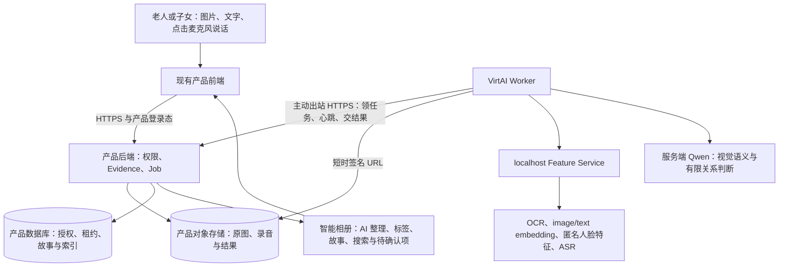

# SGX 自动分类与归纳：全栈工程师接手说明

> 日期：2026-10-07（Asia/Shanghai）
> 用途：单独转交给全栈工程师，说明从哪里开始、负责什么、按什么阶段推进。
> 状态：`internal_release_candidate`，可以开始产品接入；尚未放行内部用户稳定使用。
> 仓库：[GOATWEN6/SGX-classification](https://github.com/GOATWEN6/SGX-classification/tree/codex/classification-t1-external-20261006)
> 交付分支：`codex/classification-t1-external-20261006`，不要默认从 `main` 接入。
> 算法云端基线：`82cab23cd81a2f0b06a3c00606025153a2816468`；本说明新增前的仓库基线为 `bd84810b2ce5135e1e5fb8b53185ad9ec9a8e7d2`。

## 1. 现在能否接手

可以立即接手并开展 T2 产品接入。分类核心、Prompt/校验、Worker、OCR、图文 embedding、授权后匿名人物候选、ASR 运行代码和 T1 实验页面已提供；云端模型已有加载证据，真实图文分类、故事组织和结果持久化已成功运行。

接手意味着把这些能力接到现有产品后端、存储和智能相册页面。当前没有已证明稳定的公网产品接口，也没有完成 Notebook 空闲回收之外的常驻生命周期验证，因此还不能让用户拿仓库或 SSH 直接使用完整产品。

|能力|当前证据|接入时的准确边界|
|---|---|---|
|图片与说明分类、当前批次故事组织|真实 Qwen/混合链成功，输出及结果可持久化复读|全栈接产品数据与 UI；最新版六图尚未付费重测|
|用户点击麦克风，ASR 后参与分类|T1 有真实成功证据及录音参考实现|先接独立 ASR 前置任务，生成 `final_asr` 后创建分类 Job|
|新一轮检索旧内容|同会话两轮真实测试成功|当前返回相关候选，用于搜索与相册建议|
|人物候选|授权后检测/embedding/召回已接入|不等于确认姓名、亲属关系或稳定跨年代身份|
|跨轮自动合并成同一故事|尚未实现|算法侧继续补同事件验证与可撤回合并；全栈不可用向量相似度自行合并|
|稳定公网、最多 10 人内部使用|尚未完成产品联合验收|需完成 T2 与常驻部署后才进入 T3|

本仓提供分类算法与接入参考。接入现有新版产品，不要求替换全站框架、另做一套回忆录产品或重新训练模型。

## 2. 按什么顺序阅读

先读本说明，再按负责的环节查阅以下材料。历史日报和旧测试报告用于追溯，不需要全部重读。

|顺序|材料|阅读重点|
|---|---|---|
|1|[全栈交付 README](https://github.com/GOATWEN6/SGX-classification/blob/codex/classification-t1-external-20261006/docs/algorithms/CLASSIFICATION_FULLSTACK_DELIVERY_README_V1.md)|可复用代码、目录、产品责任和交付限制|
|2|[全栈接入手册 v2](https://github.com/GOATWEN6/SGX-classification/blob/codex/classification-t1-external-20261006/docs/algorithms/CLASSIFICATION_FULLSTACK_INTEGRATION_GUIDE_V2.md)|第 1–5 节的业务/Worker 接口，第 7 节产品状态，第 10–12 节缺口与联调|
|3|[运行配置索引](https://github.com/GOATWEN6/SGX-classification/blob/codex/classification-t1-external-20261006/docs/algorithms/CLASSIFICATION_RUNTIME_CONFIGURATION.md)|模型、容量、非密钥参数、云端版本与配置边界|
|4|[本轮真实复测报告](https://github.com/GOATWEN6/SGX-classification/blob/codex/classification-t1-external-20261006/docs/algorithms/CLASSIFICATION_T1_TARGETED_RETEST_2026-10-07.md)|哪些真实链已通过，哪些失败保留，哪些结论尚无证据|
|后端实现时|[输入 Schema](https://github.com/GOATWEN6/SGX-classification/blob/codex/classification-t1-external-20261006/contracts/classification-ingestion-v2.schema.json)、[Worker Schema](https://github.com/GOATWEN6/SGX-classification/blob/codex/classification-t1-external-20261006/contracts/classification-worker-control-plane.schema.json)、[历史检索 Schema](https://github.com/GOATWEN6/SGX-classification/blob/codex/classification-t1-external-20261006/contracts/classification-historical-retrieval.schema.json)|直接引用当前版本，保留 scope、授权、哈希、租约、幂等和撤回语义|
|算法理解时|[完整算法指南](https://github.com/GOATWEN6/SGX-classification/blob/codex/classification-t1-external-20261006/docs/algorithms/CLASSIFICATION_ALGORITHM_COMPLETE_GUIDE.md)、[模型来源](https://github.com/GOATWEN6/SGX-classification/blob/codex/classification-t1-external-20261006/deploy/classification-worker/model-candidates.json)|算法原理、证据来源、开源许可。完整指南中的早期版本/状态以本说明与最新运行配置为准|
|部署时|[部署与回滚](https://github.com/GOATWEN6/SGX-classification/blob/codex/classification-t1-external-20261006/deploy/classification-worker/README.md)、[Worker 启动说明](https://github.com/GOATWEN6/SGX-classification/blob/codex/classification-t1-external-20261006/deploy/classification-worker/runtime/README.md)、[Feature Service](https://github.com/GOATWEN6/SGX-classification/blob/codex/classification-t1-external-20261006/services/classification-feature-service/README.md)|隔离目录、模型加载、版本核验、激活/回滚与服务边界|

`contracts/README.md` 包含按日期保留的历史说明；接口字段以当前 Schema 为准。旧报告中的 Prompt/版本和失败保持原样，不改成新版本。

## 3. 产品怎样调用



公网可访问的是产品后端 HTTPS 地址。Worker 主动连接它，无需从产品后端连接 GPU 入站端口；用户不需要 SSH。浏览器只持有产品登录态，模型密钥和 Worker 服务凭据留在服务端。

录音路径是：`麦克风 → PCM WAV → 产品存储 → ASR 前置 Job → final_asr Evidence → 分类 Job → 智能相册`。原始音频不直接塞进当前分类 lease。用户修改 ASR 后保存为有来源与版本的修订，保留原转写；不能静默覆盖用户原文。

原图、原始录音和权威产品状态归产品后端管理；VirtAI 只计算并持有短时任务副本。云端临时目录删除、Worker 重启不得导致相册丢失。

## 4. 全栈负责什么，复用什么

|范围|全栈需要完成|直接复用或保持兼容|
|---|---|---|
|产品后端|登录/家庭/主体权限、上传完成复验、Evidence/Job 表、租约事务、取消与过期结果拒收|输入/结果/复核 Schema、版本字段、错误与状态语义|
|存储|原始媒体、结果 artifact、哈希/大小验证、短时读写签名 URL、备份和删除传播|Worker 下载、哈希校验、结果上传与临时清理|
|历史检索|受权限约束的向量持久化与索引、Top-K 查询、撤回失效|历史检索 `.2`、模型 revision/维度匹配、候选投影语义|
|前端|图片/说明/麦克风、后台状态、结果与原文、智能相册、确认/纠错|T1 页面交互和结果投影参考；不直接照搬实验室鉴权|
|云端运维|连接正式后端、服务凭据注入、常驻实例、supervisor、readiness/告警与恢复|既有模型制品、冻结 release、Worker/Feature Service 及回滚方案|
|算法|发现问题时提供最小案例与日志摘要给算法侧|Prompt、Guard、OCR/embedding/ASR、人脸候选、稀疏组织核心|

跨轮同事件验证、自动故事归并、稳定人物参考策略和真实质量验证仍由算法侧继续完成；不要求全栈用固定分数猜测这些结果。长期 Memory 保持独立确认机制，分类候选不直接写入。

## 5. 首轮接入必须覆盖的接口

### 5.1 产品侧

按接入手册第 4 节实现上传初始化/完成、创建/查询/取消分类 Job、复核和故事动作。补充产品自己的录音上传、创建/查询 ASR Job，以及相册读取接口，并冻结产品 OpenAPI。已有文件存储能力直接复用。

### 5.2 Worker 分类与历史查询

|方法/路径|目的|契约依据|
|---|---|---|
|`POST /internal/v1/classification/leases`|原子领取匹配版本和权限的任务|Worker 控制面 `.v1`|
|`POST /internal/v1/classification/jobs/{jobId}/execution-context`|当前租约绑定的 Job/Guard/策略快照|Worker 控制面 `.v1`|
|`POST /internal/v1/classification/jobs/{jobId}/heartbeat`|续租、进度与取消/撤权反馈|Worker 控制面 `.v1`|
|`POST /internal/v1/classification/jobs/{jobId}/complete`|接收结果 artifact 与 usage|Worker 控制面 `.v1`|
|`POST /internal/v1/classification/jobs/{jobId}/fail`|保存稳定错误、实际调用和费用|Worker 控制面 `.v1`|
|`POST /internal/v1/classification/jobs/{jobId}/cancel-ack`|确认任务已停止并清理|Worker 控制面 `.v1`|
|`POST /internal/v1/classification/jobs/{jobId}/historical-query`|查询同授权 scope 的历史候选|历史检索 `.2` 与现有 HTTP 控制面实现|

历史查询路径已存在于 [HTTP 客户端](https://github.com/GOATWEN6/SGX-classification/blob/codex/classification-t1-external-20261006/deploy/classification-worker/runtime/http-clients.mjs)，路由参考是 `src/app/internal/v1/classification/jobs/[jobId]/historical-query/route.ts`。历史特征只在可信 Worker/后端间流转，不返回浏览器向量或把 rank 解释成概率。

同一授权有效期内的多轮追加应维持一致的 session/scope/authorization revision。授权真实变化时重新过滤或建立新的合法索引快照；不得为了召回历史绕过授权匹配。

### 5.3 Worker ASR 前置任务

当前独立协议是 `classification-asr-worker.1`，接口为：

```text
POST /internal/v1/classification/asr/leases
POST /internal/v1/classification/asr/jobs/{jobId}/heartbeat
POST /internal/v1/classification/asr/jobs/{jobId}/complete
POST /internal/v1/classification/asr/jobs/{jobId}/fail
```

当前 ASR 请求校验在 [t1-asr-prejob.ts](https://github.com/GOATWEN6/SGX-classification/blob/codex/classification-t1-external-20261006/src/lib/algorithms/classification/t1-asr-prejob.ts)，Worker 在 [asr-worker-runtime.mjs](https://github.com/GOATWEN6/SGX-classification/blob/codex/classification-t1-external-20261006/deploy/classification-worker/runtime/asr-worker-runtime.mjs)。**ASR 尚无独立的语言无关 JSON Schema**；全栈接入前须依据现有 Zod/运行实现把实际路径、请求/响应、身份绑定和状态码冻结进产品 OpenAPI，算法侧配合核验，不能声称分类 Worker Schema 已覆盖 ASR。

音频通过 lease 返回的短时下载 URL 读取；可使用产品对象存储。现有 `/internal/v1/classification/asr/artifacts/{jobId}` 是 T1 文件存储参考，不要求产品保留相同下载路径。ASR 的身份包含 session、授权 revision 和原音频 SHA；过期/撤权结果必须拒收。当前 ASR v1 固定 attempt 1，没有自动重试或独立 `cancel-ack` 接口；新增重试/取消语义须显式升级，不能套用分类 Job 假装已有。

## 6. 环境和配置交接

### 6.0 服务启动与端口边界（2026-10-08 更新）

2026-10-08 实测已恢复真实 Feature Service，`healthz=200`、`readyz=ready`，
OCR、图文 embedding、face、ASR 均 loaded；开发控制面隧道已断，空转 Worker 已停止，
旧日志与算法 release 保留。详见 [服务恢复与全栈接入说明](CLASSIFICATION_SERVICE_RECOVERY_2026-10-08.md)。

源码入口是 `deploy/classification-worker/bin/start-stack.sh`；云端 release 包目录
实际为 `current/worker`，不是 `current/deploy/classification-worker`。
本次新工具独立部署在持久目录，使用：

```bash
cd /gemini/code/sgx-classification/shared/tools/service-operator-20261008-r1/worker
SGX_RELEASE_SHA="$(basename "$(readlink -f /gemini/code/sgx-classification/current)")"
bash bin/status-stack.sh
SGX_EXPECTED_RELEASE="$SGX_RELEASE_SHA" bash bin/start-feature-service.sh
```

诊断失败返回非零；根据报告处理缺口，不因存在 PID 就宣称服务可用。
冷启动 `readyz=503` 表示需用 [部署 README](../../deploy/classification-worker/README.md)
的冻结素材命令预热；随后执行 `bash bin/start-stack.sh --release "$SGX_RELEASE_SHA"`
核验版本和 readiness。Feature Service 只监听 `127.0.0.1:8765`，没有完整分类/归纳
上传入口；Worker 没有监听端口，主动通过 HTTPS 调用产品控制面。

**产品测试后端由全栈部署，云端模型与 Worker 配置由算法侧落实；Owner 不需要自行实现后端。**
全栈提供真实的 `SGX_CONTROL_PLANE_BASE_URL`、实现本文 §5 路由，并通过 Secret
渠道注入服务凭据后，才执行：

```bash
bash bin/start-stack.sh --release "$SGX_RELEASE_SHA" --worker
```

当前没有可以交给全栈直接访问的算法公网 URL。全栈需提供产品后端 staging HTTPS
基地址和 OpenAPI/control-plane 路由；SSH、8765、GPU、内部 metrics 都不属于产品入口。
新启动入口会拒绝占位地址、未就绪模型及不可达/缺失的 lease 路由。
此入口不承担常驻 supervisor，平台仍需常驻实例、健康重启与告警，解决 Notebook idle 回收。

|项目|当前配置或要求|
|---|---|
|运行位置|VirtAI：`/gemini/code/sgx-classification`；所有下载、模型、发布制品与日志写持久盘|
|可重建环境|`/quota/sgx-classification`；不把权重/下载放这里|
|临时副本|`/tmp/sgx-classification/jobs`；结束、取消或超时后清理|
|内部模型服务|`127.0.0.1:8765`；不对公网开放|
|OCR/embedding|RapidOCR 3.9.2；Chinese-CLIP base-patch16-zh、512 维；固定 revision 见运行配置|
|人物/ASR|YuNet/SFace 128 维匿名特征；SenseVoiceSmall/FunASR 1.4.16|
|语义模型|`qwen3.7-flash-2026-07-15`；Prompt `.16`、validation `.4`|
|开关|Feature Service：`SGX_ASR_ENABLED=true`、`SGX_FACE_MATCHING_ENABLED=true`；Worker：`SGX_ASR_PREJOB_ENABLED=true`、`SGX_PERSON_MATCHING_ENABLED=true`；仍逐项检查 consent|
|入口容量|8 图/轮、10MiB/图、80MiB/轮；文字/final ASR 64KiB/项；JPEG/PNG/WebP|
|录音|麦克风参考实现输出 16kHz、16-bit、mono PCM WAV；T1 默认 2 分钟，服务端防御上限 50MiB/10 分钟|
|并发与重试|分类 Worker 1，ASR Worker 1，VLM 配置上限 2；付费自动重试 0；用户数量不等于并发任务数|

部署负责人与全栈先交换 staging HTTPS 基地址、接口 OpenAPI、可访问的存储签名 URL 约定和运维责任人。服务凭据由团队 Secret 渠道分别注入，不发 `.env.local`、SSH 私钥或包含凭据的日志。`nonsecret.env.example` 的占位身份及过期授权示例不能原样启用。

常驻运行必须解决平台 idle 回收；改文件名为 `.py`、使用 nohup 或保持 SSH 连接均不能证明解决。需要平台常驻模式或固定生命周期实例，并配置监督、恢复和 readiness 核验。当前没有已证明稳定的公网 staging URL。

## 7. 计划与阶段

T0/T1 是算法与实验页面已有证据阶段；全栈从 T2 开始。T2 的联调是把真实产品前端、后端、存储与云端算法串起来，用相同 Job 验证输入、状态、结果和失败恢复。T3 才是最多 10 名内部用户在产品中体验。

|阶段|负责人与工作|交付物/退出条件|
|---|---|---|
|T2-A：接口映射|全栈阅读本说明、盘点现有后端/存储；双方对齐分类/ASR/历史查询|staging HTTPS 地址、OpenAPI、权限/scope 映射、字段版本和责任人明确；ASR 协议差异逐项记录|
|T2-B：后端闭环|全栈实现对象复验、Evidence/Job/Attempt、租约事务、结果接收和历史索引|单个已授权图文任务能自动领取、计算、入库和复读；取消/过期结果不覆盖当前结果|
|T2-C：产品体验|全栈接麦克风与 ASR 前置、上传说明绑定、相册/搜索、候选与确认|用户能上传和说话；页面显示进度、AI 整理、原文/最终 ASR、结果和可恢复错误；刷新数据不丢|
|T2-D：常驻与联合验收|运维落实常驻实例并与全栈/算法侧执行下节五类案例|脱离开发机 SSH 桥接，readiness/版本正确、重启可恢复；五类案例有真实产品证据和问题清单|
|T3：最多 10 人内部测试|Owner 决定放行；全栈维护，算法侧按集中反馈修复|记录使用量、费用、延迟、整理质量和失败；不承诺跨轮自动合并或跨年代身份准确率|

执行顺序：A 先冻结接口 → B 跑通一条真实任务 → C 补语音/相册/历史体验；D 的环境准备可与 B/C 并行。T3 须等前述放行条件具备。跨轮自动故事归并由算法侧并行推进，按独立版本上线，不能拖延已有能力的接入，也不能列为当前已完成功能。

## 8. 五类最小联合验收

|案例|实际操作|必须核对的结果|
|---|---|---|
|图文|单图和一组 3–6 图，补充对应文字；包含一条未指定图片的批次说明|后台任务真实执行；标题/摘要/标签/故事有来源；批次说明不被擅自改成单图用户事实；原图/原文/结果入库|
|麦克风 ASR|用户直接说话，停止后得到转写，再进入图文或纯语音文本整理|ASR 真实运行；音频与 final ASR 分别持久化；ASR 错误和分类错误分开；编辑后来源可追溯|
|多轮追加|同一会话上传第二轮新内容并刷新相册|第一轮结果保留；第二轮有受权限约束的历史候选；不同家庭不得串联；候选不能伪装成自动故事合并|
|取消/撤回|取消运行 Job、撤回一条 Evidence，尝试接收旧结果|立即按协议停止或拒收；旧结果不能复活被撤回内容；相册、索引与关联失效传播可核对|
|服务恢复|受控重启 Worker/Feature Service，保留产品数据库与对象存储|任务状态明确，临时副本清理；旧 lease 不能覆盖新 attempt；历史结果仍存在；readiness 恢复后继续服务|

每例记录 job/run/attempt、素材授权、代码/模型/Prompt 版本、状态、实际调用/费用、延迟和产品截图；失败保留，修复后新建复验记录。以使用任务和输出证据判断功能，不把工程测试总数当作进度或准确率。

沿用已有模型/算法证据，先完成一次无费用协议联调，再对产品新增链路做真实验证。只对新失败或改动影响补测，不重跑全部历史矩阵。

现有累计授权为 200 次/¥50，已用 193 次/¥23.243669，剩 7 次；**不能承诺剩余 7 次覆盖完整 T2 多图矩阵**。付费测试前核对最新账本，列出需新增的案例与最大调用数；额度不足时先补授权，不能越过调用上限。服务器本地 ASR/OCR/embedding 不计 Qwen 请求，但仍消耗计算资源。

## 9. 全栈第一条回复需要提供什么

请全栈返回：产品后端语言/部署方式、可从 VirtAI 访问的 staging HTTPS 基地址、现有数据库/对象存储是否支持短时签名读写 URL、接入责任人、预计先完成 T2-A/B 的时间。需要提供字段和能力说明，不在聊天或仓库发密钥。

算法侧据此对齐路径与版本、配置 Worker 出站地址，参与第一条真实任务及后续五类联调。公网后端、产品数据库/存储事务、用户页面归全栈；模型适配、Prompt/规则、跨轮归并和语义缺陷归算法侧；常驻环境由运维/平台负责人落实。
