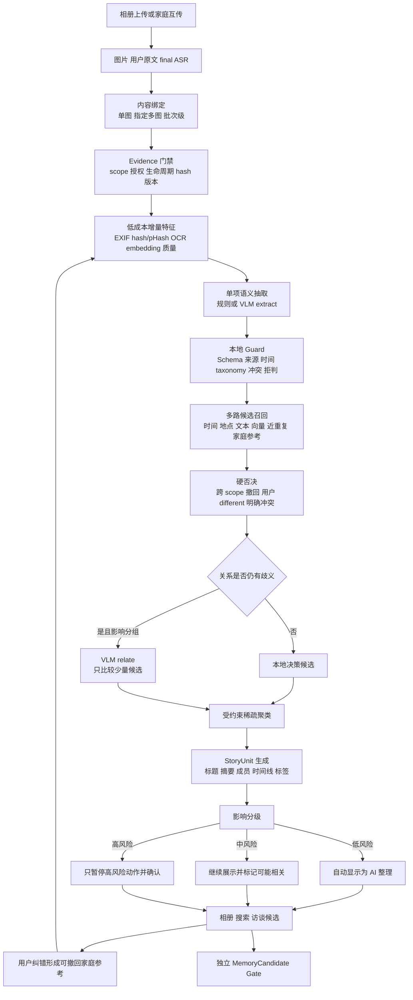

# SGX 自动分类与归纳：产品目标、完整流程与真实模型验证 Gate

> 日期：2026-10-01  
> 状态：T0/T1 主线重新对齐；14 次真实模型多图功能实验已完成，核心成组 Gate 未通过
> 适用范围：相册上传与家庭双端互传中的图片、用户文字、final ASR  
> 当前模型基线：`qwen3.7-flash-2026-07-15` / Prompt `sgx-five-facets.12`

## 1. 唯一主目标

系统接收一张或多张图片，以及可选的用户文字和 final ASR，自动完成：

1. 识别每项内容中有证据支持的人物线索、时间、地点、事件、场景和主题；
2. 判断哪些内容属于同一事件或故事，哪些应分开，哪些证据不足；
3. 生成可直接展示在智能相册中的 AI 标题、简短摘要、成员内容、时间线和筛选标签；
4. 对低风险结果自动整理，对冲突、不确定和高影响动作局部复核；
5. 保存来源和版本，使删除、撤权、纠错后能失效或重算；
6. 将经过允许的候选提供给搜索、访谈和 MemoryCandidate，但不把 AI 猜测直接写成用户事实。

产品中的主要单位是**事件/故事**。人物、时间、地点、场景和主题首先用于筛选、检索、召回和解释。

## 2. 输入与输出

### 2.1 输入

- `album_upload`：用户向智能相册上传老照片、新照片和说明；
- `family_transfer`：老人和子女互传纯图片、纯文字、纯语音转写或任意组合；
- 一张或多张 JPEG/PNG/WebP；
- 单图说明、指定多图说明或批次级说明；
- final ASR。partial ASR 不进入分类；原始音频继续由 ASR 链保存；
- 用户明确绑定、确认、拆分、合并和拒绝关系；
- 已授权的家庭参考，例如经过确认的人物、事件、地点别名和纠错。

### 2.2 产品输出

- `StoryUnit`：AI 标题、简短摘要、成员图片/文字/转写和主时间；
- 多维标签：人物候选、时间、地点、事件、场景、主题、内容类型；
- 时间线与按人物/时间/地点/事件/主题的相册筛选；
- `same / different / unknown` 的候选关系及其证据；
- `AI 整理 / 可能相关 / 需要确认 / 无法判断` 等状态；
- 可追溯的 Evidence、模型/Prompt/规则版本、费用与耗时；
- 搜索候选、访谈候选和独立的 MemoryCandidate。

用户原文和原始媒体永远保留。AI 标题和摘要是派生展示内容，不能覆盖原文。

## 3. 从输入到输出的完整处理流程

### 3.1 关键原则

- 不做全图库两两 VLM 比较。新内容先提取一次低成本特征，再检索 top-K 候选；
- VLM 负责难语义、关键关系和故事摘要，本地规则负责安全边界和可复现约束；
- 缺少证据时输出 unknown/abstain，来源冲突时保留 conflicted；
- 一个环节失败时保留 last-known-good，不能用半成品覆盖当前相册；
- 用户明确关系优先于 AI；AI 自动展示仍不等于 `user_confirmed`；
- 姓名、亲属关系、敏感事实、跨端分享和长期 Memory 晋升继续使用独立确认机制。

## 4. 当前实现与目标流程的对应关系

|环节|当前状态|结论|
|---|---|---|
|图片/文字/final ASR 与绑定|已实现版本化契约和适配|可用于 T0/T1|
|Evidence、授权、撤回、删除、迟到拒收|已实现 v2 生命周期与测试|工程边界较完整|
|真实 VLM 单图 extract|已用 Qwen 完成真实调用|可行，但语义质量还需扩大验证|
|本地 Guard 与拒判|已实现并在真实响应中触发|能阻止部分格式、时间和提示注入问题|
|多图 relate 与分组|底层算法存在|尚未经过页面端真实模型产品测试|
|StoryUnit 标题和摘要|规则候选已实现|能生成，但当前文案质量不够稳定|
|OCR、pHash、embedding、ANN|只有目标设计和 exact baseline|尚未接入正式混合链|
|渐进家庭参考|数据结构和策略已定义|人物/事件参考的产品闭环未完成|
|异步任务、取消、撤权和恢复|v2 核心已实现|正在接入 HTTP/UI；尚未形成页面真实闭环|
|生产数据库、对象存储、队列、鉴权|未实现|属于全栈 T2，不阻塞算法 T0/T1 判断|

## 5. 五项审计结论

### 5.1 正确性：边界正确，语义效果尚未达 Gate

做得较好的部分：三类 Evidence 分开、来源可追溯、用户关系优先、unknown/conflict 保留、敏感结果不直接进入 Memory、跨 scope 和撤回结果被拒绝。

仍不足的部分：现有真实模型运行只有 9 次请求，且包含修复后的重复调用，主要覆盖约 6 类单图场景。没有足够证据证明多图 same/different、事件聚类、批次说明绑定和组级摘要正确。

### 5.2 可行性：单图产品链可行，多图核心链待验证

真实 Qwen 已经从图片、用户文字和 final ASR 生成可解析观察，并经过本地 Guard 和组织器产生产品结果。9 次累计记账约 `¥0.110598`，单次中位等待约 `6.687 秒`，说明 Flash 模型作为困难语义层在成本与时延上可行。

但当前页面链仍以单图为主。产品核心价值是多图归组和故事整理，因此完成多图真实模型轮次之前，不能称“自动分类与归纳已经完成”。

### 5.3 健壮性：底层较强，真实页面尚未完全继承

已有幂等、取消、授权复查、超时、CAS、旧版本/迟到结果拒收和 0 自动重试。真实调用中 2 次非法/不兼容输出被保留为失败，说明系统没有把错误伪装成成功。

风险在于真实 Provider 的页面路径尚未全部接入 v2 生命周期。必须完成接线后再验证取消、撤权、删除和晚到响应确实不会改变当前 StoryUnit。

### 5.4 可读性：模块职责清楚，文档入口过多

代码已经分为 ingestion、Stage A、Guard、retrieval、organization、lifecycle 和 provider adapter，职责清楚。问题是历史 Spec、报告和实验说明较多，部分状态已经过期。

本文件作为“产品目标与验证 Gate”入口；算法细节继续以 `CLASSIFICATION_ALGORITHM_COMPLETE_GUIDE.md` 和代码版本为事实源。后续报告必须引用本文件中的目标，不再用单个工程测试数量代替产品完成度。

### 5.5 高效性：单图便宜，当前多图方法仍需混合优化

当前 VLM 单图调用成本低，但若所有图片都 extract，再对候选逐对 relate，图片数量增加后时延和 token 会增长。正确方向是：

1. 先接入 EXIF、hash/pHash 和 OCR；
2. 再接入 image/text embedding top-K；
3. VLM 只处理无法由低成本信号决定、且会改变分组的候选；
4. 标题摘要按 StoryUnit 生成一次，不为每张图片重复生成；
5. 缓存按内容 hash、授权、模型、Prompt 和算法版本失效。

## 6. 真实模型已知反馈

旧授权共执行 9/10 次，状态为 5 succeeded、2 needs_review、2 failed。它证明了真实 API 链路，但不是 9 个独立场景的准确率。

积极结果：

- 图文 ASR 可以共同支持 `工作 / 1992 / 工作场所`；
- 2008 与 2010 冲突没有被静默覆盖；
- 图片内提示注入被 Guard 删除；
- 纯图片缺少事件证据时可以少判断；
- 人物只形成未命名区域，没有擅自猜姓名或关系。

产品问题：

- 两个输出仍是“未命名故事 / 包含 1 项内容”；
- 部分摘要罗列衣着与站位，不像相册故事摘要；
- 一个早期结果把“不是毕业照”误读为“毕业”，修复后才消失；
- OCR 小字、时间角色和冲突完整性仍不稳定；
- 没有真实运行多图 same-event/different-event 与组级摘要。

## 7. 下一轮真实模型功能实验

使用已经独立接受的合成 v2 数据集：

- release：`sgx-synthetic-multimodal-testset-v2-spec-2.0.0-r1`；
- digest：`sha256:2d18d96933f5c85454357eedee45cb185c9ad5eefac6f21e513ce0166ded0f2a`；
- claim boundary：只验证合成功能场景，不声称真实家庭准确率。

建议固定 20 次请求、总费用上限 ¥5、0 自动重试、关闭人物匹配，继续使用 Qwen3.7 Flash。计划覆盖：

|功能场景|候选素材|预计请求|
|---|---|---:|
|纯图片应拒绝补造事件|E002|1|
|图片+文字+ASR 联合分类|E003|1|
|文字与 ASR 时间冲突|E011|1|
|图片/文字/ASR 提示注入|H011/H012 中选 1|1|
|同一花园活动的两张图应合并|E013+E014|3|
|同类但不同年份的毕业照应分开|H005+H006|3|
|同一趟旅行与另一趟旅行|H008+H009+H010|最多 6|
|失败后定点复测余量|只允许同批已登记样例|最多 4|

这轮主要回答四个产品问题：

1. 能否把应该在一起的多张图片自动组成一个 StoryUnit；
2. 能否把相似但不同事件分开；
3. 标题和摘要是否像用户可读的相册内容；
4. 冲突或模型失败时是否只影响局部，而不破坏已有分组。

## 8. 建议的 T1 功能 Gate

以下是首轮内部 Alpha 的建议值，不是生产准确率：

- 输出可追溯到 Evidence：100%；
- 跨家庭/主体串数据：0；
- 身份、亲属关系、敏感事实被静默确认为事实：0；
- 结构有效且能形成产品结果的批次：至少 95%；
- 明确不同事件发生严重误合并：0；
- 明确同一事件能正确成组：至少 90%；
- 低风险内容无需逐项确认的自动整理覆盖：至少 75%；
- 标题/摘要经产品负责人判断“可直接展示或轻微修改即可”：至少 80%；
- 单图 p50：不高于 10 秒；3–5 图批次 p95：不高于 60 秒；
- 单图平均模型费用目标：不高于 ¥0.10；批次必须单独报告总成本。

未达 Gate 时按错误类型处理：抽取错、召回漏、关系错、聚类错、摘要差、Guard 误杀或产品策略错。禁止只调一个总阈值掩盖不同问题。

## 9. 仍需产品负责人决定的事项

|决策|建议默认值|影响|
|---|---|---|
|T1 Gate 是否采用第 8 节数值|采用，首轮后只根据成组错误类型调整|决定何时可交给全栈 T2|
|下一轮是否只测 Qwen，暂不做 GLM A/B|只测 Qwen；闭环通过后再用同一冻结小集对照 GLM|避免把预算分散到供应商比较|
|标题摘要风格|事实型家庭相册文案：标题 8–18 字，摘要 1–2 句，优先人物关系、事件、时间和地点，不罗列衣着站位|决定摘要 Prompt 与人工评分准则|
|人物身份功能是否进入本轮|继续关闭；只验证未命名人物组|避免生物识别把主线拖慢|
|低成本本地组件接入顺序|多图 VLM 基线后，先 EXIF/pHash/OCR，再 embedding/ANN|决定性能优化顺序|
|新一轮付费授权|Qwen3.7 Flash，最多 20 次、总费用上限 ¥5、0 自动重试、关闭人物匹配、48 小时有效|这是唯一必须明确授权后才能执行的事项|

数据库、ORM、Redis、生产队列、正式鉴权和部署不需要产品负责人在本轮决定；它们属于全栈 T2。当前算法侧先交付可运行、可解释、可替换的接口和 T0/T1 证据。

## 10. 到“可以交给全栈”的剩余最短路径

1. 完成 v2 生命周期到 HTTP/UI 的最小接线；
2. 用 Mock 跑通多图提交、进度、结果和取消，不新增算法逻辑；
3. 执行第 7 节真实模型批次并记录产品功能反馈；
4. 修复真正影响成组、摘要或拒判的错误，不围绕单个样例反复调参；
5. 按第 8 节 Gate 形成 T1 报告；
6. 交给全栈工程师进入 T2，并保留算法 Provider、规则与评分器的替换边界。

## 11. 2026-10-02 真实模型批次结果

第 7 节批次已经执行：7/7 个任务完成，实际调用 14 次，输入 56,199 Token、输出 11,414 Token，记账费用 ¥0.122226，0 自动重试，人物匹配关闭。真实模型链路、Guard、关系请求和费用记账均能运行。

产品 Gate 未通过。`H008` 与 `H009` 明确属于同一趟三日旅行，模型理由也承认“同一事件中的不同时间点”，但最终返回 `different`，导致同一故事被拆分；普通家庭用餐纯图还被过度推断为“家庭聚会”。离线产品回放显示摘要大量罗列衣着和站位，时间冲突没有精确传播到故事状态。

完整证据与最小修复计划见 [真实模型产品功能实验报告](evidence/2026-10-02-classification-real-product-functional.md)。

当前完成度应表述为：**真实 Qwen 多图链路已跑通，安全拒判和不同事件分离有正向证据；同一故事自动成组、时间角色传播和用户可读摘要尚未通过产品功能验证。**
