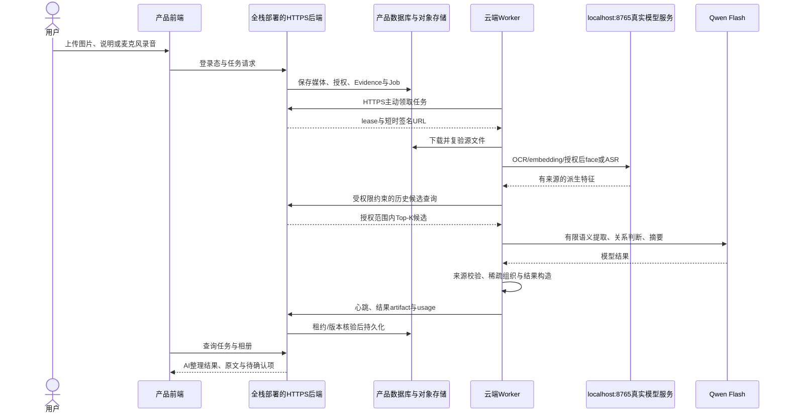

# SGX 云端服务恢复与全栈接入说明

> 日期：2026-10-08；接续全栈反馈“没有算法服务，只有空转 Worker”。
> 算法版本保持 `82cab23cd81a2f0b06a3c00606025153a2816468`，模型与 Prompt 未更换。
> 本次恢复真实本地模型服务，修正启动交付；公网完整分类接口与产品任务闭环仍待全栈后端接入。

## 1. 发生了什么，已经处理了什么

本次 SSH 实测与工程师反馈一致：Feature Service PID 已失效，`8765` 无监听，
日志记录平台 `ORION_TASK_IDLE_TIME` 回收。Worker PID 仍在运行，每两秒分别报
`lease_poll_failed` / `asr_lease_poll_failed`，日志约 12 MB。控制面配置仍为
`http://127.0.0.1:3139`：该端口接受 TCP 连接，但 HTTP 请求立即断开，属于旧开发
隧道残留，不能视为可达的产品后端。

还有一个文档缺陷：仓库路径 `deploy/classification-worker` 被当成云端 release 路径。
实际 release 目录是 `current/worker`，旧文档命令里的
`current/deploy/classification-worker` 不存在。新增统一入口的版本核验也已改为实际
HTTP JSON 字段 `gitCommit/releaseId`，并修正只读变量与加载配置的冲突。

已执行以下恢复，旧失败、账本、日志和发布全部保留：

1. 向已核验身份的空转 Worker 发 `SIGTERM`，确认 classification/ASR Worker 停止；
   不删除或重试旧 Job。
2. 备份旧 Feature Service 日志，使用既有离线 Python 环境启动服务；没有下载或安装。
3. 用已冻结合成素材预热真实 OCR、image/text embedding、face、ASR。
   五个组件均 HTTP 200；embedding 为 512 维，face 为 128 维，ASR 非空，
   `/readyz=200 ready`；`/version.gitCommit` 与当前算法 release 一致。
4. 补统一启动与只读状态工具。只对受影响的启动行为做聚焦验证，没有重复旧算法矩阵，
   没有新增 Qwen 请求。

这些结果证明恢复后的模型组件当前可用；它们不证明完整产品闭环、现实家庭准确率、
公网可用性或 Notebook 平台常驻能力。

## 2. 现在究竟交付哪个端口

|入口|当前用途|全栈如何使用|
|---|---|---|
|云端 `127.0.0.1:8765`|OCR、embedding、匿名人脸特征、ASR；已恢复 ready|同机 Worker 调用，或授权运维通过 SSH 转发做诊断；接受同机文件路径，不是产品上传/完整分类入口|
|云端 `127.0.0.1:3139`|原开发控制面隧道，HTTP 已断|不能作为正式接入地址，Worker 暂停等待替换|
|Worker|领取任务、调用模型、分类/组织、回传结果|无监听端口；连接全栈部署的 HTTPS 控制面|
|SSH `30022`|运维连接|用于部署和排查，不承载产品 HTTP API|
|`9091`|内部 metrics|非产品接口，不开放公网|
|本地 `3137/3140`|T1 页面/临时窄网关|依赖开发机，不作为团队常驻服务|
|正式产品 HTTPS 后端|用户上传、创建/查询任务、取相册结果|由全栈部署；基地址、鉴权和 OpenAPI 确认后由算法侧接 Worker|

**当前没有一个可直接交给全栈、用于外网完整自动分类与归纳的稳定公网端口或 URL。**
把 `8765` 映射到公网只能得到模型组件边界，且其输入是云端本地路径，不能据此宣称完整分类已接入。
现有正式设计是 Worker 主动访问产品后端，无需开放 GPU 入站端口。

需要诊断模型健康时，授权运维可以使用：

```bash
ssh -N -L 18765:127.0.0.1:8765 -p 30022 <授权的SSH登录地址>
curl --fail http://127.0.0.1:18765/readyz
curl --fail http://127.0.0.1:18765/version
```

SSH 密钥通过团队授权运维渠道配置，不在仓库或文档共享私钥。此方式只验证组件，
不把用户浏览器接到该端口。

## 3. 全栈、算法侧和 Owner 分别做什么

产品测试后端由全栈工程师部署，直接复用他已有的产品后端、数据库和文件存储。
Owner 不需要自己写后端或建另一套系统。算法侧负责云端模型服务、Worker 配置与
真实分类链故障定位；平台/运维负责实例常驻和公网产品部署的运行生命周期。



全栈现在先读 [接手说明 §5](CLASSIFICATION_FULLSTACK_TAKEOVER_GUIDE_2026-10-07.md)
和 [接入手册 v2](CLASSIFICATION_FULLSTACK_INTEGRATION_GUIDE_V2.md)，完成：

1. 返回可从 VirtAI 访问的 **staging HTTPS 基地址** 与接入责任人。
2. 实现分类 lease、execution-context、heartbeat、complete、fail、cancel-ack、
   historical-query；语音使用独立 ASR lease/heartbeat/complete/fail。
3. 复用产品存储的短时签名 URL，冻结实际 OpenAPI 与权限/scope/版本映射。
4. 通过 Secret 渠道注入 Worker 凭据；算法侧设置控制面地址并启动 Worker。
5. 先用一个图文 Job 核对真实领取、计算、结果入库与刷新复读，再补麦克风与多轮追加。

源码和协议已有，不要求全栈重写算法、模型或 Prompt。如果全栈需要“后端直接请求一个
独立算法 HTTPS API”，双方需要明确变更交付形态并补独立任务网关；当前 Worker pull
设计不能被描述成已经存在的独立公网 API。

## 4. 运维启动与诊断

旧算法 release 不原地覆盖。此次操作工具在持久 SGX 目录独立冻结：

```text
/gemini/code/sgx-classification/shared/tools/service-operator-20261008-r1/
  SHA256SUMS
  worker/bin/start-stack.sh
  worker/bin/status-stack.sh
  worker/bin/start-feature-service.sh
  worker/bin/start-worker.sh
  worker/bin/layout-lib.sh
  worker/tools/warm-feature-service.py
  worker/tools/status-stack.py
```

在云端运行：

```bash
cd /gemini/code/sgx-classification/shared/tools/service-operator-20261008-r1/worker
bash bin/status-stack.sh
SGX_RELEASE_SHA="$(basename "$(readlink -f /gemini/code/sgx-classification/current)")"
SGX_EXPECTED_RELEASE="$SGX_RELEASE_SHA" bash bin/start-feature-service.sh
```

诊断非零表示有待处理项，不是工具报错；状态含 `feature_service_not_ready`、
`control_plane_unreachable`、`worker_not_running` 等。配置和日志脱敏，工具不读取凭据文件、
不领取任务、不加载模型，空队列状态没有证据时不会伪称正常空闲。

冷启动预热的完整命令见 [部署 README](../../deploy/classification-worker/README.md)。
模型 ready 后，`bash bin/start-stack.sh --release "$SGX_RELEASE_SHA"` 核验版本和服务；
只有正式 HTTPS 控制面和凭据具备时才加 `--worker`。新入口不依赖旧开发隧道。

本次恢复没有改动平台 idle 机制。`nohup`、`.py`、保持 SSH 登录不等于平台常驻。
内部用户放行前仍需平台常驻推理实例/服务模式及进程监督。已存在的模型权重和所有
下载仍在持久盘，恢复不用重新下载。

现场工具部署已完成，7 项工具 SHA-256 通过；工具源码为
`4475f545634fc05b077606aa6aa4c00a6e3a289d`。统一启动入口实测 health/version/ready
检查通过并默认保持 Worker 停止。只读现场状态报告为
`/gemini/code/sgx-classification/shared/manifests/service-recovery-status-20261008T140139Z.json`，
准确记录模型就绪、控制面不可达及 Worker 未启动。无需新下载即可按本文命令排查和恢复。

## 5. 下一项及放行边界

当前模型组件已恢复；完整产品调用等待全栈后端地址、契约与授权配置。
在它们具备前不让 Worker 再对断开的隧道空转，也不把恢复预热变成重复付费评测。
接入后按图文、麦克风 ASR、同 scope 多轮追加、取消/撤回、服务恢复五类验证，
复用未受影响的历史证据，只补产品边界。

原累计授权 200 次/¥50；最新已结算证据为 193 次/¥23.243669，余 7 次。
本次无 Qwen 调用，余额未因本次服务恢复改变；新真实测试前再核对持久账本。
