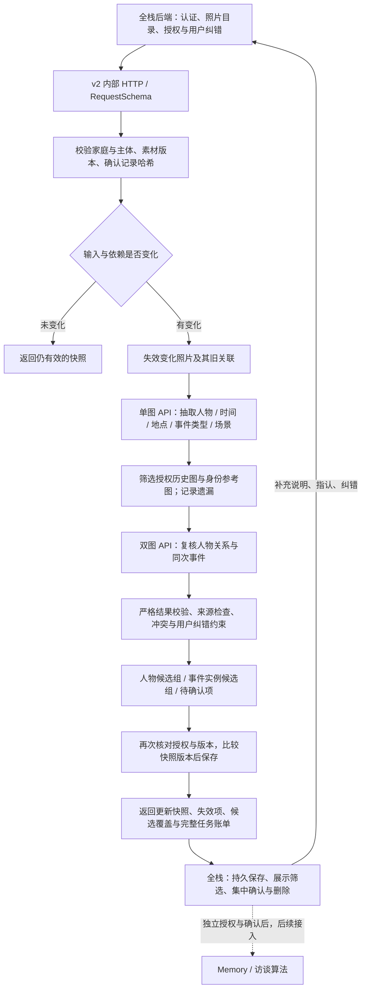

# 自动分类阶段 A：算法与全栈交接

日期：2026-09-14；2026-09-23 更新可信 Evidence 适配边界。当前范围是 D1–D3：五维分类、人物候选、同次事件聚合、纠错及增量更新。新 PRD 到位后核对产品接入层；当前实现不等于真实模型效果通过。验证记录见 [本地验收](CLASSIFICATION_STAGE_A_VERIFICATION.md)，真实实验方案见 [D4](CLASSIFICATION_D4_PROPOSAL.md)。

## 先用一个例子说明

用户上传两张“2008 年奶奶生日”的照片，一张在餐桌旁，一张在客厅。算法分别找出人物、时间、地点、事件类型和场景，再比较是否属于同一次生日；它可以保留两种场景，同时组成一个事件候选。后来上传 2009 年的生日照，应创建另一件事。

“这张脸是奶奶”由家人指认参考照片；后续匹配只产生“可能是这位已指认的人”的可纠正关联。家人把两人拆开后，模型不能在下次更新时悄悄合并回来。日常查看复用有效结果，新增照片或说明变化才触发受影响部分的处理。

## 实际模块与流程



|文件|职责|
|---|---|
|`src/lib/algorithms/classification/stage-a-contract.ts`|新契约的规范来源：Zod 运行时校验及 TypeScript 类型、来源和时间精度检查|
|`stage-a-provider.ts`（同目录）|真实多图请求适配、版本化 Prompt、图像哈希校验、超时和费用记账；可注入 Mock transport|
|`stage-a-association.ts`（同目录）|有界历史候选、人物/事件关系图、用户纠错、稳定事件组 ID 与退休 ID|
|`stage-a-pipeline.ts`（同目录）|变化识别、缓存、编排、授权复验与旧结果拒收；注入 SnapshotStore|
|`stage-a-http.ts`（同目录）|新版 HTTP、幂等、取消；必须注入可信后端授权回调|
|`harness/classification/stage-a-demo.mjs`|Mock transport 经过上述真实编排，演示 HTTP 链路|
|`harness/classification/stage-a-evaluation.mjs` / `stage-a-eval.mjs`|离线预检、授权校验、真实批次执行入口和固定分母计分|

2026-09-23 新增 `src/lib/algorithms/classification/stage-a-adapter.ts`。这是后端内部的确定性适配器，入口为 `adaptTrustedStageACatalog(catalog, {runId, trigger, budget})`，只接受已经完成鉴权、完整目录解析、正文读取和哈希校验的 `TrustedStageACatalog`。`catalog.evidence` 是当前 scope 的完整 Evidence 目录；`catalog.photos` 明确表达图片与文字/最终 ASR 的绑定。适配器返回 `request`、同版本的 `authorization`、只读当前授权图片的 `resolveImage` 和可审计的身份/来源映射。

接入时必须遵守以下边界：

- `actorId` 只表示当前操作人；`subjectId` 进入 Stage A scope；`ownerId` 和 `contributorId` 只保留在 audit，不互相替代。
- 图片、用户文字、最终 ASR 保持独立 `evidenceId`、哈希和修订号；不能把正文拼成一个 caption。
- 只有 `asr.final=true` 的转写可进入；原始音频和 partial ASR 会被拒绝。
- 每条文字/ASR 必须绑定到一张图片；未绑定、重复绑定、跨家庭/主体、未授权 consent、正文缺失、字节长度或 SHA-256 不匹配都会在模型调用前拒绝。
- 删除墓碑必须带同 ID 的上一版 `Photo`，适配为 `active=false`；没有上一版快照就拒绝，避免旧结果继续使用。
- 适配器不查询数据库、不下载对象、不写业务状态；这些责任属于全栈后端。客户端不能直接提交 `TrustedStageACatalog` 或 Stage A 内部 `Request`。

详细字段、错误码和停止条件见 [可信输入适配 Spec](../superpowers/specs/2026-09-23-classification-stage-a-integration-spec.md)。

已有 v1 JSON Schema、Fake Provider、`POST /v1/classify` 保留兼容。新能力独立使用 `classification-stage-a.1` + `POST /v2/classification/run`，不是 v1 原地扩字段。目前尚未提供新的 OpenAPI/JSON Schema 导出；全栈可直接读取 Zod 契约。未增加依赖。

## 新版 HTTP 怎么运行

在仓库根目录，使用已有 Node/npm 依赖：

```sh
npm run classification:stage-a -- --smoke
npm run --silent classification:stage-a
```

第一条自动完成启动、健康检查、POST、断言和关闭。第二条监听 `127.0.0.1:8788`，输出包含 `url` 和完整 `request` 的 JSON；请求有效期一小时。`CLASSIFICATION_STAGE_A_PORT` 可改端口，`0` 自动分配；Ctrl-C 关闭监听、取消任务并清理临时编译目录。服务不持久化，重启丢失内存快照。

|方法与地址|用途|
|---|---|
|`GET /healthz`|返回版本、mode；明确 realModelValidated=false|
|`POST /v2/classification/run`|JSON 请求经真实编排返回 StageResult；支持 upload / information_changed / correction / view|
|`DELETE /v2/classification/runs/:runId`|取消本 scope 的运行；取消后的 runId 不可直接重放|

HTTP 200 仍可能携带 `workflowStatus=failed`；调用方必须看业务结果。非法请求返回 400、授权不符 403、同一 scope 内同 runId 不同 payload 为 409、容量满为 429；不同家庭/主体可安全使用相同 runId。相同在途请求共享 Promise；已完成请求重验当前授权和缓存，不返回失效旧结果。默认最多保留 128 个 scope/runId 记录，作为本地有界服务，不是生产任务队列。

Demo 只认识两张内置素材；真实图像来自 1 像素 PNG，响应由测试 transport 控制。它验证的是“发出图片格式请求→校验响应→关联→返回”的工程链路，完全不能说明模型看懂了照片。不要把 Demo 的自动授权回调用于产品。

## 输入和输出怎么对齐

|输入|全栈的责任与算法校验|
|---|---|
|`scope.householdId / subjectId`|授权家庭和故事主体；上传者不能替代主体。跨家庭/主体在模型调用前拒绝|
|`photos[]`|本次 scope 的完整受控目录，含 photoId、sourceRef、sourceHash、revision、active、caption、可选 EXIF；不是仅传新增照片|
|`sourceHash`|实际图片字节 SHA-256；`photoHash(photo)` 则包含说明、EXIF、版本等输入，供失效判断|
|`references[]`|用户已确认的 personId/displayName、图片哈希、人脸框、指认版本；图像区域锚定避免 faceId 重排误套身份|
|`corrections[]`|经过后端验证的 same/different 约束、来源照片哈希、authorityRef、版本与 active；人物约束还必须有人脸框|
|`budget`|整个业务任务的请求、图片相关 Token、输出 Token、估算费用与 deadline；最多 60 秒/请求，0 自动重试|
|可信 `AuthorizationSnapshot`|由服务端回调提供，含素材版本、用途开关、contextRevision 和 `reviewContextHash=digest([references,corrections])`；不能从浏览器请求照抄|

photos 是适配器生成的内部规范化输入。全栈应先通过 `adaptTrustedStageACatalog` 形成可信 Evidence 快照，再把返回的 `request` 和 `authorization` 交给 Stage A；不要自己拼 `Photo`、`photoHash` 或 `reviewContextHash`。原始 Evidence 的 actorId/ownerId/contributorId、独立文字/ASR 授权和来源由适配器 audit 保留；新接口不直接消费音频，也不会把多个来源合并成 caption。

|输出|语义|
|---|---|
|`snapshot.observations`|有引用的五维候选；人物框与文字中的人物提及分开，时间精度与 event/capture/scan/upload 角色分开|
|`snapshot.groups`|人物/事件实例候选组，带 groupId、revision、members、supersedes、usableForOrganization；状态始终 ai_organized|
|`identity.state=reference_label_candidate`|关联了某个已指认参考身份；不代表组内每张照片的身份已由用户确认|
|`reviewItems`|关系未知、输入冲突、参考/纠错失效、关联被约束阻止、候选截断|
|`workflowStatus`|succeeded / needs_review / failed / cancelled；处理成功不等于语义准确|
|`evidenceStatus`|mock_transport / real_api / not_run；缓存命中时可为 not_run|
|`semanticValidation`|始终 not_evaluated；正式评价由独立 harness 提供|
|`candidateTraces`|候选总数、选中与遗漏 ID、是否截断；评价不能只计算选中的照片|
|`usage.records`|每步调用、照片发送次数、Token、耗时、响应 ID、返回模型、实报/预留区分；没有凭据或请求图片|

全栈可把**非冲突维度的候选**用于筛选并标注 AI 整理，把 reviewItems 汇总确认。组的 `calibrated=false` 表示还没经真实数据确定可靠自动归组门槛。不要把整个 succeeded 解释成每个维度都已知，也不要把 needs_review 解释成所有其他维度不可用。

`snapshot.edges` 保留模型提出的关系以便审计；用户纠错作用于最终 groups，可能否决这些边。展示和调度应读取最终组及待确认项，不能绕过纠错直接用原始 edges 建相册。

算法不写业务确认事实。确认的时间/地点等继续在业务层独立保存，展示时优先确认记录；本版未实现这些字段的用户事实覆盖 API 或全栈冲突界面，不能声称已完成该产品闭环。身份参考与人物/事件关系纠错已有独立输入、授权绑定及回归。

## 增量、纠错及历史关联

- 说明或素材版本变化：重抽该图，移除依赖旧输入的关系，再复核所选历史图。模型/Prompt/授权版本变化使相应缓存失效。纯查看复用有效结果。
- 人物指认/关系纠错变化：复核受影响关系，保留有效视觉抽取；历史人物边可能扩大受影响集合，仍受同一任务预算约束。
- 合并、拆分、移入/移出通过 `correctionPairs` 生成显式 same/different 约束，业务方附加用户授权、图片哈希和人物区域。move 的输入是期望的最终分区，不是任意一条“移动”字符串。
- 已拒绝关系优先于模型重提。人脸框匹配不唯一或消失时，旧人物纠错进入待确认，相关照片的 AI 人物边暂不合并；不会静默丢掉拒绝后恢复旧组。
- 合并优先保留既有 ID，其余列 supersedes；拆分只有最大重叠的一组保留旧 ID。retiredGroupIds 告知需失效的外部引用。业务方须保存这些映射，不能只追加新组。
- 删除/撤回应先在可信授权源中更新，然后提交完整目录中的 active=false 或移除素材；算法输出移除观察、关系和组成员。旧版本异步结果通过当前授权、进程内代次和 SnapshotStore 比较版本拒收。

没有时间/地点、跨年龄不会被硬过滤出全部历史候选。当前用参考优先和事件/时间/地点线索排序，截断时保留一个低分兜底槽；这不保证找回所有同人/同事件。不能把低候选数带来的便宜费用当作识别质量证据。

## 全栈接入边界与人工验收

SnapshotStore 当前只有进程内内存实现；全栈需提供持久化、原子版本比较、鉴权、业务触发、对象存储读取和删除通知。算法版本2是内部服务草案，不应直接暴露公网。业务数据库、ORM、Redis、队列的选型与运维属于全栈；本轮未搭建，也不要求算法负责人自己部署。

真实 Provider 由后端注入 `ApiVisionProvider` 和图片 resolver，不能给 Demo 配个 API key 就算切换。实际调用必须具备准确目标模型、照片清单、有效授权、实时撤回检查、服务端凭据及预算。D4 CLI 是离线批次实验入口，不是产品服务。

本轮新增适配器回归覆盖独立用户文字/最终 ASR、精确引用、actor/subject/owner/contributor 分离、跨 scope、缺失/错误哈希、绑定冲突、删除快照和 partial ASR；测试使用 Mock Provider，不能替代真实视觉效果验证。

全栈联调时逐项验收：上传后展示状态；同次生日多场景可聚合；不同年份不误并；指认后候选不冒充确认；拆分/改名后查看不恢复旧关联；删除后筛选不可返回旧图；超时/撤回/并发更新可恢复；Memory 不会因候选产生而自动落库。当前只完成算法侧本地验证，以上产品验收待全栈环境。

## 已知限制与结束边界

1. 通用 VLM 的跨年龄/翻拍/合影人物匹配、人脸框稳定性尚未实测；区域重锚定采用 IoU≥0.7 的工程规则，非已校准的人物识别阈值。
2. 时间区间互斥会阻止 AI 自动事件合并，可能把跨天旅行/多日婚礼误拆。此时保留人工合并途径，真实探索后再调整规则。
3. 视觉/OCR 引用只能校验结构与来源范围，不能从代码证明模型“看到了”内容。自由文本标签依赖冻结同义词和人工核对；尚无完整产品分类词表。
4. 冲突/未知和合成图测试不替代真实准确率。C036 blurred 漏标仍为辅助质量维度待扩展；C027 纯照片不能证明 screenshot，不能从文件来源自动变成视觉结论。
5. 长期 Memory、访谈、ASR/TTS/VAD、前端界面、业务事实编辑、持久服务部署均未在本轮实现。

本轮结束点是：代码与本地链路可复现、已知边界清楚、D4 方案可讨论；随后以获准的真实实验验证算法，再与全栈验证产品。不会用继续堆基础设施替代这两步。
