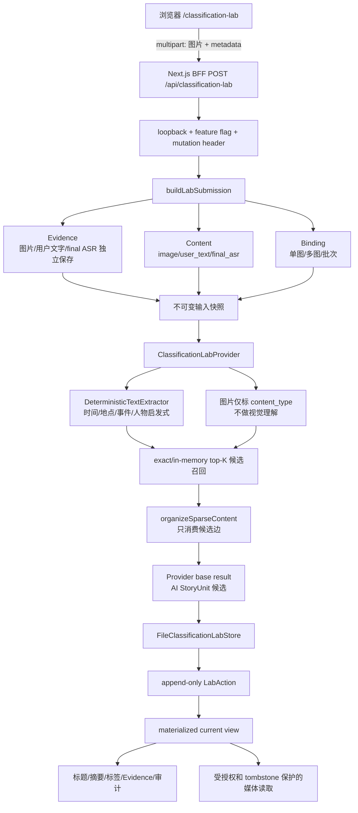
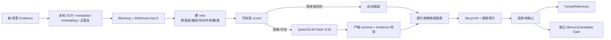
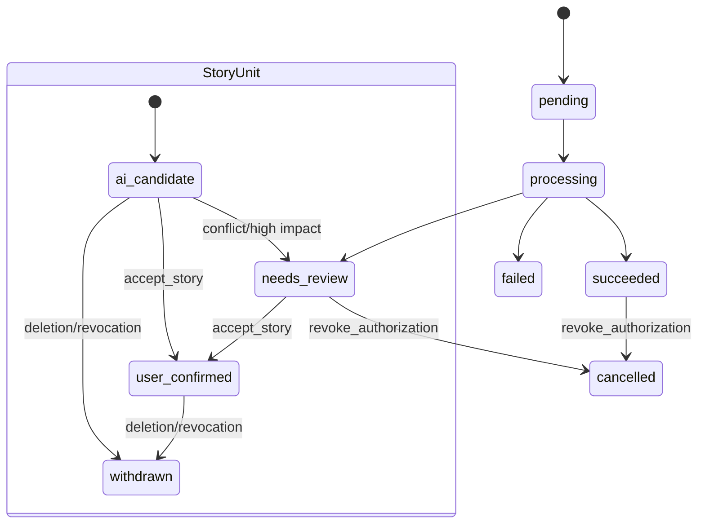

# 图文分类 T0/T1 全栈交接手册

> 冻结日期：2026-09-27
> 交付分支：`codex/classification-contract-v1`
> 当前范围：T0 算法/数据门禁 + T1 本地产品 Alpha
> 下游责任：全栈工程师从本手册进入 T2；T3 使用另一套跨家庭独立数据

## 1. 交付结论

当前仓库已经具备一条可在本机浏览器运行的图文分类主链：

1. 上传单张或多张 JPEG/PNG/WebP；
2. 同时提交用户原文和 final ASR，文字可绑定单图、多图或整个批次；
3. 服务端创建独立 `Evidence`、`Content` 和 `Binding`，浏览器不能伪造可信 Evidence；
4. 确定性 Provider 执行文字抽取、稀疏候选召回和 `StoryUnit` 组织；
5. 页面展示 AI 标题、摘要、筛选维度、依据、风险、耗时和费用；
6. 用户可以确认故事、拒绝关系、移出、拆分、合并、删除 Evidence 和撤销授权；
7. Provider 原始结果保持只读，人工动作追加保存，GET 时生成当前视图；
8. 删除或撤权后，素材接口拒绝继续读取。

这证明了契约与本地产品链能够联通。它还不证明真实模型准确率、跨家庭泛化、生产性能或老人真实使用效果。

> 证据说明：本轮浏览器 smoke 与自动化回归中的图片均为非真实的程序生成测试素材。真实照片分母目前为 0，不能把下文的工程通过项解释成真实照片验收。

|阶段|当前状态|完成条件|
|---|---|---|
|T0-A 稀疏组织工程基线|完成|契约、输入桥、exact top-K、稀疏组织和回归已通过|
|T0-B 真实素材门禁|工具完成，数据待提供|30–50 组授权真实素材、人工真值和 manifest 通过 preflight|
|T0-C 真实离线评测|待真实数据|固定分母报告完成，语义 Gate 在独立 holdout 前冻结|
|T1-A 本地 BFF/运行时|完成|本地上传、持久化、幂等和结果恢复可运行|
|T1-B 浏览器实验台|完成|上传、展示、纠错、删除/撤权入口可运行|
|T1-C 真实批次人工验收|待真实数据|30 项代表批次完成操作验收并形成失败台账|
|T2 全栈集成|未开始，由全栈负责|正式鉴权、数据库、对象存储、队列和真实 Provider 接入|
|T3 小规模用户 Pilot|不在本包|独立跨家庭数据与真实产品 Gate 通过后启动|

## 2. 冻结的产品语义

- 事件/故事是主要内容单元；人物、时间、地点、场景、主题等是可版本化筛选维度。
- 列表页展示 AI 标题和简短摘要，详情页必须保留用户原文和 Evidence。
- 用户明确指定的单图/多图关系直接保留；未指定时文字保存为批次级 Evidence，AI 只能提出候选关联。
- 低风险分类和归纳可以自动展示为“AI 整理”；人物真实身份、亲属关系、敏感事实和长期 Memory 有独立确认门。
- AI/Provider 不得产生 `user_confirmed`。只有独立用户动作可以升级故事或关系状态。
- 未经确认的候选可以支持相册搜索和访谈问题生成，但不能直接写长期 Memory。
- 家庭互传使用 3 天提醒、7 天从首页待办收起的策略；当前契约已携带该策略，T1 没有实现定时调度。
- 人物匹配在当前 T0/T1 默认关闭。授权后的一次确认只形成 provisional reference；2–3 张跨年代、角度或质量的确认照片后才可升级 stable reference。

## 3. 当前可运行架构



核心文件：

|职责|文件|
|---|---|
|浏览器实验台|`src/app/classification-lab/page.tsx`|
|BFF GET/POST/PATCH|`src/app/api/classification-lab/route.ts`|
|媒体读取门禁|`src/app/api/classification-lab/assets/[jobId]/[evidenceId]/route.ts`|
|浏览器输入转 Evidence|`src/lib/algorithms/classification/lab-contract.ts`|
|Provider 接口与确定性实现|`src/lib/algorithms/classification/lab-provider.ts`|
|任务编排|`src/lib/algorithms/classification/lab-service.ts`|
|本地文件适配器|`src/lib/algorithms/classification/lab-store.ts`|
|动作日志与当前视图|`src/lib/algorithms/classification/lab-actions.ts`|
|多模态输入契约|`src/lib/algorithms/classification/ingestion-contract.ts`|
|输入到组织器的桥|`src/lib/algorithms/classification/ingestion-organization-adapter.ts`|
|稀疏候选组织|`src/lib/algorithms/classification/content-organization.ts`|
|有界 exact 召回基线|`src/lib/algorithms/classification/exact-retrieval.ts`|
|T0 离线门禁|`src/lib/algorithms/classification/t0-real-media.ts`|

## 4. Prompt、模型、规则与评分器的当前边界

|环节|T1 实际执行|版本/证据|可以声称什么|
|---|---|---|---|
|图片输入校验|签名、MIME、尺寸、像素与字节上限|`media-inspection.ts`|图片载荷合法；不能声称看懂图片|
|文字抽取|本地确定性启发式|`DeterministicTextExtractor`|验证字段、Evidence 和组织链|
|图片理解|未执行|`modelVersion=none`|无视觉语义准确率|
|Prompt|未执行|`promptVersion=none`|无 token/模型费用|
|候选召回|本地 exact top-K|`retrieval_heuristic_not_probability`|候选数受 `N×K` 限制|
|组织器|shadow policy + 稀疏图|`classification-lab-shadow.1`|工程候选，不是已校准生产决策|
|旧规则分|时间 .25、地点 .20、事件 .25、人物 .20、主题 .10|`association-rules.1`|可复现 baseline；不是概率|
|标题/摘要|确定性模板|`titleCandidate` / `summaryCandidate`|只验证呈现链；不代表生成质量|

仓库另有真实 Stage A Provider，但它没有接入本地实验台：

- Prompt/Guard 版本：`sgx-five-facets.12`；`.12` 只完成过保存响应的历史离线 replay，尚未获得新的付费调用证据，且原 `/private/tmp` replay 目录当前已不可访问；
- 系统 Prompt：`src/lib/algorithms/classification/stage-a-provider.ts` 的 `SYSTEM_PROMPT`；
- 结构与版本：`src/lib/algorithms/classification/stage-a-contract.ts`；
- 调用方式：图片与不可信 caption/EXIF/文字 Evidence 作为 user content，返回严格 JSON；
- 边界：真实调用仍需固定批次、模型、预算、外发范围和单独批准。

`0.80/0.55` 只保留在旧 baseline。当前 hybrid `DecisionPolicy` 为 `shadow + calibrated=false`，不能把任何工程分数显示成“80% 准确”或“55% 可信”。

目标 T2 混合链如下；全栈应接 adapter，不应把所有图片两两发给 VLM：



## 5. 本地启动

安装依赖后，在仓库根目录执行：

```sh
export CLASSIFICATION_LAB_ENABLED=true
export CLASSIFICATION_LAB_PROVIDER=deterministic
export CLASSIFICATION_LAB_DATA_DIR=/安全的本地临时目录/sgx-classification-lab

# 若当前开发环境尚未提供 JWT_SECRET，只在本 shell 生成一次临时值：
export JWT_SECRET="$(openssl rand -hex 32)"

npm run classification:lab
```

打开 `http://127.0.0.1:3000/classification-lab`。

`classification:lab` 明确绑定 `127.0.0.1`。不要用仓库通用的 `npm run dev` 替代，因为后者绑定 `0.0.0.0`，实验台 API 会按安全门禁拒绝。

未设置 `CLASSIFICATION_LAB_DATA_DIR` 时，数据默认写入系统临时目录 `sgx-classification-lab`。真实家庭素材不得放入 Git 仓库。

## 6. HTTP 契约

所有当前接口仅供 T1 loopback。修改请求还必须带：

```http
x-sgx-classification-lab: 1
```

### 6.1 GET 任务

```http
GET /api/classification-lab
GET /api/classification-lab?jobId=lab_xxx
```

返回中的 `result` 是 `provider base result + actions` 的当前视图；`actions` 是追加审计；`view.source` 固定为 `provider_base_plus_append_only_actions`。

### 6.2 POST 新任务

`multipart/form-data`：图片字段重复使用 `images`，JSON 放在 `metadata`。

```json
{
  "scope": { "householdId": "house_001", "subjectId": "elder_001" },
  "actorId": "elder_001",
  "contextKind": "album_upload",
  "recipientIds": [],
  "userText": "这是1985年在北京的大学同学聚会",
  "finalAsr": "后来我们又在北京见了一次",
  "userTextTargetIndexes": [0, 1],
  "finalAsrTargetIndexes": null,
  "submittedAt": "2026-09-27T12:00:00.000Z"
}
```

- target indexes 从 0 开始，对应 multipart 图片顺序；
- `null` 表示批次级 Evidence；
- 空数组不是批次级，属于非法空目标；
- `family_transfer` 还必须提供 `senderId` 和非空 `recipientIds`。

### 6.3 PATCH 人工动作

```json
{
  "jobId": "lab_xxx",
  "actionId": "action_客户端生成的唯一ID",
  "expectedUpdatedAt": "2026-09-27T12:01:00.000Z",
  "kind": "accept_story",
  "targetIds": ["story_xxx"],
  "actorId": "elder_001"
}
```

|`kind`|`targetIds`|效果|
|---|---|---|
|`accept_story`|1 个 storyId|只由该用户动作把故事升级为 `user_confirmed`|
|`reject_association`|1 个 associationId|拒绝关系并按剩余有效边重新拆组|
|`remove_content`|1 个 contentId|从当前整理视图移出，Evidence 仍保留|
|`split_content`|1 个 contentId|从原故事拆出为单独候选故事|
|`merge_stories`|至少 2 个 storyId|合并成员；新标题/摘要仍是 AI 候选|
|`delete_evidence`|1 个 evidenceId|生成 tombstone、撤出依赖视图并禁止媒体读取|
|`revoke_authorization`|当前 authorizationRevision|整批视图取消并禁止继续读取/操作|

`actionId` 提供幂等，`expectedUpdatedAt` 提供乐观并发控制。相同 action 可安全重放；旧版本新动作返回 `LAB_ACTION_STALE`。

### 6.4 GET 媒体

```http
GET /api/classification-lab/assets/:jobId/:evidenceId
```

只返回当前视图中仍 active 且授权未撤销的图片。文字原文只在任务 JSON 中返回，媒体路由拒绝公开 text asset。

## 7. 状态和权威传播



三个层次不能混写：

1. `Evidence/Binding`：用户提供了什么，以及明确绑定到哪里；
2. Provider base result：算法提出了什么候选；
3. `LabAction`：用户后来确认、拒绝、删除或撤权了什么。

当前本地删除是 **tombstone + 读取拒绝 + 派生视图失效**。底层临时目录中的旧二进制为审计保留，没有实现生产级物理擦除；T2 必须由对象存储生命周期和删除任务完成物理清理。

## 8. T0 真实数据门禁

真实验证需要 30–50 个已授权内容组，覆盖图片、文字、final ASR、相册上传、家庭互传、冲突、拒判、旧照片、近重复和高风险案例。详细格式见 [T0/T1 真实多模态素材准备与离线门禁](CLASSIFICATION_T0_REAL_MEDIA_KIT.md)。

```sh
npm run classification:t0-preflight -- \
  --manifest /受控目录/sgx-t0-real-v1/manifest.json
```

通过 preflight 只证明数据可运行，不证明算法正确。T3 必须另建跨家庭独立 holdout，不能复用 T0/T1 素材或调参信息。

## 9. T2 替换点

|T1 当前实现|T2 全栈实现|必须保留的语义|
|---|---|---|
|`FileClassificationLabStore`|PostgreSQL/业务数据库 repository|scope、幂等键、版本、动作审计和乐观锁|
|本地 assets 目录|对象存储|hash、MIME/尺寸复验、ACL、tombstone 和物理删除任务|
|同步 `provider.run`|队列 + worker|deadline、cancel、有限重试、晚到结果拒收、dead letter|
|loopback/自定义 header|登录会话 + household/subject RBAC|actor 不从请求体自证权限|
|确定性 Provider|本地 OCR/embedding/duplicate + VLM router|严格输出 schema、Evidence 引用和版本快照|
|读取时 materialize|事件表 + materialized view/outbox|原始结果不可覆盖、动作可审计|
|本地实验页|智能相册/待整理正式 UI|“AI 整理”标识、纠错入口、原文和依据可见|
|静态 reviewPolicy|scheduler/notification service|第 3 天提醒、第 7 天从首页收起、高风险保留|

建议的最小生产表边界为：`evidence`、`content_item`、`evidence_binding`、`classification_job`、`classification_base_result`、`classification_action_event`、`story_view`。具体 ORM 与队列产品由全栈按现有基础设施选择，算法契约不绑定 Prisma、Redis 或特定云产品。

## 10. 开源依据与许可边界

- [Immich](https://github.com/immich-app/immich)，AGPL-3.0：只参考增量索引、人物聚类与纠错产品流程；未复制源码、未引入服务。
- [LibrePhotos](https://github.com/LibrePhotos/librephotos)，根仓库 MIT：只参考照片管理、搜索和人物/事件组织；模型与子依赖许可必须另审。
- [pgvector](https://github.com/pgvector/pgvector)，PostgreSQL License：T2 已使用 PostgreSQL 时可作为向量候选；尚未选型或安装。
- OpenCLIP/SigLIP、PaddleOCR、OpenCV YuNet/SFace 仅是 H2 Spike 候选。正式采用前必须记录代码许可、权重许可、来源、hash、商用边界和数据基准。

本轮动作日志、T0 manifest 和本地实验台是 SGX 特定契约与实现，没有复制外部项目代码。

## 11. 已验证证据

- `npm run test:classification`：历史受控 loopback 环境记录为 196/196；本次受限沙箱复验为非 HTTP 168/168 通过，另 28 项因 `listen EPERM` 未运行，代码改动后必须在允许 loopback 的环境重跑；
- `npm run typecheck`：通过；
- `JWT_SECRET=<仅本进程临时值> npm run build`：通过；
- `npm run test:classification:secret`：通过；
- 浏览器：2 张非真实的程序生成测试图 + 用户原文 + final ASR 上传成功，形成 4 份 Evidence 和 1 个 StoryUnit；
- 浏览器：故事由 `AI 整理候选` 经独立动作升级为 `用户已确认`，人工动作审计可见；
- 浏览器运行证据：模型调用 0、费用 ¥0.00，说明当前验证没有调用真实模型或付费 API。

构建仍显示仓库原有 voice VAD/`` 警告，与本轮分类实验台无关；分类页面没有新增构建错误。

## 12. 已知限制与禁止误读

1. 确定性 Provider 不读取图片语义，只把图片作为 `content_type=照片`；不得用其输出报告图片分类准确率。
2. 真实 Stage A、OCR、embedding、近重复和 VLM router 尚未接入实验台。
3. 本地任务同步执行，没有生产队列、租约、重试 worker、分布式锁或多实例一致性。
4. T1 的 actor 校验只验证请求 actor 与原始 envelope actor 一致；它不是生产登录鉴权。
5. 本地删除不等于物理擦除，T2 必须完成对象存储删除和派生索引清理。
6. 7 天待整理策略只有数据契约，没有 scheduler。
7. 人物身份匹配关闭；不能从人物组推断姓名或关系。
8. `0.80/0.55`、retrieval score 和 confidence band 都不是概率或真实准确率。
9. 30–50 个真实内容组尚未提供；真实分布指标为 0 分母。它们属于独立 `Real Distribution Gate`，不能与合成 `T0-Synthetic Functional Gate` 混称。
10. T0/T1 结果不得替代 T3 跨家庭独立验证或真实老人 Pilot。
11. 回归中的 30 组数据是运行时生成的 2×2 PNG/文字契约 fixture，只验证 preflight 代码，不能计入真实素材分母。

## 13. 全栈接手清单

全栈工程师接手时按以下顺序执行：

1. checkout 本分支并运行第 5 节本地实验台；
2. 用 2 张非敏感测试图 + 用户说明 + final ASR 完成人工 smoke；
3. 运行 `npm run test:classification`、typecheck、build 和 secret scan；以当次测试 runner 的固定分母为准，不把旧测试数量写成操作要求；
4. 阅读 `classification-ingestion-v2.schema.json`、`classification-hybrid.schema.json` 与本文件；
5. 先实现 store/object/auth adapter，保持 Provider 为 deterministic；
6. 再实现 queue/worker 与取消、晚到结果拒收；
7. 用相同 contract 接真实 Provider，禁止浏览器持有 provider key；
8. 先完成冻结的合成功能 Gate；真实内容可用后，再单独运行 30–50 个 content groups 的 Real Distribution Gate，并分别报告图片、文字、final ASR 和音频数量；
9. 真实数据 exploration 完成后，在查看独立 holdout 前冻结数值 Gate；
10. 通过 T2 Gate 后再准备独立跨家庭 T3。

出现任何接口歧义时，以“Evidence 独立、用户动作独立、AI 不能自证确认、删除/撤权使下游失效”四条原则为最终裁决。
