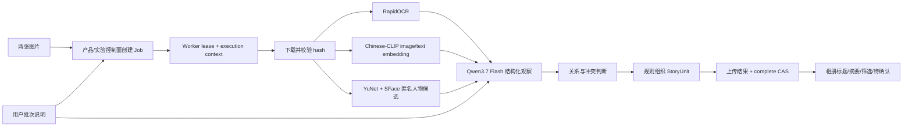

# SGX T1 真实多图链复测报告（2026-10-04）

## 给产品和全栈工程师的结论

当前版本已经能把“多张图片 + 用户说明”送入真实 Qwen 和服务器本地 Feature Service，完成 OCR、图文向量、人脸候选、语义识别、事件归组、AI 标题/摘要、结果上传和持久化。本次复测修复了真实模型完成后因上传租约判断错误而丢失结果的问题。

这意味着全栈工程师可以开始 T2 接入。接入时应复用公开 Schema、状态机、错误码和 Worker 协议，并将实验室文件存储替换为产品的数据库、对象存储、队列和鉴权。

## 一次输入如何被处理

模型不把每张新图片和全库逐一发送给 VLM。embedding 和授权后的人脸向量先产生有限候选；VLM只处理当前图片和候选上下文。向量相似度仅用于候选召回，不作为概率，也不单独决定合并。

## 本次输入

- 两张社区花园分苗活动图片；
- 用户说明：“这是同一天社区花园活动刚开始，我们先分苗。”；
- 说明由用户明确绑定两张图片；
- 人物匹配已授权；
- 新 household、新 subject，因此没有历史数据可召回。

## 本次输出

|项目|结果|
|---|---|
|Job|`lab_run_e8fd529c4610565d899e94c5`|
|最终状态|`succeeded`|
|真实模型|`qwen3.7-flash-2026-07-15`|
|Prompt|`sgx-five-facets.16`|
|发布 SHA|`4a904f413c017e0fc576d8bdb3ef8d1edcfe9486`|
|耗时|37.792 秒|
|Provider 调用|3 次，全部 `finish_reason=stop`|
|Token|输入 12,664；输出 3,151|
|费用|¥0.0303216|
|StoryUnit|1 个，含 2 图 + 用户原文|
|AI 标题|兴趣活动|
|AI 摘要|共3项内容；记录兴趣活动。|
|图片关系|`same_event / ai_auto`|
|人脸候选|每图 3 个匿名候选|
|人工复核项|0|
|Feature 组件错误|0|

## 修复前为什么失败

`lab_run_c4c628cfc2517119f9272789` 已完成 3 次真实模型调用，但总耗时超过初始 30 秒上传窗口。Worker 的 heartbeat 已从服务端续租，上传接口也会使用新的 authoritative fence，但 Worker 仍用最初 lease 中的旧时间在本地拒绝上传。

此外，provider usage 当时只在上传成功后保存，导致上传失败时错误报告为 0 次。这会让预算账本低估真实成本。

修复后：

1. 上传前 heartbeat 负责检查当前租约；服务端上传接口负责最终 fence；Worker 不再使用旧快照重复判断。
2. processor 一返回就保存已知 usage；之后即使上传失败，fail 请求也会携带真实调用次数、token、费用和延迟。
3. 新增两个聚焦回归覆盖上述行为。

## 正确性、健壮性和性能判断

- **正确性**：本次用户显式说明被保留为 `user_confirmed` 支持关系；图片关系由真实模型与组织规则产生；向量候选没有越权变成身份事实。
- **健壮性**：lease、attempt、authorization revision、scope 和结果 digest 仍由服务端 CAS 控制；上传失败也能准确结算 provider usage。
- **性能**：本次端到端约 38 秒，主要来自两图三次 VLM 调用和本地特征处理。当前适合后台渐进整理，页面应显示处理中状态；不适合要求即时返回的同步请求。
- **成本**：本次约 3 分人民币。embedding/OCR/人脸在自有服务器运行，只将困难语义与关系交给 Flash VLM，避免把全量历史图片反复送给多模态模型。
- **泛化边界**：本次只覆盖一个合成多图同事件场景；不能由此推断真实家庭数据准确率或所有场景泛化。

## 全栈接入时保持不变的部分

- `Evidence / Content / Binding / Job / Result / Review` 契约；
- `householdId + subjectId + authorizationRevision` 隔离；
- `pending → processing → succeeded/needs_review/failed/cancelled` 生命周期；
- Worker 的 lease、heartbeat、execution-context、artifact download/upload、complete/fail/cancel-ack；
- 低风险 AI 整理可自动显示，人物姓名、亲属关系、敏感事实和长期 Memory 仍走独立确认；
- Prompt、模型、taxonomy、adapter 和规则发生变化时必须更新版本或 digest。

## 当前不能直接用于生产的部分

- 实验室 JSON 文件存储；
- 本地页面的 localhost 鉴权；
- Notebook 进程生命周期；
- 合成数据得出的质量判断；
- 缺少正式业务监控、告警、对象存储签名 URL 和数据库事务。

以上边界不阻止全栈工程师开始 T2，但必须在 10 人内部测试前完成替换和运行保障。
