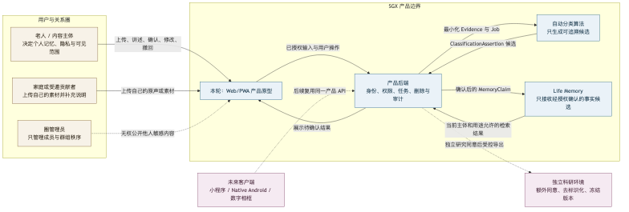
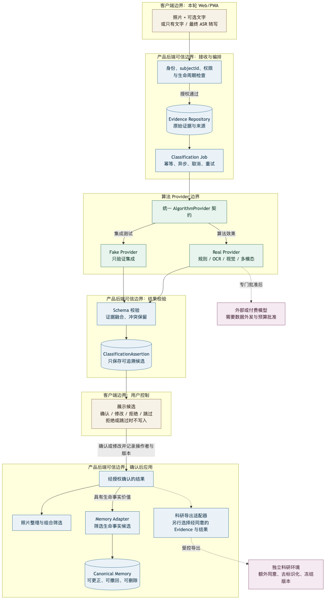
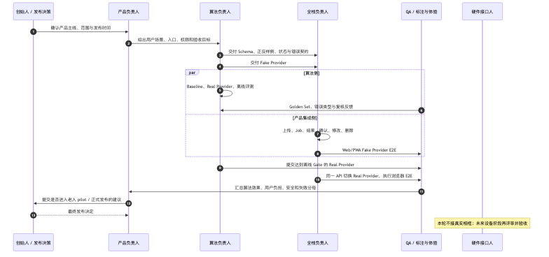

# 多模态自动分类：业务关系、数据流程与协作边界

> 文档状态：ready_for_owner_review
> 版本：0.1.0
> 日期：2026-09-06
> 适用范围：自动分类 P0、Web/PWA 内部产品原型及未来多端兼容
> 不代表：老人 pilot、生产发布、Native Android 或真实相框验收

## 1. 这份文档解决什么

本文件是任务二的边界基线，先回答“谁、为什么、处理什么数据、做到哪里、由谁负责”，再进入任务一的 Schema、测试样例和 Fake Provider 实现。

业务关系图不是代码架构图。它表达参与者、权利、动作和用户价值；数据流程图表达数据如何移动、变形和受控；协作时序图表达团队何时交接。三者分开，避免把用户权限、算法内部实现和团队分工塞进一张难以阅读的图。

## 2. 为什么任务二先于任务一

Schema 会把边界固化成字段，Fake Provider 会把边界固化成行为，测试样例会把边界固化成验收结果。如果没有先明确内容主体、贡献者、Evidence、候选事实、确认权、删除传播和产品—科研隔离，代码越早写，返工越大。

任务二只冻结最小必要边界，不延伸到数据库选型、云厂商、Android 框架或硬件参数。后续若业务规则改变，先更新本文件和 Decision Log，再变更契约。

## 3. 图一：业务关系与价值边界



源文件：

- [Mermaid 源码](../../figures/sgx-classification-business-context.mmd)
- [Markdown 预览](../../figures/sgx-classification-business-context.md)

这张图回答：

- 老人是个人 Memory、隐私和长期可见范围的主要决定者。
- 家庭或受邀成员可以贡献自己的素材，但不因此获得公开老人敏感内容的权利。
- 圈管理员只管理成员和秩序，不天然拥有内容确认或公开权。
- 算法只生成候选；产品后端负责权限与生命周期；确认后的生命事实候选才进入 Memory。
- 科研环境只有在额外研究同意、去标识化和冻结版本后接收受控导出。
- Web/PWA 是本轮真实集成端；小程序、Native Android 和相框未来复用产品 API。

## 4. 图二：多模态数据流程与信任边界



源文件：

- [Mermaid 源码](../../figures/sgx-classification-data-flow-boundaries.mmd)
- [Markdown 预览](../../figures/sgx-classification-data-flow-boundaries.md)

### 4.1 主链路

照片、可选说明文字、只有文字或最终 ASR 转写进入产品后端。后端先检查操作者、subjectId、授权和内容生命周期，之后创建 Evidence 和 Classification Job。Provider 返回的只是 ClassificationAssertion；结果经过 Schema 校验、证据融合和冲突保留后展示给授权人确认、修改、拒绝或跳过。

照片整理标签可在权限范围内用于筛选。只有已确认、可追溯且具有生命事实价值的结果，才可转换成 MemoryClaim；模型输出不能直接成为 Canonical Memory。

### 4.2 七类必须保持的边界

| 边界 | 当前规则 | 由谁守住 |
|---|---|---|
| 业务范围 | 当前做自动分类和 Web/PWA 内部原型；不做老人 pilot、Native Android 和真实机器 | 产品负责人、创始人 |
| 主体与贡献 | actorId、subjectId、ownerId、contributorId 分开；共用相框也不能猜主体 | 产品后端、全栈 |
| 证据与推断 | 原图、原文、最终转写是 Evidence；模型结果是 Assertion | 算法、后端 |
| 候选与事实 | 未经授权确认的 Assertion 不能进入正式 Memory | 产品、Memory、后端 |
| 权限与相关性 | 算法判断“相关”不等于有权查看、使用或分享 | 后端、产品 |
| 产品与科研 | 研究需额外同意、去标识化、冻结版本；P1 个体预测不回写产品 | 科研负责人、数据治理 |
| 部署与外发 | Fake/本地 Provider 可用于当前研发；付费或外部 Provider 需数据外发与预算审批 | 算法、后端、创始人 |

### 4.3 Fake 与 Real Provider 的边界

- Fake Provider：返回确定、可重复且可制造成功、低置信、冲突、超时和失败的模拟结果；只证明集成链路正确。
- Real Provider：执行规则、OCR、人脸检测、视觉或多模态推理；必须用冻结数据评价真实效果。
- 两者遵守同一契约，因此全栈先完成产品闭环，算法后续替换实现，不重写 Web/PWA。
- Fake E2E 通过不能标记 algorithm_ready；Real Provider 离线指标通过也不能自动标记 pilot_ready 或 production_ready。

## 5. 图三：团队协作与交接边界



源文件：

- [Mermaid 源码](../../figures/sgx-classification-collaboration-sequence.mmd)
- [Markdown 预览](../../figures/sgx-classification-collaboration-sequence.md)

| 角色 | 本轮主责 | 不应越权决定 |
|---|---|---|
| 创始人 | 战略、资源冲突和最终发布决定 | 不以演示效果替代算法与安全证据 |
| 产品负责人 | 用户场景、入口、权限、确认体验和发布建议 | 不单独改变算法证据语义 |
| 算法负责人 | taxonomy、Schema 语义、Provider、融合、拒判、版本和离线评测 | 不单独决定数据库、客户端实现或生产发布 |
| 全栈负责人 | 后端、API、Job、存储适配、Web/PWA、确认修改闭环和未来 Android 集成 | 不单方面改变 Assertion、Memory 和权限语义 |
| 标注 / QA / 用户研究 | Golden Set、契约测试、浏览器 E2E、失败分母和体验反馈 | 不把模型输出直接当 gold |
| 硬件接口人 | 后续设备约束、供应商接口和真实相框验收 | 本轮不构成算法实现阻塞 |

## 6. 数据对象之间的最小业务关系

```text
一个 ContentBundle
  ├─ 一条或多条 EvidenceRecord
  └─ 一个或多个 ClassificationJob 版本

一个 ClassificationJob
  └─ 零条或多条 ClassificationAssertion

一条 ClassificationAssertion
  ├─ 必须引用一条或多条 EvidenceRecord
  ├─ 可以被确认、修改、拒绝、冲突或撤回
  └─ 只有确认且具生命事实价值时才生成 MemoryClaim
```

具体字段由任务一冻结。这里先规定不变量：

1. 每个输入必须有 subjectId、来源、授权范围和生命周期。
2. 缺少某种模态是正常情况，不自动补全未知人物、时间或地点。
3. 图片、文字、最终 ASR 转写分别提取证据，再按 facet 融合。
4. 冲突不以“最后写入”覆盖，必须保留双方来源并进入确认。
5. 删除或撤回必须传播到任务、Assertion、索引、缓存和 Memory 派生。
6. 人脸相似不等于真实身份：F1 检测可进入 P0；F2 匿名聚类受 feature flag 控制；F3 家庭闭集建议后续评审；F4 开放网络身份识别不做。

## 7. 当前产品范围与成熟度

| 状态 | 含义 | 当前情况 |
|---|---|---|
| design_ready | 业务、数据和责任边界已冻结，可进入契约实现 | 文档和图示已完成技术检查，待负责人最终确认 |
| algorithm_ready | Real Provider 在冻结评测集达到预设 Gate | 尚未成立 |
| integration_ready | Web/PWA 用统一 API 跑通上传、任务、结果、确认、修改、删除和失败恢复 | 尚未成立 |
| pilot_ready | 权限、删除、体验、真实数据和停止规则通过 | 尚未成立 |
| production_ready | 监控、成本、扩缩容、回滚和发布批准完成 | 尚未成立 |

9 月 25 日目标属于 L2 internal demo：创始人、团队和展会演示人员可以真实操作原型，但不是老人 pilot。10 月 3 日争取自动分类稳定并启动访谈落地。11 月初 MVP 的精确组合仍需创始人与算法负责人后续冻结。

## 8. 任务一的直接输入与完成条件

任务一按以下顺序执行：

1. 冻结 Evidence、ClassificationJob、ClassificationAssertion 和 Provider v1 Schema。
2. 建立正常、缺失、冲突、低置信、越权、删除中、超时和非法输出样例。
3. 建立可切换场景的 Fake Provider。
4. 建立 Schema/contract 自动化测试。
5. 全栈负责人用 Fake Provider 完成 Web/PWA 闭环。
6. 算法负责人开发 Baseline/Real Provider 和离线 harness。
7. Real Provider 过离线 Gate 后，用同一 API 替换并完成浏览器 E2E。

完成条件不是“生成了几个标签”，而是：边界字段可验证、异常结果被拒绝、Fake 不能被误报为算法完成、Real Provider 有冻结评测证据、客户端不因 provider 更换而重写流程。

## 9. 为什么不在一张图里继续增加内容

数据库 ERD、Job 状态机、权限矩阵、删除状态机和 API sequence 都有价值，但它们是任务一的工程附图，不应挤进业务主图。本轮三张主图足以让创始人、产品、算法和全栈形成共同语言；进入实现后再补：

- Schema/ER 图：字段和对象关系冻结后生成。
- Job 状态机：pending、processing、needs_review、failed、cancelled 等。
- 权限矩阵：随着 API authorization rules 一起验收。
- 删除传播图：随着 repository 和 lifecycle service 实现。

这保持了适度复杂度：业务层容易看懂，工程层又有足够边界可测试。
