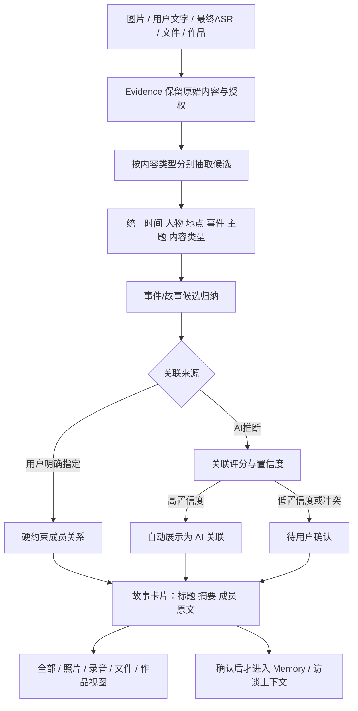

# 多模态内容分类与事件归纳 Spec

> 状态：产品语义已确认，作为下一阶段工程实现依据  
> 日期：2026-09-23  
> 适用范围：图片、用户文字、最终 ASR、文件和作品进入统一内容库后的分类、归纳与关联

> 2026-09-27 扩展：事件/故事仍是主内容单元；产品进一步确认了智能相册上传与家庭双端互传两种场景，以及纯文本、纯 final ASR、多图片共用说明和任意图文语音组合。现有 `ContentItem` 方向继续有效，具体 ingestion/binding 契约转入 2026-09-27 Draft 后再冻结。

## 1. 已确认的产品原则

1. **事件/故事是主要内容单元**。图片、文字、录音转写、文件和作品可以成为同一个事件/故事的成员。
2. **人物、时间、地点、主题是辅助筛选维度**。它们可以来自图片、文字或最终 ASR，也可以由多个内容共同支持。
3. **列表页显示 AI 标题和简短摘要**。详情页保留用户原文、原始媒体和完整来源；AI 摘要不能替换原文。
4. **用户明确指定的关系是硬约束**。AI 不能自动拆除、覆盖或重新解释用户已经确认的关系。
5. **AI 可以自动补充内容关联**。自动关联必须保存关联证据、评分方法和置信度；高置信度可以自动展示，低置信度进入待确认，不直接写成用户确认事实。

## 2. 对当前算法的影响

现有 Stage A 能够对照片提取人物、时间、地点、事件和场景，并把用户文字/最终 ASR 作为照片的独立证据。它还不足以表达“独立文字本身就是一个可分类内容”，因此下一层增加统一内容组织层：



## 3. 统一内容模型

### 3.1 ContentItem

`ContentItem` 是产品中的一级内容视图，引用一个或多个 Evidence，但不复制原始内容：

```ts
interface ContentItem {
  contentId: string;
  subjectId: string;
  householdId: string;
  modality: 'photo' | 'user_text' | 'final_asr' | 'file' | 'work';
  evidenceIds: string[];
  title?: string;          // 用户标题或 AI 生成标题
  originalText?: string;   // 仅文本/ASR，原文保留
  capturedAt?: string;
  lifecycle: 'active' | 'withdrawn';
}
```

当前第一阶段只要求真正支持 `photo`、`user_text`、`final_asr`；`file` 和 `work` 先保留统一接口，不把文件解析和作品理解塞入本轮 Stage A。

### 3.2 ContentObservation

图片、文字和 ASR 分别生成自己的观察结果。文字观察不得伪装成图片 caption：

```ts
interface ContentObservation {
  contentId: string;
  evidenceId: string;
  facet: 'person' | 'time' | 'place' | 'event' | 'scene' | 'theme' | 'content_type';
  rawValue: string;
  normalizedValue?: string;
  supports: { evidenceId: string; quote?: string; region?: Region }[];
  state: 'candidate' | 'abstained' | 'conflicted';
}
```

每个观察必须能够回到原始 Evidence。无法从文字或图片确定的内容输出 `abstained`，矛盾信息输出 `conflicted`，不能强行填充。

### 3.3 StoryUnit

事件/故事是用户看到的主要归纳单元：

```ts
interface StoryUnit {
  storyId: string;
  scope: { householdId: string; subjectId: string };
  titleCandidate: string;
  summaryCandidate: string;
  memberContentIds: string[];
  facets: { people: string[]; times: string[]; places: string[]; themes: string[] };
  titleSupports: string[];
  summarySupports: string[];
  state: 'ai_candidate' | 'needs_review' | 'user_confirmed' | 'withdrawn';
}
```

标题和摘要必须由成员内容的证据支持；它们是派生展示字段，不能覆盖用户原文。

### 3.4 AssociationCandidate

图片与文字、ASR 或故事之间的关系统一表示为候选关联：

```ts
interface AssociationCandidate {
  associationId: string;
  fromContentId: string;
  toContentId?: string;
  toStoryId?: string;
  relation: 'same_story' | 'same_event' | 'supports' | 'related';
  source: 'user_explicit' | 'ai_inferred';
  status: 'user_confirmed' | 'ai_auto' | 'needs_review' | 'not_selected' | 'rejected';
  score?: number;           // 统一 0–1 的工程评分
  confidenceBand?: 'high' | 'medium' | 'low';
  method: string;           // 例如 association-rules.1
  evidenceRefs: string[];
  createdAt: string;
}
```

`score` 是当前算法版本的可审计工程评分，不能直接解释成统计学概率。只有在独立评测完成校准后，才可以对外称为概率。

## 4. 关联评分初版

AI 自动关联先采用可解释的多信号评分，不依赖单一模型置信度：

- 时间一致或相邻：最高 0.25；
- 地点一致：最高 0.20；
- 事件/主题语义一致：最高 0.25；
- 人物或家庭关系线索一致：最高 0.20；
- 用户显式绑定：直接进入 `user_confirmed`，不走评分；
- 来源冲突、撤回、主体不一致：直接拒绝或降为 `needs_review`。

初版展示阈值：

- `score >= 0.80`：`ai_auto`，可自动出现在故事卡片中；
- `0.55 <= score < 0.80`：`needs_review`，显示“可能相关”；
- `< 0.55`：标记 `not_selected`，不自动关联，但保留审计记录。

阈值是可配置版本参数，必须通过离线评测校准后再调整，不能根据单个案例临时修改。

## 5. 页面映射

| 页面视图 | 数据来源 | 主要交互 |
|---|---|---|
| 全部 | 所有 active ContentItem 和 StoryUnit | 搜索、按时间/人物/地点/事件/主题筛选 |
| 照片 | modality=photo | 以图片为主，显示所属故事标题和摘要 |
| 录音 | modality=final_asr + 原始音频引用 | 播放、查看转写、进入故事详情 |
| 文件 | modality=file | 文件类型、来源和所属故事 |
| 作品 | modality=work | 用户作品与 AI 归纳结果 |
| 故事详情 | StoryUnit + 成员 ContentItem | 标题、摘要、图片、原文、录音转写、确认/纠正关联 |

第一张截图中的“最新、人物、城市、事件、合照、物件、怀旧、时间”属于照片视图的筛选入口；第二张截图中的“全部、照片、录音、文件、作品”属于统一内容库入口。两者共用同一套 StoryUnit、Observation 和 Association 数据。

## 6. 记忆和后续算法边界

- AI 标题、摘要、标签和关联都是候选产物。
- 用户明确确认或产品明确允许的高置信度内容，才可进入长期 Memory 候选适配器。
- 敏感内容、家庭冲突、健康和财务内容需要单独确认；不能因为 AI 关联分数高就自动进入长期记忆。
- 访谈算法可以读取已确认的 StoryUnit 和其证据引用；不能只读取无来源的摘要。
- 删除或撤回任一 Evidence 后，依赖它的标题、摘要、标签和关联必须失效或重新计算。

## 7. 本阶段实现范围与结束标准

下一阶段只实现最小闭环：

1. 为独立图片、用户文字、最终 ASR 建立统一 `ContentObservation` 输入/输出类型；
2. 增加 Fake 多模态 Provider：固定输入可生成可复现的文字摘要、故事候选和关联评分；
3. 实现用户显式关系优先、AI 关联评分和低置信度待确认；
4. 用 1 个故事包含 1 张图片 + 1 段文字 + 1 段 ASR 的 fixture 验证端到端契约；
5. 验证原文、证据引用、撤回和跨主体隔离。

完成标准：契约、Fake、回归测试和全栈交接文档可运行；不宣称真实模型效果，不接生产数据库、队列或 Memory 持久化。真实模型评测仍等待新版素材、独立真值和具体批准。

## 8. 剩余边界与本轮默认值

以下问题会影响产品细节，但不会改变当前主线。为保证工程可以继续，本轮先采用明确默认值，并把它们作为版本化配置或可迁移字段保存。

|待确认边界|本轮默认值|后续可调整方式|
|---|---|---|
|故事与事件的关系|v0.1 把一个“事件/故事卡片”视为同一个用户可浏览单元，不做嵌套故事|未来增加 `storyId -> eventSegmentId[]`，不改变 Evidence 和 Observation|
|一个内容能否属于多个故事|一个内容只有一个 primary StoryUnit，同时可以有多个 `related` 候选关联|用户明确选择后可增加 secondary membership，保留 primary 不变|
|高置信度 AI 关联是否算确认|高置信度仅标记 `ai_auto` 并自动展示，不变成 `user_confirmed`|产品若要求自动确认，只能通过版本化策略开启并保留来源|
|标题和摘要长度|中文标题不超过 32 字，摘要不超过 120 字；原文不截断|由展示层调整长度，算法保留完整派生文本和证据|
|标题和摘要语言|默认跟随主体内容语言；混合语言保留原文中的专有名词|后续增加语言检测和本地化策略|
|列表排序|默认按 StoryUnit 最近有效成员的 `capturedAt`，没有拍摄时间时按上传时间|前端可增加“最相关/最早/最近更新”排序|
|用户明确关系与 AI 冲突|用户明确关系优先；AI 冲突关系保留为 rejected/review 记录，不覆盖用户关系|通过独立 review 契约撤销用户关系|
|未知和不确定时间地点|保留 `unknown`、年代和时间区间，不补写精确日期或地址|后续由用户补充后产生新 revision|
|原始录音与 ASR|录音仍由原始 Evidence 保存；分类与故事标题只使用 final ASR 文本和其证据引用|未来音频检索单独增加，不改变本轮分类输入|
|文件和作品|本轮只保留 ContentItem modality，不解析正文、不生成真实关联|下一阶段增加文件解析器和作品专用 Provider|
|敏感内容|健康、家庭冲突、财务等候选可以分类，但不得自动进入长期 Memory|由产品确认流程单独控制 Memory 写入|
|评分的含义|`score` 是可解释工程评分，不称为概率；只有完成校准评测后才可对外使用概率语言|新增 calibrationVersion 和评测报告后调整阈值|
|Provider 选择|统一使用 `ContentOrganizationProvider` 接口；图片可用视觉模型，文字可用文本或视觉模型，产品层不绑定供应商|真实评测时分别记录模型、提示词、价格和版本|

## 9. 本轮统一的输入输出边界

开发中不再使用“照片分类”和“文字分类”两套互相独立的业务流程，而采用同一条内容组织链：

```text
ContentItem
  -> modality-specific extraction
  -> ContentObservation[]
  -> StoryUnit candidate
  -> AssociationCandidate[]
  -> list/detail projection
```

其中：

- `ContentItem` 保留用户内容和生命周期；
- `ContentObservation` 保存人物、时间、地点、事件、主题等可追溯候选；
- `StoryUnit` 提供列表页标题、摘要和成员内容；
- `AssociationCandidate` 保存用户关系或 AI 关系、评分、方法、证据和状态；
- `list/detail projection` 只负责展示，不改变原始 Evidence 或候选语义。

## 10. 实施计划

详细执行计划见 [多模态内容组织实施计划](../plans/2026-09-23-multimodal-content-organization-plan.md)。本轮按“契约与规则 → Fake 组织器 → 回归与交接”三个小提交推进，每个提交都可以单独回退。
