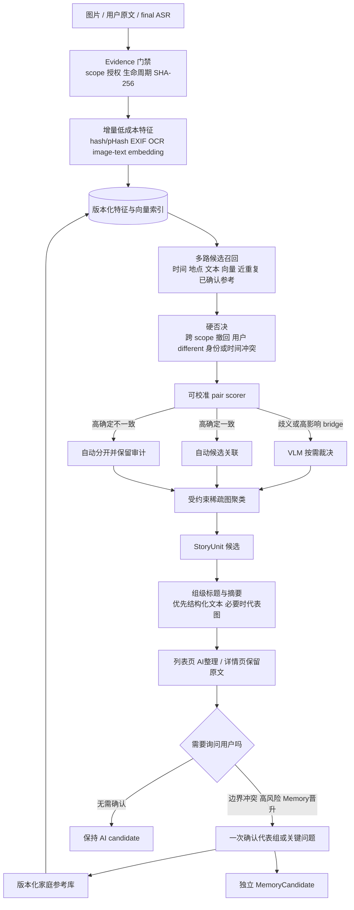

# SGX 图文分类：混合召回、按需多模态裁决与渐进自动化 Spec

> 状态：下一阶段设计冻结候选，供实现与真实数据 Gate 使用<br>
> 日期：2026-09-27<br>
> 适用范围：照片、用户原文、final ASR 的分类、关联、事件/故事归纳和家庭参考积累<br>
> 当前基线：`classification-stage-a.1`、`sgx-five-facets.6`、`association-rules.1`

## 1. 本轮结论

1. **正常路径不得把整个图库做全量图片两两 VLM 比较。** 图片先各自抽取一次低成本特征，再从索引中找少量候选；多模态模型只裁决有歧义、会改变分组边界的候选。
2. **`0.80/0.55` 只保留为现有规则基线。** 它们没有经过概率校准，不作为正式产品自动关联或人工确认门槛。
3. **产品目标是高自动覆盖率与低严重误合并同时成立。** 不能为了减少人工确认而放宽所有结果，也不能把一个宽阈值区间全部交给用户。
4. **家庭参考会随确认逐步增强。** 用户确认的人物、事件、地点别名和 same/different 关系形成可撤回、可版本化的参考；新内容优先与这些参考原型匹配，从而减少后续比较和确认。
5. **本地轻量模型有必要，完整本地多模态大模型暂不作为首要依赖。** 本地模型负责 OCR、去重、embedding、候选召回和可选匿名人脸聚类；API VLM 负责困难语义抽取、关键关系裁决和故事摘要。

这是一条混合架构：确定性工具保证边界，本地模型降低成本，VLM 处理复杂语义，用户确认建立家庭权威事实。

## 2. 为什么图片两两送入模型不可持续

若 `N` 张图片全部两两比较，请求对数为：

```text
N × (N - 1) / 2
```

|图片数|全部图片对|每张图片平均被重复发送|
|---:|---:|---:|
|10|45|9 次|
|30|435|29 次|
|100|4,950|99 次|
|1,000|499,500|999 次|

图片 token 的精确计算取决于供应商、分辨率、缩放和模型版本，不能用一个固定数字代表所有模型。但每个图片对请求都会重复发送 System Prompt、两张图片和上下文，所以成本、网络耗时和失败面都会随图片对数快速增长。

当前代码有两种不同的“两两处理”，必须分开理解：

- Stage A 不会把全库所有图片对都发给 VLM；它先选择每张受影响图片的最多 `K` 个候选，再调用 `relate`。设 `Δ` 是需要重新抽取的变化图片数，`I` 是需要重算关系的受影响图片数，则 `extract <= Δ`、`relate <= I×K`，照片对去重后会更低。普通新增时 `I` 通常接近 `Δ`，reference/correction 变化时 `I` 可能包含未变化图片。目前真实 API 调用仍是串行。
- `content-organization.ts` 会在本地对全部 active `ContentItem` 两两规则打分。它不消耗模型 token，但组合数仍是 `O(N²)`；246 项已经产生 30,135 对，超过当前 Schema 的 30,000 条 association 上限。

因此优化必须同时处理两件事：减少进入 VLM 的候选关系，并让 StoryUnit 组织器只消费稀疏候选边。

## 3. 目标架构

完整流程图见 [混合召回与渐进自动化流程](../../../figures/sgx-classification-hybrid-retrieval-adaptive-flow.md)。



## 4. 分层处理方式

### 4.1 Evidence 与 provenance 门禁

现有强边界继续保留：

- 用 `householdId + subjectId + authorizationRevision` 隔离；
- 图片、用户原文和 final ASR 保持独立 Evidence；
- 每个派生物保存 `sourceRefs + sourceHash + extractorVersion`；
- 撤回、删除、授权变化、模型版本变化使相应派生物失效；
- 迟到结果和旧版本结果不得写入当前状态。

### 4.2 一次性、增量的低成本特征

默认不调用 VLM，先为新内容或变化内容生成：

|特征|用途|是否可作为事实|
|---|---|---|
|SHA-256、pHash/dHash|完全重复、缩略图、翻拍近重复候选|只表示文件/视觉近似，不证明同一事件|
|EXIF 时间与 GPS|时间、地点候选和 blocking|需区分 capture/scan/upload；GPS 按授权降精度|
|OCR 文字与区域|照片中的日期、地点、横幅和文档线索|只是候选，不能自动成为用户事实|
|多语 image-text embedding|跨图片、图片与文字的语义召回|只用于召回/排序，不解释成概率|
|文本 embedding|用户原文、final ASR、标题和地点别名召回|只用于召回/排序|
|质量、尺寸、方向|低质量处理、重复和路由|可作为技术元数据|
|未命名/假名化 face embedding|同人候选和人物 cluster|仍是敏感生物识别模板；默认关闭，需单独授权、加密访问、撤回删除与可商用模型|

所有特征必须缓存并带版本。更换 embedding 或 OCR 模型时只重算受影响特征和索引。

### 4.3 多路候选召回

候选集合使用多路 union，而不是一次固定加权扫全库：

1. 时间窗口：date、year、decade 按各自精度选择窗口；
2. 地点：GPS/geohash、城市、具名场所；
3. image/text embedding ANN top-K；
4. 相同 event/scene 粗标签；
5. pHash 近重复；
6. 已确认 Person/Event reference；
7. 少量 discovery fallback，避免系统永远只强化已有分组。

候选必须记录 `selected / omitted / reason / coverage`。候选召回不足不能静默自动合并，应进入 `needs_review` 或保持未关联。

### 4.4 硬规则、排序分与最终决策分离

新体系有三层，不能再由一个 `0–1` 分数承担全部含义：

#### 第一层：硬门和 veto

跨 scope、撤回、用户明确 `different`、互斥 confirmed identity、明确不相交时间窗、缺少授权，直接阻止关联。用户明确 `same_story/same_event` 是可撤回硬约束。

#### 第二层：候选召回分

时间重叠、地理距离、语义 cosine、OCR/文字相似、事件一致、来源可靠性、缺失和冲突标记用于 top-K 排序。这个分数只回答“是否值得进一步比较”。

#### 第三层：经过校准的决策风险

初期使用可解释的 logistic regression 或 GBDT 融合上述特征；有足够独立真值后，用 Platt 或 isotonic calibration 校准。最终输出至少包括：

- `p_same_calibrated`；
- `calibrationVersion`；
- `inDistribution / outOfDistribution`；
- `decisionReason`；
- `severityIfWrong`。

正式产品决策根据风险而不是一个宽阈值带：

|条件|动作|
|---|---|
|无 veto、证据充分、分布内、误合并风险低|产生 `auto_link_candidate` 决策|
|明显不一致|自动分开，保留审计|
|高影响 bridge、来源冲突、OOD、会合并两个已成型故事|调用 VLM 或询问用户|
|人名/亲属身份、敏感事实、长期 Memory 晋升|保留候选并按既定确认规则处理|

`0.80/0.55` 继续作为 `association-rules.1` 基线，便于回归比较；新策略使用新的 `method` 和 `calibrationVersion`，不能原地改变旧分数的语义。

新策略先输出独立的 `DecisionPolicyResult.action`：`auto_link_candidate / auto_separate / review`。在真实 Gate 通过前，它只以 shadow 结果保存，不改变旧关联和故事。Gate 通过后再做以下显式映射：

|层级|状态或动作|权威含义|
|---|---|---|
|决策审计|`auto_link_candidate`|新策略建议自动组织，仍不是内容关系事实|
|AssociationCandidate|`source=ai_inferred, status=ai_auto`|可自动展示/组织进 AI 候选 StoryUnit|
|StoryUnit|`state=ai_candidate`|AI 故事候选，可以纠正或撤回|
|用户关系|`status=user_confirmed`|用户明确确认的关系，优先于 AI|
|Memory|独立 MemoryCandidate Gate|不能由上述任何 AI 状态直接晋升|

`auto_separate` 映射为 `not_selected`，`review` 映射为 `needs_review`。H0 必须把这组映射写进 Schema 和测试，避免把自动展示、自动组织、用户确认和长期 Memory 混成一个状态。

### 4.5 受约束聚类

- 人物与事件使用各自的稀疏候选图，不能把“同一人物”和“同一事件”混成一条边；
- 低置信 bridge 不能因为传递性直接合并两个已成型 group；
- confirmed `same/different` 作为 must-link / cannot-link；
- 组发生变化时才重新生成标题与摘要；
- 一项内容只有一个 primary StoryUnit，可以保留多个 related 候选。

### 4.6 VLM 路由

VLM 只处理三类任务：

1. 图片缺少足够结构化描述时做 `extract`；
2. scorer 落入歧义区、且关系会影响 group merge/split 时做 `relate`；
3. group digest 变化时做一次标题和摘要。

两到四张图片可在受控批次内共同抽取，以减少重复 Prompt 开销；图片 token 仍近似随图片量增加，一张坏输出也必须能隔离。大组归纳不发送所有原图，优先发送结构化 Observation、用户原文、final ASR、代表图片和必要局部 crop。

模型无效输出、超时或限流不得修改当前 StoryUnit。系统保留 last-known-good，并把失败放入有限重试、review 或 dead letter。

## 5. 成本与时延模型

设：

- `M`：已有内容总数；
- `Δ`：本次新增或变化内容数；
- `I`：本次需要重算关系的受影响内容数，可能大于 `Δ`；
- `K`：每项召回候选数；
- `α`：候选中真正需要 VLM 关系裁决的比例；
- `β`：内容中需要 VLM 视觉抽取的比例；
- `Be / Br`：extract / relate 批大小；
- `G`：受影响 group 数。
- `R`：组摘要实际携带的代表图片总数。

建议方案的 **API 请求数** 约为：

```text
ceil(βΔ / Be) + ceil(αIK / Br) + G
```

批处理不会让图片本身消失。若每个关系候选仍需两张图，视觉 payload 数约为：

```text
βΔ + 2αIK + R
```

因此必须分别衡量：请求数、重复图片 payload/输入 token、实际费用和 wall time。`Be/Br` 可以摊薄重复 Prompt 与网络往返；token 与费用能下降多少，还取决于图片压缩、是否复用已抽取 Observation、模型计价和代表图策略。并发也只能降低部分 wall time，不能降低 token。

例：100 张新图且 `I=Δ=100`、`K=8`、`α=15%`、`Be=4`、`Br=4`、`G=10`：

- 当前有界链上界约为 `100 + 800 = 900` 次；
- 如果全部图片都需要批量 extract，约 `25 + 30 + 10 = 65` 次；
- 如果只有 30% 图片需要 VLM extract，约 `8 + 30 + 10 = 48` 次。

约 93%–95% 只表示上述示例的 **API 请求数估算下降**，不是 token、费用或总时延下降结论。真实批次必须同时记录：图片数、候选数、VLM 调用数、重复图片 payload、输入/输出 token、缓存命中、invalid rate、费用以及 p50/p95 延迟。

当前候选扫描并排序的计算成本约为 `O(I×M log M)`；小规模 exact baseline 约为 `O(I×M)`，ANN 查询成本取决于具体索引和参数，不能只用一个固定大 O 承诺。召回后稀疏打分约为 `O(IK)`，图处理约为 `O(M+E)`，其中 `E` 是实际保留的稀疏边数。

单张增量的目标形态是：一次本地 embedding + top-K 查询，常见只触发 0/1 次 extract、0–2 批歧义关系裁决和 0/1 次受影响组摘要。

## 6. 如何让人工确认随时间下降

建立独立于长期 Memory 的 `FamilyReferenceStore`：

|参考类型|保存内容|来源要求|
|---|---|---|
|`PersonReference`|假名化 personId、用户确认的 face region、显示名、consent、modelVersion|必须由经认证用户明确提供或确认，并有有效 biometric consent；AI 候选不能成为锚点|
|`EventReference`|已确认成员、时间窗、地点、参与者和证据|必须可回到 Evidence|
|`RelationCorrection`|same/different、merge/split/move|记录 actor、revision 和撤回状态|
|`HouseholdVocabulary`|家庭称谓、地点别名、常用活动名|只保留用户明确提供的语境|

减少确认的产品策略：

- 第一次命名后，一次展示 3–5 张代表图确认一个 cluster；
- 只询问会改变分组边界的 bridge、冲突 reference、低 margin 样本和 Memory 晋升；
- 负反馈缓存，避免反复询问同一照片对；
- 新照片高匹配已确认事件时，只问“是否加入这次活动”，不重复询问全部时间地点；
- 每个 component 选择信息增益最高的一个问题，而不是逐图询问；
- AI 自动结果不能递归成为训练真值，防止错误自我强化。

评测必须按真实时间顺序执行 `0 → 10 → 30 → 100` 个确认的 prefix-to-future replay，验证参考增加后用户问题是否减少，同时严重 false merge 不增加；不能随机挑选容易样本组成后续阶段。

## 7. 泛化要求

### 7.1 数据切分

- 按家庭和事件切分 train/calibration/holdout；
- 同一事件、连拍、翻拍和近重复必须在同一分区；
- 至少保留一个完全未见家庭的 holdout；
- 合成数据只验证工程与异常路径，真实家庭数据才能验证效果与泛化。

### 7.2 必测切片

- 老照片、近期手机照片、扫描/翻拍、低光、模糊、多人；
- 有/无 EXIF，有/无用户原文，有/无 final ASR；
- 图文一致、图文冲突、时间地点模糊、纯文本；
- 家庭团聚、旅行、求学、工作、日常碎片和非事件内容；
- 未见家庭、未见地点、未见事件表达；
- 删除、撤回、纠错、重复内容和跨主体隔离。

### 7.3 指标

|层级|指标|
|---|---|
|候选召回|Recall@K、每项候选数、漏召回原因|
|关系与聚类|precision/recall、false merge、false split、B-cubed、ARI|
|概率与决策|Brier、ECE、reliability curve、OOD coverage|
|产品负担|每 100 项新内容触发的问题数、涉及问题的内容比例、每个问题覆盖的内容数、auto coverage、abstain rate|
|工程成本|调用/内容、token/内容、费用/内容、缓存命中、p50/p95、invalid rate|
|长期效果|参考增加后 review rate 下降，且 false merge 不恶化|

正式 auto merge Gate 需要真实、独立、冻结的 holdout。建议在至少 300 个预先冻结 eligibility 与固定分母的 auto-eligible held-out pair、且 pair 与 cluster 两级都没有高严重误合并时，才讨论开放自动组织；若样本不足，只输出候选和 shadow decision。这个数字是下一阶段的保守工程 Gate 候选，不是当前已验证结论，正式冻结需结合真实样本覆盖和风险容忍度。

## 8. 本地模型与开源组件策略

### 8.1 推荐采用

|能力|第一选择|集成边界|
|---|---|---|
|多语图片/文本 embedding|SigLIP 2 Base 或经许可审查的 OpenCLIP checkpoint|只做召回和特征，不直接确认事实|
|中文 OCR|PaddleOCR|保存文本、box、模型版本和来源；不直接升级为事实|
|向量检索|小规模先做 exact baseline；产品已有 PostgreSQL 时优先 pgvector，规模增长后再开 HNSW|ANN 需要与 exact 对照监控 Recall@K|
|近重复|pHash/dHash|确定性预筛选|
|聚类|约束图聚类；人物可在授权后评估 DBSCAN/HDBSCAN|must-link/cannot-link 与用户修正优先|
|困难语义|Qwen/GLM Flash 类 VLM API|只处理 extract、歧义 relate 和组摘要|

SigLIP 2 提供多语 image-text encoder；pgvector 同时支持 exact、HNSW 和 IVFFlat；PaddleOCR 提供中文与多语 OCR。正式采用前仍需冻结具体 checkpoint、权重许可、模型哈希、显存/内存和实测质量。

### 8.2 暂缓或单独评估

- P0 不引入完整本地 VLM 作为主链依赖；先证明 embedding/OCR/召回能明显减少 API 调用。
- 人脸识别默认关闭。InsightFace 代码许可与公开预训练权重许可不同，公开模型通常仅限非商业研究；商业产品不能直接把它作为默认模型。
- 独立 Qdrant/FAISS 服务只有在 PostgreSQL/pgvector 的规模、吞吐或运维证据不足时再引入，避免过早增加基础设施。
- 任何 OpenCLIP checkpoint 都要分别核对代码、权重和训练数据许可，不能只看仓库代码许可证。

## 9. 下一阶段执行计划

### H0：契约和基线冻结

- 新增 `AssetFeature`、`RetrievalCandidate`、`SparseAssociationInput`、`FamilyReference`、`DecisionPolicy` 的版本化契约；
- 保留 `association-rules.1` 作为对照；新的 auto policy 默认 shadow；
- 写清 StoryUnit、用户确认和 MemoryCandidate 的权威边界。

**Gate：** 契约可由全栈读取；旧 fixture 仍可复现；AI 输出不能产生 `user_confirmed`。

### H1：先移除正常路径的全量两两组织

- 实现 `Stage A Observation/Group → ContentObservation` 适配器；
- 让 `organizeContent` 接收稀疏 `AssociationCandidate`，不再自行枚举所有 active 内容对；
- 提供小规模 exact/in-memory 候选检索基线和可追溯 fallback；
- 为纯 `user_text/final_asr` 增加独立 extractor 接口。

**Gate：** 250 项输入不产生全量 30,000+ pair；输出规模受 `N×K` 限制；跨 scope、撤回或无证据的边为 0；既有分类回归全部通过。

### H2：本地特征与索引离线 Spike

- 在隔离环境比较 SigLIP 2 与一个许可合格的 OpenCLIP checkpoint；
- 接入 PaddleOCR、pHash、EXIF；人脸链默认关闭；
- 用 exact vector search 作为 ANN 的技术对照，计算 `ANN Recall@K_exact`、时延和资源占用；
- 用人工冻结的 same-event/same-story 关系或组作为业务真值，独立计算 `semantic candidate Recall@K_labeled`；
- 记录所有代码、checkpoint、权重和数据许可。
- 为本地模型和索引定义 timeout、circuit breaker、降级到 exact/metadata-only 的路径，以及新旧 embedding 双版本迁移。

**探索 Gate：** ANN 技术召回不得掩盖业务漏召回，两类指标必须同时报告。业务 `semantic candidate Recall@K_labeled` 的候选目标为整体 `>=95%`、高风险切片 `>=90%`；未达标时扩大 K 或进入 review，禁止 auto merge。数字在 exploration 后再正式冻结。

### H3：VLM router 与组级归纳

- 只把 ambiguous/merge-impact 候选发给 VLM；
- 同 digest 不重复计费；单项失败不阻断其他项；
- StoryUnit 只在 group digest 变化时归纳，优先结构化文本，必要时带代表图；
- 每句摘要可回到 Evidence，详情页永远保留原文。

**Gate：** 相同冻结批次下，分别报告请求、token、费用和时延；VLM 请求/内容相对当前有界 pair 基线下降至少 70%，费用下降幅度由实测决定。无效、超时、429 不产生新 group；身份、日期和地点捏造审查必须预先冻结样本数、审阅者和判定标准。70% 是下一阶段请求数工程目标，须实测确认。

### H4：评分校准与渐进自动化

- 以 household-group split 训练/校准可解释 pair scorer；
- 建立 FamilyReferenceStore、负反馈缓存和主动询问选择器；
- shadow 运行 auto-link/auto-separate/review 决策；
- 报告 calibration、false merge/split、coverage、review rate 和 OOD。

**Gate：** 在冻结 holdout 达到批准的严重 false merge 上限后才能开放 auto association；初期产品目标候选为 review `<=20%`，参考积累后 `<=10%`，前提是误合并指标不恶化。目标不是当前结果。

### H5：可靠任务与产品闭环

- DB-backed Job/CAS/idempotency、限次退避、cancel、late-result rejection、dead letter；
- 上传、AI 整理、批量确认、纠错、撤回、删除传播和 last-known-good UI；
- 只有通过独立规则的确认结果生成 MemoryCandidate。

**Gate：** 重启可恢复；10 个重复请求只计费 1 次；撤回、取消和旧 run 在并发下 0 次写入；浏览器 E2E 覆盖主要老人端路径。

## 10. 当前立即执行的最小任务包

下一次工程提交从 H0 + H1 开始，结束标准是：

1. 冻结五个新契约及错误语义；
2. 写出会在 250 项输入上失败的全量 pair 回归；
3. 实现 sparse candidate 输入并通过该回归；
4. 完成 Stage A 到 `ContentObservation` 的可追溯映射；
5. 保留旧 `association-rules.1` 作为 baseline，禁止旧阈值被误认为生产概率；
6. 运行 `npm run test:classification`、`npm run typecheck`、密钥扫描和 `git diff --check`；
7. 形成一个可单独回退的小提交，不安装模型、不调用付费 API、不接生产数据库。

完成这个任务包后，才进入 H2 的服务器本地模型 Spike 和真实照片 exploration。

## 11. Source Gate

当前仅完成候选评估，没有复制外部源码或正式采用模型。版本、依赖和权重许可仍须在 H2 单独冻结：

|项目|已知仓库许可或权重边界|参考范围|采用状态与理由|
|---|---|---|---|
|[SigLIP 2 / big_vision](https://github.com/google-research/big_vision/blob/main/big_vision/configs/proj/image_text/README_siglip2.md)|仓库声明代码/多数模型为 Apache-2.0，具体 checkpoint 仍需复核|多语 image-text embedding 与检索评测|候选；适合跨图片与中文文本召回|
|[PaddleOCR](https://github.com/PaddlePaddle/PaddleOCR)|仓库代码 Apache-2.0；具体权重和依赖另核|中文 OCR、box 与批处理接口|候选；照片内中文线索较重要|
|[pgvector](https://github.com/pgvector/pgvector)|PostgreSQL License|exact、HNSW、IVFFlat 与 recall 监控|候选；已有 PostgreSQL 时运维最小|
|[OpenCLIP](https://github.com/mlfoundations/open_clip)|代码 MIT；checkpoint 与训练数据许可逐项不同|embedding 对照模型|候选；不可因代码 MIT 推断所有权重可商用|
|[FAISS](https://github.com/facebookresearch/faiss)|代码 MIT|离线 exact/ANN benchmark|候选；暂不引入独立服务|
|[HNSWlib](https://github.com/nmslib/hnswlib)|代码 Apache-2.0|轻量 ANN 对照|候选；仅在 pgvector 证据不足时评估|
|[Immich](https://github.com/immich-app/immich)|AGPL-3.0|增量索引、人物聚类与纠错产品流程|架构参考；不复制源码、不引入服务|
|[LibrePhotos](https://github.com/LibrePhotos/librephotos)|根仓库 MIT，模型与依赖不自动继承|照片管理、搜索和人物/事件组织|架构参考；不复制源码|
|[InsightFace](https://github.com/deepinsight/insightface/blob/master/python-package/docs/model_zoo.md)|代码 MIT；官方公开预训练模型通常仅限非商业研究|许可和人物识别风险参考|不作为商业 P0 默认模型|
|pHash/dHash 实现|尚未选库|近重复候选|未采用；选库前单独核对实现许可|

实施 H2 前必须为最终选定版本建立 license manifest，并逐项记录代码许可、权重许可、下载来源、哈希、商用边界和复制/改造范围。
