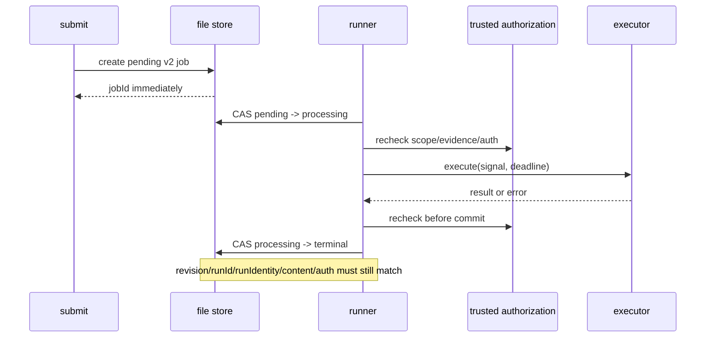

# Classification Lab Execution Lifecycle Spec

> 日期：2026-09-30
> 阶段：E3b
> 状态：冻结，进入测试优先实现
> 前置：E3a `classification-lab-stage-a-composition.1`
> 证据边界：`offline_execution_lifecycle_only`

## 1. 目标

E3b 把当前“一个 HTTP 请求内同步跑完全部分类”的本地实验台改成可审计、可取消、可恢复的两阶段执行生命周期：先持久化 `pending` Job，再由受控 runner 领取执行，最后通过 revision/CAS 接受终态。

它必须解决以下问题：

1. 相同内容切换 Provider、模型、Prompt、taxonomy、scorer 或授权版本时不能误用旧结果；
2. 浏览器拿到 Job ID 前不应被一个长模型调用阻塞；
3. 取消、授权撤回、Evidence 删除或版本变化后，晚到模型结果不得落盘；
4. 两个并发写者不能用 last-write-wins 覆盖彼此；
5. 进程崩溃后不能把中断的调用伪装成成功，也不能自动重复产生费用；
6. 所有时间和执行身份均可注入、可测试，不依赖真实等待。

E3b 只证明本地实验台的执行控制正确。它不调用真实模型，不证明分类准确率，也不代表生产数据库、Redis 或消息队列已经完成。

## 2. 范围

### 2.1 包含

- `contentDigest`、`runIdentityDigest` 与 `idempotencyKey` 分层；
- `classification-lab-job.2` strict Job Schema；
- `pending → processing → terminal` 状态机；
- numeric `revision` 与 compare-and-set；
- 每个运行中的 Job 一个 `AbortController`；
- durable cancel、授权撤回、Evidence 删除和晚到结果拒收；
- deadline/timeout；
- 进程重启后的 abandoned `processing` 恢复；
- 可注入 Clock 和 runner generation；
- deterministic 与后续 `stage_a_mock` 可共用的 executor 接口；
- 零网络、零凭据、零费用的自动化 Gate。

### 2.2 不包含

- 真实 Qwen/GLM 调用、Keychain 或 API key；
- E3c Provider factory、图片派生图与 raw response artifact finalization；
- 页面 UI 或路由交互改版；
- 数据库、Redis、消息队列、分布式锁或多进程生产调度；
- 自动重试；
- 真实模型效果、阈值校准或长期 Memory 写入；
- 把旧临时目录重造为可验证实验记录。

### 2.3 v1/v2 并行迁移

E3b 新增明确命名的 v2 create/run/read/store API，并保留现有 `classification-lab-job.1`、同步 `submitClassificationLabJob`、HTTP route、页面和 action 路径不变。v2 runner 必须拒领 v1。E3c 在 executor/factory 稳定后再把 POST 切成 pending/202、触发 runner 并增加页面 polling；E3b 不交付一个页面无法消费的半迁移状态。

v2 默认使用独立物理根 `<CLASSIFICATION_LAB_DATA_DIR>/v2`，其 Job、asset 与 temp namespace 不进入 v1 root 的 `list/get`。回归必须证明创建 v2 Job 后 v1 list、route 和页面仍可正常读取 v1。

## 3. Source Gate

结论：`PASS_WITH_CONDITIONS`。

E3b 优先复用本仓库已经验证的语义：

- `ClassificationEngine` 的授权复查、context hash 与 stale generation；
- `SnapshotStore.compareAndSet` 的 CAS 语义；
- `executeProvider` 的 `AbortSignal`、timeout 和晚到结果隔离；
- `stage-a-http.ts` 的运行中 controller registry；
- E0 artifact registry 的不可变身份与证据边界；
- 当前 `FileClassificationLabStore` 的 owner-only 临时文件 + rename 写入。

已有方案审计把 Node `AbortSignal`、p-queue、write-file-atomic、lowdb、proper-lockfile 作为语义参考并记录许可；E3b 不复制其代码、不新增依赖。当前功能只需要项目专用的薄 runner 与单进程文件 CAS，自研范围更小，也避免提前引入生产中间件。若未来改成多进程或多机执行，必须重新过 Source Gate，并迁移到具备真实事务或分布式租约的存储。

## 4. 冻结术语与身份分层

### 4.1 `contentDigest`

`contentDigest` 表示“用户希望分类的内容是什么”，不表示“用什么模型执行”。它由规范化 `ContentIdentityV1` 计算：

```ts
interface ContentIdentityV1 {
  version: 'classification-lab-content-identity.1';
  scope: { householdId: string; subjectId: string };
  actorId: string;
  context: {
    kind: 'album_upload' | 'family_transfer';
    senderId?: string;
    recipientIds: string[];
  };
  images: Array<{
    slot: number;
    sourceHash: `sha256:${string}`;
    mimeType: 'image/jpeg' | 'image/png' | 'image/webp';
    byteLength: number;
    width: number;
    height: number;
  }>;
  texts: Array<{
    modality: 'user_text' | 'final_asr';
    normalizedText: string;
    sourceHash: `sha256:${string}`;
    target: 'batch' | { imageSlots: number[] };
  }>;
}
```

规则：

- 图片 slot 和绑定目标有产品语义，因此保留；recipient、target 列表规范化排序去重；
- 文本使用 NFKC 和既有 Lab trimming 规则；
- 图片文件名、`submittedAt`、`createdAt`、临时路径、Job ID、Provider、预算和授权不参与；
- scope、actor、家庭互传双方、bytes hash、模态、尺寸、文本或绑定任一变化都会改变 digest；
- E3a `audit.inputDigest` 仍是某次 Stage A plan 的摘要，不能代替 `contentDigest`。

### 4.2 `runIdentityDigest`

`runIdentityDigest` 表示“这份内容按哪一套执行配置和授权运行”：

```ts
interface LabRunIdentityV1 {
  version: 'classification-lab-run-identity.1';
  contentDigest: `sha256:${string}`;
  attemptRevision: number;
  executionProfile: {
    providerMode: 'deterministic' | 'stage_a_mock' | 'stage_a_real';
    providerVersion: string;
    modelVersion: string;
    promptVersion: string;
    guardVersion: string;
    adapterVersion: string;
    taxonomyVersion: string;
    placeKindPolicyDigest: `sha256:${string}`;
    scorerVersion: string;
    configDigest: `sha256:${string}`;
  };
  authorizationGrantDigest: `sha256:${string}`;
  authorizationRevision: string;
  contextRevision: string;
  semanticContextDigest: `sha256:${string}`;
  budgetPolicyDigest: `sha256:${string}`;
}

interface SemanticContextV1 {
  version: 'classification-lab-semantic-context.1';
  referenceDate: string; // YYYY-MM-DD
  timeZone: string; // IANA zone
  relativeTimePolicyVersion: string;
}
```

- `attemptRevision` 从 1 开始。E3b 不自动重试；显式重试必须递增它，因此是一个新 run；
- `budgetPolicyDigest` 包含 request/token/cost/candidate/output/call-duration 上限，不含绝对 `deadlineAt`；
- `semanticContextDigest` 由核心对 strict `SemanticContextV1` 计算，绑定服务端给出的 reference date、IANA timezone 和 relative-time policy；不能接受调用方任意 hash，“今天/昨晚”等相对时间跨语义锚点必须产生新 run；
- `deadlineAt` 是本次 operational constraint。相同 run identity 重放仍命中同一 Job，并以首次创建的 deadline 为准，重复提交不能偷偷延长或缩短；若旧 attempt 已超时，显式重试必须增加 `attemptRevision`；
- immutable grant fingerprint 参与 `runIdentityDigest`，mutable `authorization.state` 只控制当前可执行与可见性；撤权不能反向改写已经冻结的 run identity；
- API key、secret path、原始凭据值绝不进入 profile、digest、Job、日志或响应。

### 4.3 派生 ID

```text
idempotencyKey = sha256(["classification-lab-run.2", runIdentityDigest])
runId         = "lab_run_" + idempotencyKey[7:31]
jobId         = runId
```

完全相同的 run identity 并发提交只创建一个 Job、最多领取一次执行。同内容但 Provider/model/prompt/taxonomy/scorer/授权 revision/attempt 任一变化必须产生新 Job。

E3b 将完全相同内容和执行身份的重复提交视作同一次 Lab run。产品如果需要把相同 bytes 的两次上传表达为两个独立事件，E3c/E4 接线前必须决定是否把可信 `submissionId/ingestionId` 纳入 content identity；当前不得用客户端任意字符串破坏幂等。

所有 digest 复用 `stage-a-contract.ts` 的 `stable + digest`：对象键排序、数组保序，只有明确声明为集合的 recipient/target/purpose/allowlist 才排序去重。文字先 NFKC、trim，再从规范化 UTF-8 bytes 重算 `sourceHash`，不能信任调用方传入的 hash。实现测试必须固定至少一个 golden vector，保证跨模块复现。

## 5. Job v2

新增 `classification-lab-job.2`，至少包含：

```ts
interface LabJobRecordV2 {
  version: 'classification-lab-job.2';
  revision: number;
  jobId: string;
  runId: string;
  idempotencyKey: `sha256:${string}`;
  contentDigest: `sha256:${string}`;
  runIdentityDigest: `sha256:${string}`;
  attemptRevision: number;
  status: 'pending' | 'processing' | 'succeeded' | 'needs_review' | 'failed_retryable' | 'failed_terminal' | 'cancelled';
  executionProfile: LabExecutionProfile;
  authorization: {
    actorId: string;
    authorityRef: string;
    authorizationRevision: string;
    contextRevision: string;
    grantDigest: `sha256:${string}`;
    initialGuardDigest: `sha256:${string}`;
    state: 'active' | 'revoked';
    revokedAt?: string;
  };
  createdAt: string;
  updatedAt: string;
  startedAt?: string;
  finishedAt?: string;
  deadlineAt: string;
  processingOwner?: { runnerGeneration: string; claimedAt: string };
  termination?: { requestedAt: string; reason: 'user' | 'authorization_revoked' | 'evidence_changed' | 'timeout' };
  envelope: IngestionEnvelope;
  originalTextByEvidenceId: Record<string, string>;
  assetRefs: Array<LabAssetRef & { sourceHash: `sha256:${string}` }>;
  result?: LabExecutionResult;
  resultDigest?: `sha256:${string}`;
  metrics?: LabExecutionMetrics;
  error?: { code: string; retryable: boolean };
  actions: LabAction[];
  privacyEvents: TrustedPrivacyControlEvent[];
  transitions: Array<{
    from: LabJobStatusV2 | 'none';
    to: LabJobStatusV2;
    reason: LabTransitionReason;
    at: string;
    revision: number;
    runnerGeneration?: string;
  }>;
}

interface LabExecutionResult {
  version: 'classification-lab-execution-result.1';
  workflowStatus: 'succeeded' | 'needs_review';
  profile: LabExecutionProfile;
  output: CanonicalLabProviderResult;
}

interface LabExecutionOutcome {
  result: LabExecutionResult;
  metrics: LabExecutionMetrics;
}

interface CanonicalOrganizationOutput {
  organization: SparseOrganizationResult;
  observations: ContentObservation[];
  batchBindings: BatchEvidenceBinding[];
  retrieval: {
    candidateCount: number;
    comparisonCount: number;
    maxCandidatesPerContent: number;
    scoreMeaning: 'retrieval_heuristic_not_probability';
  };
}

type CanonicalLabProviderResult =
  | (CanonicalOrganizationOutput & {
      provider: {
        mode: 'deterministic';
        providerVersion: string;
        modelVersion: 'none';
        promptVersion: 'none';
        evidenceStatus: 'integration_baseline_only';
        accuracyClaim: 'not_evaluated';
      };
    })
  | (CanonicalOrganizationOutput & {
      provider: {
        mode: 'stage_a_mock';
        providerVersion: string;
        modelVersion: string;
        promptVersion: string;
        evidenceStatus: 'mock_transport';
        accuracyClaim: 'not_evaluated';
      };
    });

interface LabExecutionMetrics {
  latencyMs: number;
  modelRequests: number;
  imageRequests: number;
  inputTokens: number;
  outputTokens: number;
  costCny: number;
}
```

约束：

- `revision` 从 0 开始，每次成功 CAS 恰好加 1；
- `processing` 必须有 `startedAt + processingOwner`；terminal 必须有 `finishedAt`。从 pending 直接终止时 `startedAt/processingOwner` 必须缺失，且 `createdAt <= finishedAt=updatedAt`；从 processing 终止才要求 `createdAt <= startedAt <= finishedAt`，首次 terminal 的 `updatedAt=finishedAt`；
- succeeded/needs_review 必须有 strict result、canonical `resultDigest` 与 metrics，failed_retryable/failed_terminal/cancelled 不得伪造成功结果；
- `retryable` 必须与失败状态一致；它只表示允许用户显式创建新 attempt，不触发自动重试；
- 每次状态变化都追加不可变 transition；create transition 使用 revision=0，后续 transition 使用 expectedRevision+1；reason 只能是稳定错误码/枚举，不能写 Provider 异常原文；同状态追加 action 只增加 revision，不能重写历史 transition；
- Job 只能保存无凭据执行身份；
- v1 Job 目录不得被 v2 runner 领取或覆盖。若需要读取旧记录，只允许经过显式 legacy read-only adapter，修改时返回 `LAB_LEGACY_JOB_READ_ONLY`。
- v2 submit 的授权由服务端注入，绝不能沿用 v1 由内容 key 派生的伪授权 revision。immutable `grantDigest` 对规范化 actor、authorityRef、scope、purposes、authorization/context revision、Evidence identity/revision/sourceHash/consent、correction allowlist 和 person-matching 权限求 digest；live `guardDigest` 再加入 active 与每条 Evidence lifecycle。run identity 绑定 grantDigest，Job 同时保存 initialGuardDigest 供审计。

## 6. 状态机

```mermaid
stateDiagram-v2
    [*] --> pending: create
    pending --> processing: CAS claim
    pending --> cancelled: durable cancel/revoke/delete
    pending --> failed_retryable: timeout/provider unavailable
    pending --> failed_terminal: invalid input/store invariant
    processing --> succeeded: validated terminal CAS
    processing --> needs_review: validated terminal CAS
    processing --> failed_retryable: timeout/provider unavailable/interrupted
    processing --> failed_terminal: invalid output/invariant failure
    processing --> cancelled: durable cancel/revoke/delete
    succeeded --> succeeded: append user action only
    needs_review --> needs_review: append user action only
    failed_retryable --> failed_retryable: status/result immutable; privacy action allowed
    failed_terminal --> failed_terminal: status/result immutable; privacy action allowed
    cancelled --> cancelled: status/result immutable; privacy action allowed
```



执行状态一旦 terminal 不得回到 `processing`。用户确认、拆分、合并、删除和撤权可以追加 action 并增加 revision，但不能改写已完成 run 的原始 Provider result。`accept_story`、`reject_association`、`remove_content`、`split_content` 和 `merge_stories` 只接受 `succeeded/needs_review`；pending/processing 只接受会终止执行的 cancel、撤权或 Evidence 删除；failed_retryable/failed_terminal/cancelled 仍允许撤权和删除，但不接受内容确认动作。`accept_story` 只确认故事编排，不能顺带确认人物身份、亲属关系、敏感事实或 Observation，也不能触发长期 Memory。

授权状态与执行状态分开：

- 对 pending/processing Job 撤权：同一 CAS 设置 `authorization.state=revoked` 和 `status=cancelled`；
- 对已完成 Job 撤权：保留历史执行状态和原始结果，设置 authorization revoked；只允许受限审计读取原始记录，产品视图必须移除原文、Observation、候选、故事、Evidence/asset ref 和媒体访问能力；
- terminal commit 只接受 authorization active 的 processing Job。

E3b 必须拆开 internal audit record 与 product view。产品 API 不得直接序列化 `LabJobRecordV2`。单条 Evidence 删除后，product view 必须移除该 Evidence、对应 Content、原文和资产引用，并递归移除所有直接或间接依赖其 support 的 Observation、Association、Story、标题和摘要；原始 Provider result 只在受限审计记录中保留。

`LabProductJobViewSchema` 使用正向 strict allowlist，只能包含安全 Job metadata、经过当前 guard 投影的 envelope/text/asset refs、materialized result、actionCount 和 authorizationState；禁止 spread internal record。`LabRedactedJobShellSchema` 只允许 `version/jobId/status/createdAt/updatedAt/error.code/redacted=true`，未来新增 internal 字段不会自动进入响应。

每次 v2 product get/list 和 public asset read 都必须实时查询 trusted guard，并显式传入 `requiredPurpose`：runner=`classification`，相册/媒体展示=`album_organization`，搜索投影=`search_candidate`，访谈投影=`interview_candidate`。guard unavailable、inactive，或 scope/actor/authority/auth revision/context/purpose 不匹配时整批返回脱敏壳，asset 拒绝；可信 guard 明确某 Evidence 为 withdrawn/deleted 时即时构造部分删除视图，即使 fan-out CAS 尚未完成；未知 Evidence 或无法解释的 revision/sourceHash 漂移整批 fail closed。资产读取始终逐 Evidence 校验。不能只信 Job 中上次持久化的 authorization.state，durable fan-out 负责审计和停止运行，但不是唯一隐私门。

## 7. Store 与 CAS

```ts
interface ClassificationLabJobStore {
  create(record: LabJobRecordV2, assets: LabAsset[]): Promise<{ record: LabJobRecordV2; created: boolean }>;
  get(jobId: string): Promise<LabJobRecordV2 | undefined>;
  compareAndSet(
    jobId: string,
    expectedRevision: number,
    transform: (current: LabJobRecordV2) => LabJobRecordV2
  ): Promise<{ ok: boolean; record: LabJobRecordV2 }>;
  list(limit?: number): Promise<LabJobRecordV2[]>;
  scanAll(): AsyncIterable<
    | { kind: 'record'; record: LabJobRecordV2 }
    | { kind: 'corrupt'; jobId: string; code: 'LAB_STORE_CORRUPT' }
  >;
  readAsset(jobId: string, evidenceId: string): Promise<{ bytes: Buffer; ref: LabAssetRef & { sourceHash: `sha256:${string}` } }>;
}
```

文件实现必须：

- 在当前 Node 进程内按 canonical root + jobId 串行化读取、revision 检查和写入；
- transform 后由 strict Schema 和状态转换表验证，再自动 `revision + 1`；
- `jobId/runId/idempotencyKey/contentDigest/runIdentityDigest/attemptRevision/executionProfile/raw envelope/originalText/assetRefs/createdAt/deadlineAt` 永久不可改；actions 与 privacyEvents 只能 append；authorization 只允许 active→revoked；`result + resultDigest + metrics` 只能由 runner 在 processing→terminal 时原子写入一次，store 每次 parse/CAS 都重算并验证 `digest(result)===resultDigest`，之后三者永久 byte-for-byte 不变；时间必须单调；
- 使用 owner-only 临时文件、flush/close、原子 rename；
- 不跟随 symlink，不接受 hard-linked `job.json`/asset，不覆盖非法或截断记录；
- 资产创建后 immutable；每次读取都复核 byteLength 与 sourceHash；
- 对 revision 不匹配返回 `LAB_JOB_REVISION_CONFLICT`，不能自动重试 transform；
- 明确标注为**单进程本地 store**。同一进程第二个 store 实例复用共享 mutex；能力必须公开为 `coordinationScope=single_process`、`crossProcessCas=false`，不能把 rename 宣称为分布式 CAS。E3b 不用不可靠的 PID marker 假装检测跨进程并发；T2 迁移到事务存储或真实租约前，部署层必须保证单进程单 owner。
- 截断 `jobId` 命中已有目录时必须继续比较完整 `idempotencyKey/runIdentityDigest`；不同则返回 `IDEMPOTENCY_CONFLICT`。

E3b Job store 是 operational state，可位于本地私有目录。正式实验的 manifest、raw response、usage ledger 和报告仍必须由 E3c 写入 E0 规定的 Git 外持久证据目录；两者不能互相冒充。

时间不变量按阶段定义：pending 只有 created/updated；processing 满足 `createdAt <= startedAt <= updatedAt`；pending 直接终止满足 `createdAt <= finishedAt=updatedAt` 且没有 started/owner；processing 终止满足 `createdAt <= startedAt <= finishedAt` 且首次 terminal 的 `updatedAt=finishedAt`；终态追加 action 后允许 `updatedAt >= finishedAt`，而 `finishedAt` 永远保留 Provider attempt 完成时刻。

v2 action 使用 `expectedRevision`，不再用时间戳做 CAS。相同 `actionId` 的完全一致重放先于 revision 冲突判断并返回当前 view；相同 ID 不同内容返回 `LAB_ACTION_ID_CONFLICT`。现有 v1 `expectedUpdatedAt` 暂时保留。迁移回归必须明确证明：v1 的终态撤权仍是旧行为，而 v2 终态撤权保持原 status/result、只改变 authorization 与 product view。

## 8. Runner



建议接口：

```ts
interface LabClock {
  nowMs(): number;
  setTimeout(callback: () => void, delayMs: number): unknown;
  clearTimeout(handle: unknown): void;
}

interface LabExecutionExecutor {
  readonly profile: LabExecutionProfile;
  execute(input: {
    job: LabJobRecordV2;
    signal: AbortSignal;
    clock: LabClock;
    getGuard: () => Promise<TrustedLabGuardSnapshot>;
    readAsset: (evidenceId: string) => Promise<Uint8Array>;
  }): Promise<LabExecutionOutcome>;
}

interface TrustedLabGuardSnapshot {
  scope: { householdId: string; subjectId: string };
  actorId: string;
  authorityRef: string;
  purposes: Array<'classification' | 'album_organization' | 'search_candidate' | 'interview_candidate'>;
  authorizationRevision: string;
  contextRevision: string;
  active: boolean;
  allowedConsentRefs: string[];
  allowedCorrectionIds: string[];
  allowPersonMatching: false;
  evidence: Array<{
    evidenceId: string;
    revision: number;
    sourceHash: `sha256:${string}`;
    consentRef: string;
    lifecycleState: 'active' | 'withdrawn' | 'deleted';
  }>;
  guardDigest: `sha256:${string}`;
}

interface TrustedLabGuardProvider {
  get(jobId: string): Promise<TrustedLabGuardSnapshot>;
}
```

runner 顺序冻结为：

1. submit 只做规范化、身份计算和 `pending` 持久化；
2. `runPendingJob` 用 CAS 领取，写入 caller 注入的 `runnerGeneration`；
3. 调用 executor 前从 `TrustedLabGuardProvider` 获取独立于 frozen Job 的服务端可信快照，用统一 `normalizeGuard + computeGrantDigest + computeGuardDigest` 重算，重验 actor、authority、scope、purpose、authorization/context revision、Evidence allowlist、revision、sourceHash、allowed consent/correction 和生命周期；`allowPersonMatching` 在当前阶段必须为 false；preflight 与 commit 的 grantDigest 必须等于 Job immutable grantDigest，active run 的 guardDigest 必须等于 initialGuardDigest，禁止从 Job envelope 反向重建快照让 Job 自证；
4. 以 `canonicalRoot + jobId` 为 key 注册 per-job `AbortController`，随后重新读取 Job；若 cancel 已在 claim 与注册之间落盘，立即退出且不调用 executor；
5. executor 必须接收 signal，Stage A 内部继续在每个阶段前后复查授权；
6. result 先经过 strict result Schema 和 E3a composition/organization Gate；
7. terminal commit 前重新读取当前 Job，并再次从同一可信 Provider 获取最新 guard；
8. 只有 status=processing 且 revision、runId、run identity、content digest、authorization/context revision 全部匹配，且同一注入 Clock 满足 `now < deadlineAt` 时才能 CAS 落盘；
9. 任一项变化时丢弃晚到结果并返回 `STALE_RESULT`；
10. finally 清除 controller registry。

executor 永远不能直接写 store。

Clock 只有 `nowMs()` 一个时间真值，ISO 一律由核心代码使用 `new Date(nowMs()).toISOString()` 派生。executor 建立后、任何 secret getter 或 transport 调用前，runner 必须比较 executor profile 的完整 digest 与 Job execution profile；不一致以 `LAB_RUN_IDENTITY_MISMATCH` fail closed。

## 9. 取消、撤权、删除与 timeout

统一顺序是“先 durable CAS，再 abort”：

1. CAS 把 pending/processing Job 写成 `cancelled` 或 timeout `failed_retryable`；
2. 写入 reason、finishedAt 和安全错误码；
3. 再触发内存 `AbortController`；
4. 即使 executor 忽略 abort，后续 terminal CAS 也会因状态/revision 变化被拒绝。

Evidence 删除或 revision/source hash 漂移发生在运行中时，使用同一边界：活动 run 被 durable cancel，旧输出不得进入展示、搜索候选、访谈候选或 Memory。

竞态以第一个成功 CAS 为线性化点：cancel/timeout/撤权/删除先胜出时，晚到 success 必须拒收；success 先胜出时普通 cancel 返回 `LAB_JOB_ALREADY_TERMINAL`，但撤权和删除仍能追加隐私动作并立即改变产品可见性。隐私控制遇 revision 冲突可以重新读取后按当前状态重新判断和提交，但不能原样重跑带副作用的 transform。一次 Evidence 删除或授权撤回事件必须通过 `scanAll()` 处理所有引用同一 grant/Evidence 的 v2 Job，包括 terminal Job，不能只改 active Job 或调用方已知的一个 Job。

普通用户 action 在写入前必须用 active trusted guard 校验当前 actor/authority；不能只相信请求体里的 `actorId`。撤权/删除使用独立 `TrustedPrivacyControlEvent`，由可信服务端来源签发并记录 authorityRef、authorizationRevision、guardDigest、affected Evidence 和事件 ID；它不因 `active=false` 被普通 action gate 拒绝。E3b 只承诺逻辑删除后立即不可见、不可读、不可继续处理；生产物理清除与法定保留期属于 T2 存储实现。

```ts
interface PrivacyEventBase {
  version: 'classification-lab-privacy-event.1';
  eventId: string;
  authorityRef: string;
  scope: { householdId: string; subjectId: string };
  authorizationRevision: string;
  guardDigest: `sha256:${string}`;
  occurredAt: string;
}

type TrustedPrivacyControlEvent =
  | (PrivacyEventBase & { kind: 'authorization_revoked'; evidenceIds?: never })
  | (PrivacyEventBase & { kind: 'evidence_deleted'; evidenceIds: [string, ...string[]] });
```

该 discriminated union strict，并追加到每个受影响 Job 的 append-only `privacyEvents` ledger；普通 `actions` 不复制隐私事件字段。同 eventId 同内容重放幂等，同 ID 不同内容返回 `LAB_PRIVACY_EVENT_ID_CONFLICT`。fan-out 中断后可用同一事件安全重放，每个 Job 最多落一次。guard provider 必须为已删除 Evidence 保留 tombstone，不能把它省略成未知漂移。

timeout 的边界为 `now >= deadlineAt`。runner 使用 `Promise.race` 或同等机制保证 executor 永不结束时也会在 durable timeout 后返回；迟到 resolve/reject 必须被安全吸收，不产生未处理 rejection。各阶段时间使用第 7 节的不变量。

## 10. 崩溃恢复

Clock 与唯一 `runnerGeneration` 由调用方注入；核心模块不自己读取当前时间或生成随机 ID。E3b 的自动 recovery 只在“同一 canonical root、单进程、单 runner owner”契约下成立；没有可靠 root lease 时不得启动第二个 runner，也不得宣称能检测跨进程 owner。

启动执行器时运行 `recoverInterruptedJobs(now, runnerGeneration)`：

- 先用 `scanAll()` 和最新 trusted guard 做 privacy reconciliation，再处理 orphan processing，避免撤权记录在恢复窗口内重新可见；
- pending 保留，等待显式领取；
- 属于其他 generation 的 processing Job 通过 CAS 标记 failed_retryable，错误码 `LAB_RUN_INTERRUPTED`；
- 不自动再次调用 Provider；
- terminal Job 的 execution status/result 不变；privacy state/action 可由 reconciliation 追加；
- 只清理符合严格命名且不含 symlink/hardlink 的 orphan temp；
- 非法、截断或无法解释的 Job 标记/报告 `LAB_STORE_CORRUPT`，不得覆盖修复；单个坏 Job 不得阻断其他 Job；
- recovery 使用不截断的 active-job 遍历接口，不能复用默认 20/100 条页面列表；仅允许在 runner 启动初始化阶段运行，不能周期执行后把仍存活的 generation 误判为中断。

## 11. E3c 接口边界

E3b 只要求 Provider factory 提供两项：

```ts
type CredentialFreeExecutionDescriptor = {
  providerMode: 'deterministic' | 'stage_a_mock' | 'stage_a_real';
  providerVersion: string;
  modelVersion: string;
  promptVersion: string;
  guardVersion: string;
  adapterVersion: string;
  taxonomyVersion: string;
  placeKindPolicyDigest: `sha256:${string}`;
  scorerVersion: string;
  configDigest: `sha256:${string}`;
};

interface ClassificationLabExecutorFactory {
  describe(config: CredentialFreeExecutionDescriptor): LabExecutionProfile; // 无凭据、无网络
  create(profile: LabExecutionProfile, context: TrustedExecutionContext): LabExecutionExecutor;
}
```

- E3b 拥有身份、Job 状态、CAS、timeout、abort 和结果接受门禁；
- E3c 拥有 Provider transport、模型/Prompt 参数、Stage A adapter、usage 和 raw artifact sink；
- `describe` 必须在 Job 创建前得到完整版本身份，但不能读取 secret；
- `create` 只有在 Job 已被领取且授权仍有效后才允许 E3c 内部读取 secret；
- E3b 测 `deterministic` 与本地 `stage_a_mock`；`stage_a_real` 只有 E3c 才能启用。

`LabExecutionResultSchema` 必须是 strict、按 `providerMode` 判别的 union。E3b 至少冻结 deterministic 与 `stage_a_mock` 的 canonical organization/result 形状；E3c 扩展 `stage_a_real` 时不能绕过 Schema。结果内 provider/model/prompt/guard/adapter/taxonomy/scorer 版本必须逐项等于 Job profile，不能只检查 mode。secret getter 只能存在于 claim 和第一次 trusted guard 复查之后创建的 `TrustedExecutionContext`，不能进入 `describe`。

## 12. 稳定错误码

复用：

- `IDEMPOTENCY_CONFLICT`
- `AUTHORIZATION_REVOKED`
- `AUTHORIZATION_CHANGED`
- `INACTIVE_EVIDENCE`
- `STALE_RESULT`
- `INVALID_OUTPUT`
- `CANCELLED`

E3b 新增：

- `LAB_JOB_NOT_FOUND`
- `LAB_JOB_NOT_PENDING`
- `LAB_JOB_ALREADY_TERMINAL`
- `LAB_JOB_REVISION_CONFLICT`
- `LAB_RUN_IDENTITY_MISMATCH`
- `LAB_RUN_TIMEOUT`
- `LAB_RUN_INTERRUPTED`
- `LAB_PROVIDER_UNAVAILABLE`
- `LAB_GUARD_UNAVAILABLE`
- `LAB_STORE_CORRUPT`
- `LAB_STORE_WRITE_FAILED`
- `LAB_STORE_MULTI_PROCESS_UNSUPPORTED`
- `LAB_LEGACY_JOB_READ_ONLY`
- `LAB_PRIVACY_EVENT_ID_CONFLICT`

错误记录带 `retryable`，但 E3b 不据此自动重试。

### 12.1 唯一结果映射

`LabExecutionResultSchema.workflowStatus` 只能是 `succeeded | needs_review`。runner 还要强制覆盖：只要存在人物身份/亲属关系、敏感事实、高风险 assertion、未解决冲突或要求确认的 review item，最终只能是 `needs_review`；只有低风险相册整理可为 `succeeded`。任何候选都不因 succeeded 自动进入长期 Memory。

错误到状态的纯函数映射冻结为：

| 条件/错误码 | 持久状态 | retryable | 说明 |
|---|---|---:|---|
| user cancel | `cancelled` | false | durable 后 abort |
| `AUTHORIZATION_REVOKED`、`AUTHORIZATION_CHANGED`、`INACTIVE_EVIDENCE`、Evidence drift | `cancelled` | false | 隐私/授权终止 |
| `LAB_RUN_TIMEOUT`、`LAB_PROVIDER_UNAVAILABLE`、`LAB_GUARD_UNAVAILABLE`、`LAB_RUN_INTERRUPTED` | `failed_retryable` | true | 只允许显式新 attempt |
| `INVALID_OUTPUT`、`LAB_RUN_IDENTITY_MISMATCH`、输入/Schema/不变量错误 | `failed_terminal` | false | 禁止自动重试 |
| `STALE_RESULT` | 不改当前记录 | n/a | 返回已赢得 CAS 的当前状态 |
| `LAB_STORE_WRITE_FAILED`、`LAB_STORE_CORRUPT` | 抛出操作失败 | n/a | 保留旧状态，不能伪称 terminal 已落盘 |

该映射由一个可单测纯函数拥有，executor 不能自行选择失败状态。

## 13. 测试矩阵

至少覆盖：

1. canonical 排序不改变 `contentDigest`；内容、绑定、scope 或 Evidence 变化会改变；固定 golden vector；相对时间语义锚变化会改变 run identity；
2. 同内容 + 同执行身份的 10 个并发 submit 只创建一个 Job；
3. Provider/model/prompt/taxonomy/scorer/auth revision/attempt 任一变化生成新 run；
4. deadline 不进入 run identity，过期 attempt 不能偷偷重跑；
5. 所有合法与非法状态转换；terminal Provider result immutable；
6. 两个并发 CAS 只有一个成功；
7. pending cancel 不调用 executor；processing cancel 先落盘再 abort；覆盖 claim 后、controller 注册前的取消窗口；
8. 不合作或永不结束 executor 的晚到 success/reject 不能覆盖 cancel/timeout，也不能产生未处理 rejection；
9. 运行中 revoke、Evidence delete、revision/source drift 均拒收结果；
10. 已完成 Job 撤权后历史状态/result digest 保留，但 product JSON 不含原文、Observation、候选、故事、Evidence/asset refs，资产访问立即失效；即使 fan-out CAS 尚未完成，live guard 也必须先阻断；单条 Evidence 删除递归移除所有派生；
11. fake clock 覆盖 deadline 和 timeout，不使用真实 sleep；
12. pending 重启保持 pending，orphan processing 变成 `LAB_RUN_INTERRUPTED`；第 101 个 active Job 也能恢复，单个 corrupt Job 不阻断其他 Job；
13. 恢复不增加 executor 调用次数，不做自动重试；
14. 截断 JSON、非法 Schema、symlink、hardlink、等长资产篡改与 orphan temp fail closed；
15. v1 Job 不被 v2 runner 领取或覆盖；v2 独立根创建 Job 后 v1 list/route 仍正常；
16. 双家庭、多主体和相同 run suffix 保持隔离；
17. deterministic 旧功能经 v2 lifecycle 继续可用；
18. `stage_a_mock` valid/invalid/provider-profile version mismatch 走相同门禁；
19. network 与 credential getter 使用 fail-fast spy，断言调用均为 0；
20. 高风险候选强制 `needs_review`；`accept_story` 后人物/关系/敏感 Observation 仍是候选，Memory 写入次数为 0；
21. 同截断 Job ID、不同完整 digest/asset manifest 拒绝复用；相同 identity 不同 deadline first-write-wins；
22. privacy event 跨中断重放幂等、同 ID 异内容冲突、多个 terminal Job fan-out 各只落一次；classification-only grant 不能用于相册、搜索或访谈投影；
23. typecheck、secret scan、全量 classification 回归和 diff check 通过。

## 14. 建议文件边界与提交

实现阶段建议只修改：

- `src/lib/algorithms/classification/lab-contract.ts`
- `src/lib/algorithms/classification/lab-store.ts`
- `src/lib/algorithms/classification/lab-service.ts`
- `src/lib/algorithms/classification/lab-actions.ts`
- `src/lib/algorithms/classification/lab-provider.ts`
- 新增 `src/lib/algorithms/classification/lab-execution.ts`
- 新增 `harness/classification/lab-execution-lifecycle.test.mjs`
- 必要时扩展 `harness/classification/lab-runtime.test.mjs`

E3b 单独提交；E3c Provider factory、HTTP/UI 接线和真实模型授权另做提交，避免生命周期与模型问题混在一起。

## 15. 完成条件

E3b 只有同时满足以下条件才完成：

- Job v2 strict Schema、三层身份、状态机和 numeric CAS 落地；
- submit 能先返回可读取的 pending Job；
- cancel/revoke/delete/timeout 均先持久化，再 abort；
- 晚到结果、旧 revision、旧授权、旧 Evidence 和旧 run identity 均 fail closed；
- 崩溃恢复不自动重跑，不产生重复模型调用；
- deterministic 与 `stage_a_mock` 的零网络测试通过；
- typecheck、secret scan、全量 classification 回归和 `git diff --check` 通过；
- 无 DB、Redis、队列、UI、真实模型、凭据读取或费用；
- 文档明确该 Gate 只证明本地执行生命周期，不证明模型准确率或产品就绪；
- 输出给 E3c 的 factory/executor 接口稳定，E3c 无需绕过 E3b 的 state gate。
