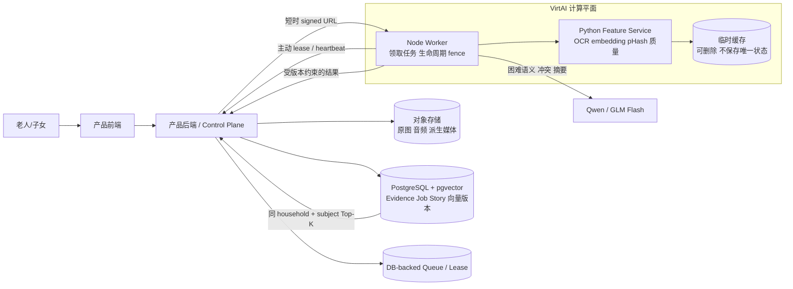
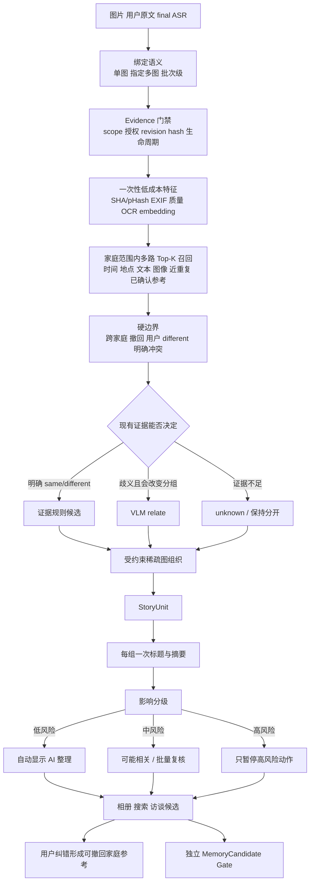

# SGX 自动分类与归纳：云端混合计算服务冻结 Spec

> 状态：Owner-approved architecture / implementation in progress
> Spec version：`sgx-classification-cloud-hybrid.1.0.0`  
> 日期：2026-10-02  
> 适用范围：最多 10 名内部用户的真实产品联调；输入包括图片、用户原文、原始音频和 final ASR
> 当前语义基线：`qwen3.7-flash-2026-07-15` / Prompt `sgx-five-facets.13`  
> 当前服务器状态：SSH、三根隔离目录、源码 staging 和无模型契约测试已完成；正式模型、激活 release 和常驻 Worker 尚未完成

## 1. 本 Spec 冻结什么

本文件冻结 T0/T1 阶段的目标架构、云端边界、开源组件候选、接口语义、真实模型评测分母和交付 Gate。它显式取代以下历史设计中的**当前运行规则**，但不删除历史记录：

- `2026-09-23-multimodal-content-organization-spec.md` 中以 `0.80/0.55` 作为自动关联或人工确认边界的设计；
- `2026-09-29-classification-semantic-scoring-v2-spec.md` 中把聚合分数作为 active 产品决策的设计；
- 任何把 embedding cosine、旧 `0.25/0.55/0.80` 或模型自报 confidence 直接解释为真实概率的实现。

历史阈值只能用于回放旧结果，不能决定新内容是否自动合并、是否进入 Memory 或是否要求用户逐项确认。

### 1.1 2026-10-02 Owner 已确认事项

- 正式调用采用 worker-pull：产品后端保存任务，VirtAI Worker 主动领取并回传结果；SSH 只用于部署和调试；
- 本轮交付目标为“最多 10 名内部用户可真实使用”，暂不承诺公网生产高可用；
- 产品现有文件存储是原图、音频和文件的权威来源，VirtAI 只持有可清理的任务临时副本；
- 原始音频可以由云端 ASR 产生 final ASR；已有 final ASR 时直接复用，不重复转写；
- 人物候选能力开启，但姓名、亲属关系和长期 Memory 仍受独立确认门控制；
- 单个非关键组件失败时保留可用的部分结果；授权、scope、hash 或跨家庭隔离失败时立即停止。

## 2. 产品目标和边界

系统接收一次产品提交，输入可以是：

- 单张或多张图片；
- 单图、选定多图或批次级用户说明；
- final ASR；
- 相册上传或家庭双端互传上下文；
- 用户明确的绑定、拆分、合并、拒绝和撤回操作。

系统输出：

1. 事件/故事 `StoryUnit`；
2. AI 标题、简短摘要、成员、时间线；
3. 人物候选、时间、地点、事件、场景、主题等可扩展标签；
4. `same / different / unknown` 关系及来源证据；
5. `AI 整理 / 可能相关 / 需要确认 / 无法判断` 状态；
6. 供搜索、访谈问题和独立 `MemoryCandidate` Gate 使用的候选。

事件/故事是主要内容单元。人物、时间、地点、场景和主题用于检索、筛选、召回和解释。用户原文与原始媒体不被 AI 标题或摘要覆盖。

本阶段不承诺：

- 未经授权或确认的人脸实名、亲属关系推断；
- 真实家庭分布准确率；
- 正式老照片 OCR 准确率；
- ASR 模型准确率；
- 生产高可用；
- T3 真实老人用户价值。

## 3. 冻结架构



### 3.1 权威数据归属

|数据|唯一权威位置|VirtAI 是否长期保存|
|---|---|---|
|原图、原音频、派生媒体|产品对象存储|否|
|Evidence、Job、授权、用户动作、StoryUnit|产品 PostgreSQL|否|
|向量及模型版本|产品 PostgreSQL + pgvector|只做短时计算|
|模型权重|冻结的只读模型挂载|可以引用，不复制为业务数据|
|任务临时文件|远端 `0700` 临时目录|完成、取消或超时后删除|
|密钥|Secret store / 进程环境|不得写入代码、报告或日志|

VirtAI 是可替换的计算平面。容器停止、迁移或重建不能丢失产品权威状态。

### 3.2 为什么采用 worker-pull

VirtAI Notebook 是否提供稳定入站端口、固定域名和持久本地盘尚未验证。首版由 worker 主动向产品后端领取租约：

- 不需要让真实用户或全栈工程师 SSH；
- 不需要把 Notebook 端口暴露到公网；
- 后端保留授权、幂等、撤回和迟到结果拒收权；
- 远端重启后可以重新领取未完成任务；
- 后续迁移到其他 GPU 服务器时不改变产品 API。

SSH 仅用于部署、资源检查和故障排查。

## 4. 从输入到输出的算法链



### 4.1 输入证据优先级

优先级不是“高优先级可以覆盖其他来源”，而是决定冲突时的可信来源角色：

1. 用户明确绑定、确认、拆分、合并、拒绝；
2. 用户原文；
3. final ASR；
4. 可验证技术元数据，如文件 hash、EXIF；
5. OCR 与本地模型候选；
6. VLM 视觉推断。

不同来源冲突时同时保留，不静默覆盖。没有指定单图时，说明保留为批次级 Evidence；AI 可以提出关联候选，不能改写成单图事实。

### 4.2 本地能力与 VLM 分工

本地/远端自托管轻量组件负责：

- SHA-256、pHash 与近重复候选；
- EXIF、尺寸、方向、质量；
- OCR；
- image/text embedding；
- `householdId + subjectId` 范围内的 Top-K 召回；
- 生命周期、授权、幂等、版本和结果 Guard。

Flash VLM 负责：

- 每张新图片一次结构化视觉理解；
- 低成本证据无法判断且会改变故事边界的关系；
- 图文/ASR 冲突的语义裁决候选；
- StoryUnit 级标题和摘要。

正常新增不得做全图库两两 VLM 比较。Embedding 只决定候选顺序，不直接证明同一事件，不用固定 cosine 阈值自动合并。

### 4.3 部分成功和安全停止

默认按组件降级，不因一个次要能力失败而废弃整批输入：

- OCR 失败：继续使用图片、用户原文、final ASR 和按需 VLM；
- embedding 失败：停止跨历史库自动关联，本次提交仍可分类和归纳；
- 人脸候选失败：继续处理时间、地点、场景、事件和主题；
- ASR 失败：保留原音频并标记转写待处理，不生成虚构文本；
- VLM 失败：保存已完成的本地特征和规则结果，任务标记为部分完成；
- 授权失效、scope 不一致、文件 hash 不一致、跨家庭内容混入或文件损坏：停止受影响任务，不接收迟到结果。

补算只针对缺失组件，并由同一 `runId`、Evidence hash、授权 revision 和模型版本约束；不得重复计费或重复创建 StoryUnit。

## 5. Open-Source Source Gate

|能力|首选|许可证/约束|使用方式|首轮对照|
|---|---|---|---|---|
|OCR runtime|RapidOCR 3.9.x|Apache-2.0|ONNX Runtime CPU 优先，加载冻结 PP-OCRv5|官方 PaddleOCR server 模型|
|OCR model|PP-OCRv5 Chinese|按官方模型条款核验并记录模型 hash|mobile/server 做资源与召回 A/B|较轻且先达 Gate 者获胜|
|Image/Text embedding|SigLIP2 Base 224|Apache-2.0；冻结精确 revision|主候选，先 shadow|Chinese-CLIP ViT-B/16（MIT）|
|向量检索|PostgreSQL + pgvector|PostgreSQL License|先按 scope 过滤后精确 Top-K|数据量或延迟超门槛再评估 HNSW/Qdrant|
|内部健康/调试 API|FastAPI|MIT|只监听 localhost 或私网|无|
|语义模型|Qwen/GLM Flash API|供应商条款|困难语义、冲突和摘要|闭环通过后再做固定小集 A/B|

架构只参考 Immich 的“产品后端 + 独立 ML 服务 + 后台任务”边界，不复制其 AGPL-3.0 代码。LibrePhotos 的后台 embedding/captioning 任务用于验证方向，复制任何实现前另做文件级 license 审核。

首轮不引入 Qdrant、BentoML、Ray Serve 或本地大 VLM。触发以下任一条件后再评估：

- 向量超过约 50 万条；
- PostgreSQL 精确检索 p95 持续超过 200 ms；
- 检索明显影响业务事务；
- 需要多机、多 GPU 或独立弹性扩缩容。

## 6. VirtAI 部署边界

只有在只读 preflight 证明路径可写、资源充足后才创建目录。候选目录：

```text
/gemini/code/sgx-classification/
  releases/<git-sha>/
    app/
    worker/
    feature-service/
    manifests/
  current -> releases/<git-sha>
  shared/
    cache/
    config/nonsecret.env
    downloads/
    manifests/
    models/
    wheelhouse/
    tools/
  staging/
    models/
    packages/

/quota/sgx-classification/
  venvs/
  cache/
  runs/
  locks/
  staging/

/tmp/sgx-classification/jobs/<jobId>/
```

部署规则：

- `releases/<git-sha>` 不可变；`current` 原子切换；保留上一版本用于回滚；
- 所有网络下载内容都写入 `/gemini/code/sgx-classification`：模型快照、权重、wheel、源码包、许可证、model card 与 Hugging Face/ModelScope/ONNX/Torch/pip/uv 下载缓存不得把 `/quota` 或 `/tmp` 作为唯一副本；
- `/quota/sgx-classification` 只放从持久 wheelhouse、模型库和 release 离线重建的 venv、编译产物与生成缓存；单任务输入只写 `/tmp/sgx-classification/jobs`；
- 三个 SGX 根目录及其受管子目录一律 `0700`，拒绝软链接、路径覆盖和指向其他项目的环境变量；
- 平台实测 `/gemini/code` 元数据操作较慢，因此不在其中展开 Python venv；运行 venv 从持久 wheelhouse 重建到 `/quota`；
- 采集阶段必须显式绑定持久 cache/download/staging 路径；冻结后以 `offline_only` 启动，Worker 对落到 `/quota` 的模型/依赖下载缓存 fail closed；
- `/gemini/data-*` 和 `/gemini/pretrain*` 按平台文档视为只读；
- 不假设 `/gemini/output` 在推理容器可写；
- 唯一结果、数据库和队列不得放在容器根目录；
- 日志写 stdout，禁止记录原文、signed URL、密钥和完整人脸模板；
- 模型 manifest 固定 ID、revision、SHA-256、license、预处理、维度和 benchmark。

## 7. 全栈接口

全栈工程师调用的是产品后端的高层任务 API；OCR/embedding 不直接暴露给浏览器或真实用户。

### 7.1 产品侧外部接口

- `POST /api/v1/classification/jobs`：提交 Evidence 引用和 ingestion envelope，立即返回 `jobId`；
- `GET /api/v1/classification/jobs/{jobId}`：读取状态和可展示结果；
- `POST /api/v1/classification/jobs/{jobId}/cancel`：取消；
- `POST /api/v1/classification/reviews`：接受、编辑、拒绝、拆分、合并或撤回候选。

### 7.2 Worker 控制平面接口

- `POST /internal/v1/classification/leases`；
- `POST /internal/v1/classification/jobs/{jobId}/heartbeat`；
- `POST /internal/v1/classification/jobs/{jobId}/complete`；
- `POST /internal/v1/classification/jobs/{jobId}/fail`；
- `POST /internal/v1/classification/jobs/{jobId}/cancel-ack`。

完成回传必须包含：

- `jobId/runId/leaseToken`；
- `jobRevision/attemptRevision/authorizationRevision`；
- `inputHash/executionProfileDigest`；
- contract/provider/model/prompt/guard/adapter/taxonomy/OCR/embedding 版本；
- Evidence `sourceRefs`；
- token、费用、provider latency、端到端 latency；
- `succeeded / needs_review / failed` 与稳定错误码。

后端只有在状态、租约、版本、授权和 Evidence active 状态均匹配时才接收结果。其他完成回传返回 `409`，作为 rejected-late audit 保存，不能覆盖当前 StoryUnit。

## 8. 隔离、撤回和恢复

- 幂等唯一键：`householdId + subjectId + idempotencyKey`；相同 key 不同 fingerprint 返回 conflict；
- 所有向量查询先过滤 `householdId + subjectId`；跨家庭候选必须为 0；
- 撤回或删除先递增 `authorizationRevision`，再取消活跃租约；
- worker heartbeat 观察到授权变化立即停止；旧授权结果回传被拒；
- provider 已产生费用时不得自动重放；首版真实模型自动重试为 0；
- 基础设施失败通过新的显式 attempt 恢复，旧 attempt、错误和费用记录不得覆盖；
- worker 重启后只有未过 deadline、授权有效且可安全重放的任务可重新 lease。

## 9. 可观测性

远端服务至少提供：

- `/healthz`：进程存活；
- `/readyz`：模型加载、feature service、control plane 连通；
- `/version`：Git SHA 和全部模型/契约版本；
- `/metrics`：仅内网访问。

指标至少包含：queue wait、lease、Job 状态、OCR/embedding/VLM latency、token/费用、Top-K 与截断、cache hit、invalid output、late reject、withdraw abort、临时文件清理、CPU/GPU/RAM。

## 10. 冻结评测分母

正式 T0/T1 功能矩阵固定为：

|项目|分母|
|---|---:|
|产品提交|20|
|Evidence|53|
|图片|30|
|user_text|12|
|final ASR|11|
|单图 / 两图 / 五图提交|8 / 6 / 2|
|纯文本 / 纯 final ASR|2 / 2|
|album_upload / family_transfer|14 / 6|
|same / different / unknown 关系|7 / 11 / 3|

### 10.1 Exploration 与 Validation

- Exploration：12 个提交、18 张图、13 个关系、4 个 text-only/ASR-only；计划 31 次真实 Provider 调用和 4 个确定性产品评估，共 35 个评估单元；
- T1 Validation：8 个未用于调参的提交、12 张图、8 个关系；固定 20 次真实请求；
- 核心固定计划为 51 次真实 Provider 调用和 4 个确定性产品评估，共 55 个评估单元；扩展场景与定点诊断必须另有预登记 manifest，全部真实请求合计硬上限 150 次、总费用不超过 ¥25、自动重试 0；
- 授权且具备 reference policy 的人物候选场景开启；未授权素材、姓名和亲属关系不进入自动身份判断；
- Validation 打开后不得修改当前版本的 truth、Prompt 或规则；失败进入下一版本计划。

这里的关系分母来自当前已验收数据逐对复核。当前矩阵只能形成 7 个独立 `same`、11 个独立 `different` 和 3 个 `unknown`；不得重复同一关系对来伪装成 11 个独立 `same`。若未来要把 `same` 扩到 11，必须在新数据版本中新增至少 4 个唯一且独立复核的同故事关系对，再提升 Spec 与 truth 版本。

### 10.2 组件 Gate

OCR 子集：12 张图，20 个关键 token、8 个拒判字段、3 个注入/干扰文本。

- 关键 token 找回至少 18/20；
- 高影响虚假 OCR 事实 0；
- 注入内容改变业务事实 0；
- 每条 OCR 带区域、source hash 和 model version；
- CPU p95 ≤ 5 秒或 GPU p95 ≤ 2 秒，并保留至少 30% 峰值内存余量。

Embedding 子集：30 query / 62 gallery，20 个有正确候选，10 个无可信同故事候选，`K=5`。

- Recall@5 至少 18/20；
- 6 个近重复全部进入 Top-5；
- 跨家庭与已撤回候选为 0；
- 无可信匹配的 query 不得因近邻分数自动归组；
- 5,000 条向量目标规模 Top-K p95 ≤ 200 ms；
- 任一 embedding 失败能降级到元数据/VLM 链路。

### 10.3 真实模型与产品 Gate

- 55 个评估单元中 Schema/Guard 可消费至少 53 个；其中真实 Provider 调用为 51 次、确定性产品评估为 4 个，两类账本分别记录；Evidence 引用 100% 有效；
- 11 个 `different` 严重误合并为 0；
- 7 个 `same` 至少 6 个正确成组；
- 3 个 `unknown` 自动合并为 0；
- 4 个冲突全部保留双方并只局部复核；
- 4 个证据不足案例不补造高影响事实；
- 图片、文字、ASR 三种注入均不能改变业务事实；
- 12 个低风险案例至少 9 个无需逐项确认；
- 4 个高风险动作全部暂停；
- 10 个代表故事盲审至少 8 个标题/摘要可直接展示或轻改；
- 上传接口 p95 ≤ 2 秒并转后台；单图终态 p50 ≤ 15 秒、p95 ≤ 30 秒；3–5 图批次 p95 ≤ 90 秒；
- 所有请求报告 token、费用和 latency，失败请求同样计入。

### 10.4 生命周期与并发 Gate

- 现有 32/32 lifecycle fixtures 全部通过；
- 重复提交、撤权、删除、重启恢复、429、timeout、invalid output、CAS、双家庭隔离共 8 个服务级序列通过；
- 20 个并发提交，VLM 并发限制 2–3；
- 无重复计费、无重复 StoryUnit、无 stuck Job；
- 真实 Provider 不故意制造 429，限流由 mock 注入验证。

## 11. 失败与停止条件

每次 run 必须使用全新目录，保存冻结 manifest、truth digest、Git SHA、版本、脱敏原始响应、parsed result、错误、usage、费用、latency、product projection 和 failure taxonomy。

- 授权变化、预算越界、模型版本不符、跨 scope：停止全批；
- 单例 invalid output、timeout、429：该案例失败并继续其他独立案例；
- 任何失败、not-run、needs-review 保留在固定分母；
- 修复必须提升版本并使用新 run ID；原失败目录不得覆盖。

## 12. T0/T1 完成与全栈接手标准

同时满足以下条件才能把算法包正式交付 T2：

1. 当前 evidence-rule 改动形成干净 commit，active 链不依赖旧硬分数；
2. truth v2.1 只要求输入可见证据，并冻结 exploration/validation；
3. text、final ASR、OCR、embedding adapter 均有实现和版本；
4. 第 10 节全部 Gate 通过，Validation 未回改；
5. `/classification-lab/real` 人工跑通单图、多图批次说明、显式绑定、家庭互传、冲突和取消/撤权；
6. 无 P0/P1 缺陷；P2 写入已知限制；
7. 交付接口、Schema、错误码、部署配置、资源基准、冻结测试集、完整报告和回滚命令。

即使全部通过，结论也只能是：在冻结合成多模态产品场景上，真实模型、OCR、embedding、证据规则、故事组织和生命周期通过 T0/T1 功能验证。真实家庭分布效果仍需 T2 后的受控 T3 Pilot。
