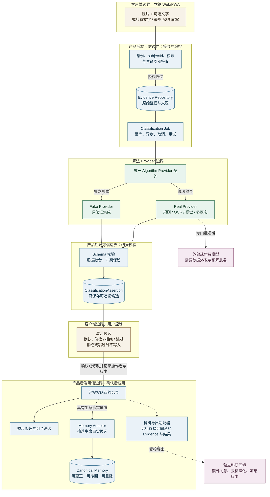

# SGX 自动分类数据流程与边界图

展示多模态输入如何经过权限、Evidence、异步 Job、Fake/Real Provider、用户确认进入照片整理或 Life Memory，并标出外部模型和科研隔离门禁。

```mermaid
flowchart TD
    subgraph CLIENT_IN["客户端边界：本轮 Web/PWA"]
        INPUT["照片 + 可选文字<br/>或只有文字 / 最终 ASR 转写"]
    end

    subgraph BACKEND_IN["产品后端可信边界：接收与编排"]
        direction LR
        AUTH["身份、subjectId、权限<br/>与生命周期检查"]
        EVIDENCE[("Evidence Repository<br/>原始证据与来源")]
        JOB["Classification Job<br/>幂等、异步、取消、重试"]
        AUTH -->|"授权通过"| EVIDENCE --> JOB
    end

    subgraph ALGORITHM["算法 Provider 边界"]
        direction LR
        CONTRACT["统一 AlgorithmProvider 契约"]
        FAKE["Fake Provider<br/>只验证集成"]
        REAL["Real Provider<br/>规则 / OCR / 视觉 / 多模态"]
        CONTRACT -->|"集成测试"| FAKE
        CONTRACT -->|"算法效果"| REAL
    end

    EXTERNAL["外部或付费模型<br/>需要数据外发与预算批准"]

    subgraph BACKEND_OUT["产品后端可信边界：结果校验"]
        direction LR
        VALIDATE["Schema 校验<br/>证据融合、冲突保留"]
        ASSERTION[("ClassificationAssertion<br/>只保存可追溯候选")]
        VALIDATE --> ASSERTION
    end

    subgraph CLIENT_REVIEW["客户端边界：用户控制"]
        EXPERIENCE["展示候选<br/>确认 / 修改 / 拒绝 / 跳过<br/>拒绝或跳过时不写入"]
    end

    subgraph APPLICATION["产品后端可信边界：确认后应用"]
        direction LR
        CONFIRMED["经授权确认的结果"]
        ORGANIZE["照片整理与组合筛选"]
        MEMORY["Memory Adapter<br/>筛选生命事实候选"]
        CANONICAL[("Canonical Memory<br/>可更正、可撤回、可删除")]
        EXPORT["科研导出适配器<br/>另行选择经同意的 Evidence 与结果"]
        CONFIRMED --> ORGANIZE
        CONFIRMED -->|"具有生命事实价值"| MEMORY --> CANONICAL
        CONFIRMED -.-> EXPORT
    end

    RESEARCH["独立科研环境<br/>额外同意、去标识化、冻结版本"]

    INPUT --> AUTH
    JOB --> CONTRACT
    FAKE --> VALIDATE
    REAL --> VALIDATE
    REAL -.->|"专门批准后"| EXTERNAL
    ASSERTION --> EXPERIENCE
    EXPERIENCE -->|"确认或修改并记录操作者与版本"| CONFIRMED
    EXPORT -.->|"受控导出"| RESEARCH

    classDef client fill:#F7F2E8,stroke:#8B6B3F,color:#2D2418;
    classDef backend fill:#EAF2F8,stroke:#326B8C,color:#17364A;
    classDef algorithm fill:#E8F4EE,stroke:#347355,color:#173D2B;
    classDef gated fill:#F5EAF2,stroke:#8A4F72,color:#47263A;
    class INPUT,EXPERIENCE client;
    class AUTH,EVIDENCE,JOB,VALIDATE,ASSERTION,CONFIRMED,ORGANIZE,MEMORY,CANONICAL,EXPORT backend;
    class CONTRACT,FAKE,REAL algorithm;
    class EXTERNAL,RESEARCH gated;
```
