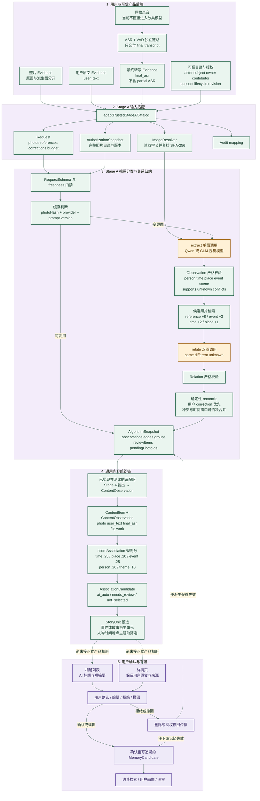

# SGX 图文分类与归纳算法端到端详细架构

```mermaid
%%{init: {"theme":"base","themeVariables":{"fontFamily":"Arial, PingFang SC, Microsoft YaHei, sans-serif","primaryColor":"#EEF6F2","primaryTextColor":"#18332A","primaryBorderColor":"#5B806F","lineColor":"#557468","secondaryColor":"#FFF4DE","tertiaryColor":"#F3ECFA"},"flowchart":{"curve":"basis","htmlLabels":true,"nodeSpacing":30,"rankSpacing":42}}}%%
flowchart TD
  subgraph A[1. 用户与可信产品后端]
    direction LR
    A1[照片 Evidence<br/>原图与派生图分开]
    A2[用户原文 Evidence<br/>user_text]
    A0[原始录音<br/>当前不直接进入分类模型]
    A00[ASR + VAD 独立链路<br/>只交付 final transcript]
    A3[最终转写 Evidence<br/>final_asr<br/>不含 partial ASR]
    A4[可信目录与授权<br/>actor subject owner contributor<br/>consent lifecycle revision]
  end

  subgraph B[2. Stage A 输入适配]
    direction LR
    B1[adaptTrustedStageACatalog]
    B2[Request<br/>photos references corrections budget]
    B3[AuthorizationSnapshot<br/>完整照片目录与版本]
    B4[ImageResolver<br/>读取字节并复核 SHA-256]
    B5[Audit mapping]
  end

  subgraph C[3. Stage A 视觉分类与关系归纳]
    direction LR
    C0[RequestSchema 与 freshness 门禁]
    C1[缓存判断<br/>photoHash + provider + prompt version]
    C2[extract 单图调用<br/>Qwen 或 GLM 视觉模型]
    C3[Observation 严格校验<br/>person time place event scene<br/>supports unknown conflicts]
    C4[候选照片检索<br/>reference +8 / event +3<br/>time +2 / place +1]
    C5[relate 双图调用<br/>same different unknown]
    C6[Relation 严格校验]
    C7[确定性 reconcile<br/>用户 correction 优先<br/>冲突与时间窗口可否决合并]
    C8[AlgorithmSnapshot<br/>observations edges groups<br/>reviewItems pendingPhotoIds]
  end

  subgraph D[4. 通用内容组织链]
    direction LR
    D0[已实现并测试的适配器<br/>Stage A 输出 → ContentObservation]
    D1[ContentItem + ContentObservation<br/>photo user_text final_asr file work]
    D2[scoreAssociation 规则分<br/>time .25 / place .20 / event .25<br/>person .20 / theme .10]
    D3[AssociationCandidate<br/>ai_auto / needs_review / not_selected]
    D4[StoryUnit 候选<br/>事件或故事为主单元<br/>人物时间地点主题为筛选]
  end

  subgraph E[5. 用户确认与下游]
    direction LR
    E1[相册列表<br/>AI 标题与短摘要]
    E2[详情页<br/>保留用户原文与来源]
    E3[用户确认 / 编辑 / 拒绝 / 撤回]
    E4[确认且可追溯的 MemoryCandidate]
    E5[访谈检索 / 用户画像 / 洞察]
    E6[删除或授权撤回传播]
  end

  A1 --> B1
  A2 --> B1
  A0 --> A00 --> A3
  A3 --> B1
  A4 --> B1
  B1 --> B2
  B1 --> B3
  B1 --> B4
  B1 --> B5
  B2 --> C0
  B3 --> C0
  B4 --> C2
  C0 --> C1
  C1 -->|变更图| C2
  C1 -->|可复用| C8
  C2 --> C3
  C3 --> C4
  C4 --> C5
  C5 --> C6
  C6 --> C7
  C7 --> C8
  C8 --> D0
  D0 --> D1
  D1 --> D2
  D2 --> D3
  D3 --> D4
  D4 -. 尚未接正式产品相册 .-> E1
  D4 -. 尚未接正式产品相册 .-> E2
  E1 --> E3
  E2 --> E3
  E3 -->|确认或编辑| E4
  E4 --> E5
  E3 -->|拒绝或撤回| E6
  E6 -. 使派生候选失效 .-> C8
  E6 -. 使下游记忆失效 .-> E4

  classDef implemented fill:#EAF5EF,stroke:#2F6B52,color:#173B2B,stroke-width:2px;
  classDef model fill:#FFF1D6,stroke:#A46A19,color:#573500,stroke-width:2px;
  classDef missing fill:#FCE8E8,stroke:#A83F3F,color:#681F1F,stroke-width:2px,stroke-dasharray: 6 4;
  classDef product fill:#EEEAF8,stroke:#6B54A3,color:#33245E,stroke-width:2px;
  class A0,A00,A1,A2,A3,A4,B1,B2,B3,B4,B5,C0,C1,C3,C4,C6,C7,C8,D1,D2,D3,D4 implemented;
  class C2,C5 model;
  class D0 implemented;
  class E1,E2,E3,E4,E5,E6 product;
```
