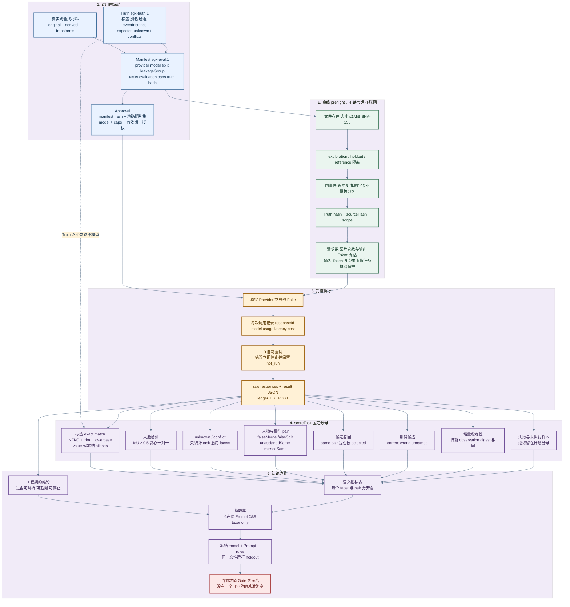

# SGX 分类评测与评分器

```mermaid
%%{init: {"theme":"base","themeVariables":{"fontFamily":"Arial, PingFang SC, Microsoft YaHei, sans-serif","primaryColor":"#EFF5FB","primaryTextColor":"#17324D","primaryBorderColor":"#4C78A8","lineColor":"#58718A","secondaryColor":"#FFF3D8","tertiaryColor":"#F1EBF8"},"flowchart":{"curve":"basis","htmlLabels":true,"nodeSpacing":28,"rankSpacing":42}}}%%
flowchart TD
  subgraph D[1. 调用前冻结]
    direction LR
    D1[真实或合成材料<br/>original + derived + transforms]
    D2[Truth sgx-truth.1<br/>标签 别名 脸框 eventInstance<br/>expected unknown / conflicts]
    D3[Manifest sgx-eval.1<br/>provider model split leakageGroup<br/>tasks evaluation caps truth hash]
    D4[Approval<br/>manifest hash + 精确照片集<br/>model + caps + 有效期 + 授权]
  end

  subgraph P[2. 离线 preflight：不读密钥 不联网]
    direction LR
    P1[文件存在 大小 ≤1MiB SHA-256]
    P2[exploration / holdout / reference 隔离]
    P3[同事件 近重复 相同字节不得跨分区]
    P4[Truth hash + sourceHash + scope]
    P5[请求数 图片次数与输出 Token 预估<br/>输入 Token 与费用由执行预算器保护]
  end

  subgraph X[3. 受控执行]
    direction LR
    X1[真实 Provider 或离线 Fake]
    X2[每次调用记录 responseId model usage latency cost]
    X3[0 自动重试<br/>错误立即停止并保留 not_run]
    X4[raw responses + result JSON<br/>ledger + REPORT]
  end

  subgraph S[4. scoreTask 固定分母]
    direction LR
    S1[标签 exact match<br/>NFKC + trim + lowercase<br/>value 或冻结 aliases]
    S2[人脸检测<br/>IoU ≥ 0.5 贪心一对一]
    S3[unknown / conflict<br/>只统计 task 启用 facets]
    S4[人物与事件 pair<br/>falseMerge falseSplit<br/>unassignedSame missedSame]
    S5[候选召回<br/>same pair 是否被 selected]
    S6[身份候选<br/>correct wrong unnamed]
    S7[增量稳定性<br/>旧新 observation digest 相同]
    S8[失败与未执行样本<br/>继续留在计划分母]
  end

  subgraph O[5. 结论边界]
    direction LR
    O1[工程契约结论<br/>是否可解析 可追溯 可停止]
    O2[语义指标表<br/>每个 facet 与 pair 分开看]
    O3[探索集<br/>允许修 Prompt 规则 taxonomy]
    O4[冻结 model + Prompt + rules<br/>再一次性运行 holdout]
    O5[当前数值 Gate 未冻结<br/>没有一个可宣称的总准确率]
  end

  D1 --> D3
  D2 --> D3
  D3 --> D4
  D3 --> P1
  D4 --> X1
  P1 --> P2 --> P3 --> P4 --> P5 --> X1
  X1 --> X2 --> X3 --> X4
  D2 -. Truth 永不发送给模型 .-> S1
  X4 --> S1
  X4 --> S2
  X4 --> S3
  X4 --> S4
  X4 --> S5
  X4 --> S6
  X4 --> S7
  X4 --> S8
  S1 --> O2
  S2 --> O2
  S3 --> O2
  S4 --> O2
  S5 --> O2
  S6 --> O2
  S7 --> O2
  S8 --> O2
  X4 --> O1
  O1 --> O3
  O2 --> O3
  O3 --> O4 --> O5

  classDef freeze fill:#E9F2FF,stroke:#3F6F9D,color:#183653,stroke-width:2px;
  classDef preflight fill:#EAF5EF,stroke:#3A7757,color:#173E2B,stroke-width:2px;
  classDef execute fill:#FFF1D6,stroke:#A46A19,color:#573500,stroke-width:2px;
  classDef score fill:#F1EBF8,stroke:#715099,color:#3B2755,stroke-width:2px;
  classDef caveat fill:#FCE8E8,stroke:#AA4141,color:#681F1F,stroke-width:2px;
  class D1,D2,D3,D4 freeze;
  class P1,P2,P3,P4,P5 preflight;
  class X1,X2,X3,X4 execute;
  class S1,S2,S3,S4,S5,S6,S7,S8,O1,O2,O3,O4 score;
  class O5 caveat;
```
