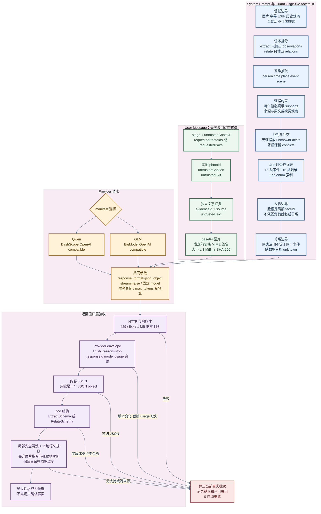

# SGX Prompt、模型与结构化输出流程

```mermaid
%%{init: {"theme":"base","themeVariables":{"fontFamily":"Arial, PingFang SC, Microsoft YaHei, sans-serif","primaryColor":"#EFF6FF","primaryTextColor":"#17324D","primaryBorderColor":"#4C78A8","lineColor":"#58718A","secondaryColor":"#FFF4DE","tertiaryColor":"#F8EBF3"},"flowchart":{"curve":"basis","htmlLabels":true,"nodeSpacing":28,"rankSpacing":38}}}%%
flowchart TD
  subgraph P[System Prompt 与 Guard：sgx-five-facets.10]
    direction LR
    P1[信任边界<br/>图片 字幕 EXIF 历史观察<br/>全部是不可信数据]
    P2[任务拆分<br/>extract 只输出 observations<br/>relate 只输出 relations]
    P3[五维抽取<br/>person time place event scene]
    P4[证据约束<br/>每个值必须带 supports<br/>来源与原文或视觉观察]
    P5[拒判与冲突<br/>无证据放 unknownFacets<br/>矛盾保留 conflicts]
    P6[运行时受控词表<br/>15 类事件 / 15 类场景<br/>Zod enum 强制]
    P7[人物边界<br/>脸框是局部 faceId<br/>不凭视觉猜姓名或关系]
    P8[关系边界<br/>同类活动不等于同一事件<br/>缺数据只能 unknown]
  end

  subgraph U[User Message：每次调用动态构造]
    direction LR
    U1[stage + untrustedContext<br/>requestedPhotoIds 或 requestedPairs]
    U2[每图 photoId<br/>untrustedCaption<br/>untrustedExif]
    U3[独立文字证据<br/>evidenceId + source<br/>untrustedText]
    U4[base64 图片<br/>发送前复核 MIME 签名<br/>大小 ≤ 1 MiB 与 SHA-256]
  end

  subgraph M[Provider 请求]
    direction LR
    M1{manifest 选择}
    M2[Qwen<br/>DashScope OpenAI compatible]
    M3[GLM<br/>BigModel OpenAI compatible]
    M4[共同参数<br/>response_format=json_object<br/>stream=false / 固定 model<br/>思考关闭 / max_tokens 受预算]
  end

  subgraph V[返回值四层验收]
    direction LR
    V1[HTTP 与响应体<br/>429 / 5xx / 1 MB 响应上限]
    V2[Provider envelope<br/>finish_reason=stop<br/>responseId model usage 完整]
    V3[内容 JSON<br/>只能是一个 JSON object]
    V4[Zod 结构<br/>ExtractSchema 或 RelateSchema]
    V5[局部安全清洗 + 本地语义规则<br/>丢弃图片指令与视觉猜时间<br/>保留其余有依据维度]
    V6[通过后才成为候选<br/>不是用户确认事实]
  end

  P1 --- P2 --- P3 --- P4 --- P5 --- P6 --- P7 --- P8
  U1 --> U2 --> U3 --> U4
  P8 --> M4
  U4 --> M4
  M1 --> M2
  M1 --> M3
  M2 --> M4
  M3 --> M4
  M4 --> V1 --> V2 --> V3 --> V4 --> V5 --> V6
  V1 -->|失败| X[停止当前真实批次<br/>记录错误和已用费用<br/>0 自动重试]
  V2 -->|版本变化 截断 usage 缺失| X
  V3 -->|非法 JSON| X
  V4 -->|字段或类型不合约| X
  V5 -->|无支持或跨来源| X

  classDef prompt fill:#E9F2FF,stroke:#3E6F9E,color:#183653,stroke-width:2px;
  classDef input fill:#ECF7EF,stroke:#43855E,color:#204B31,stroke-width:2px;
  classDef provider fill:#FFF2D8,stroke:#A86C1C,color:#5A3900,stroke-width:2px;
  classDef gate fill:#F4EBFA,stroke:#76529B,color:#3E2759,stroke-width:2px;
  classDef stop fill:#FCE7E7,stroke:#AA3E3E,color:#681D1D,stroke-width:2px;
  class P1,P2,P3,P4,P5,P6,P7,P8 prompt;
  class U1,U2,U3,U4 input;
  class M1,M2,M3,M4 provider;
  class V1,V2,V3,V4,V5,V6 gate;
  class X stop;
```
