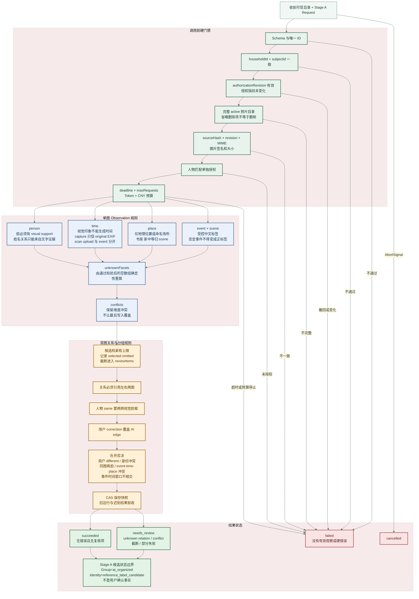

# SGX 分类规则与状态机

```mermaid
%%{init: {"theme":"base","themeVariables":{"fontFamily":"Arial, PingFang SC, Microsoft YaHei, sans-serif","primaryColor":"#F1F7F4","primaryTextColor":"#173B2B","primaryBorderColor":"#52806B","lineColor":"#557468","secondaryColor":"#FFF4DE","tertiaryColor":"#F7EAEA"},"flowchart":{"curve":"basis","htmlLabels":true,"nodeSpacing":28,"rankSpacing":42}}}%%
flowchart TD
  S[收到可信目录 + Stage A Request]

  subgraph G[调用前硬门禁]
    direction LR
    G1[Schema 与唯一 ID]
    G2[householdId + subjectId 一致]
    G3[authorizationRevision 有效<br/>授权指纹未变化]
    G4[完整 active 照片目录<br/>省略删除项不等于删除]
    G5[sourceHash + revision + MIME<br/>图片签名和大小]
    G6[人物匹配单独授权]
    G7[deadline + maxRequests<br/>Token + CNY 预算]
  end

  subgraph O[单图 Observation 规则]
    direction LR
    O1[person<br/>脸必须有 visual support<br/>姓名关系只能来自文字证据]
    O2[time<br/>视觉印象不能生成时间<br/>capture 只信 original EXIF<br/>scan upload 与 event 分开]
    O3[place<br/>仅地理位置或命名场所<br/>书房 家中等归 scene]
    O4[event + scene<br/>受控中文标签<br/>否定事件不得变成正标签]
    O5[unknownFacets<br/>由通过校验后的空数组确定性重算]
    O6[conflicts<br/>保留维度冲突<br/>不让最后写入覆盖]
  end

  subgraph R[双图关系与分组规则]
    direction LR
    R1[候选检索有上限<br/>记录 selected omitted<br/>截断进入 reviewItems]
    R2[关系必须引用左右两图]
    R3[人物 same 要两侧视觉脸框]
    R4[用户 correction 覆盖 AI edge]
    R5[合并否决<br/>用户 different / 身份冲突<br/>同图两脸 / event-time-place 冲突<br/>事件时间窗口不相交]
    R6[CAS 保存快照<br/>旧运行与迟到结果拒收]
  end

  subgraph W[结果状态]
    direction LR
    W1[succeeded<br/>无错误且无复核项]
    W2[needs_review<br/>unknown relation / conflict<br/>截断 / 部分失败]
    W3[failed<br/>没有有效观察或硬错误]
    W4[cancelled]
    W5[Stage A 候选状态边界<br/>Group=ai_organized<br/>Identity=reference_label_candidate<br/>不是用户确认事实]
  end

  S --> G1 --> G2 --> G3 --> G4 --> G5 --> G6 --> G7
  G7 --> O1
  G7 --> O2
  G7 --> O3
  G7 --> O4
  O1 --> O5
  O2 --> O5
  O3 --> O5
  O4 --> O5
  O5 --> O6 --> R1 --> R2 --> R3 --> R4 --> R5 --> R6
  R6 --> W1
  R6 --> W2
  G1 -->|不通过| W3
  G2 -->|不通过| W3
  G3 -->|撤回或变化| W3
  G4 -->|不完整| W3
  G5 -->|不一致| W3
  G6 -->|未授权| W3
  G7 -->|超时或预算停止| W3
  S -->|AbortSignal| W4
  W1 --> W5
  W2 --> W5

  classDef gate fill:#E8F3ED,stroke:#357052,color:#153B29,stroke-width:2px;
  classDef semantic fill:#EAF1FA,stroke:#426F9A,color:#183651,stroke-width:2px;
  classDef relation fill:#FFF1D8,stroke:#9D681D,color:#573700,stroke-width:2px;
  classDef bad fill:#F9E4E4,stroke:#A23F3F,color:#651F1F,stroke-width:2px;
  classDef good fill:#E3F3E6,stroke:#2C7A45,color:#174325,stroke-width:2px;
  class G1,G2,G3,G4,G5,G6,G7 gate;
  class O1,O2,O3,O4,O5,O6 semantic;
  class R1,R2,R3,R4,R5,R6 relation;
  class W3,W4 bad;
  class W1,W2,W5 good;
```
